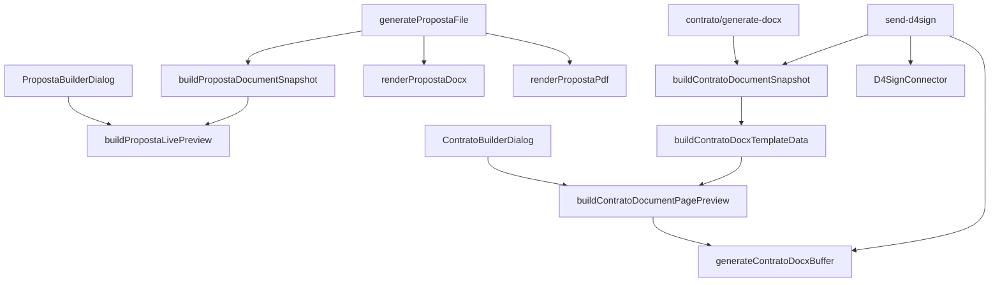
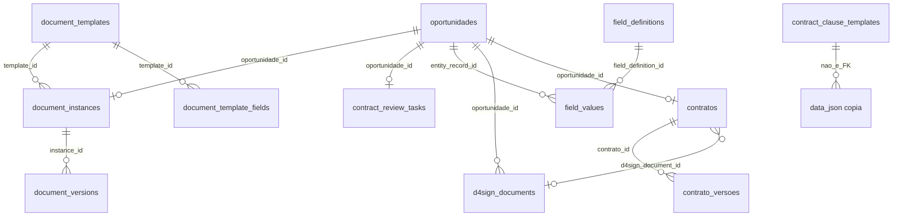
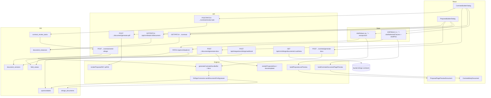
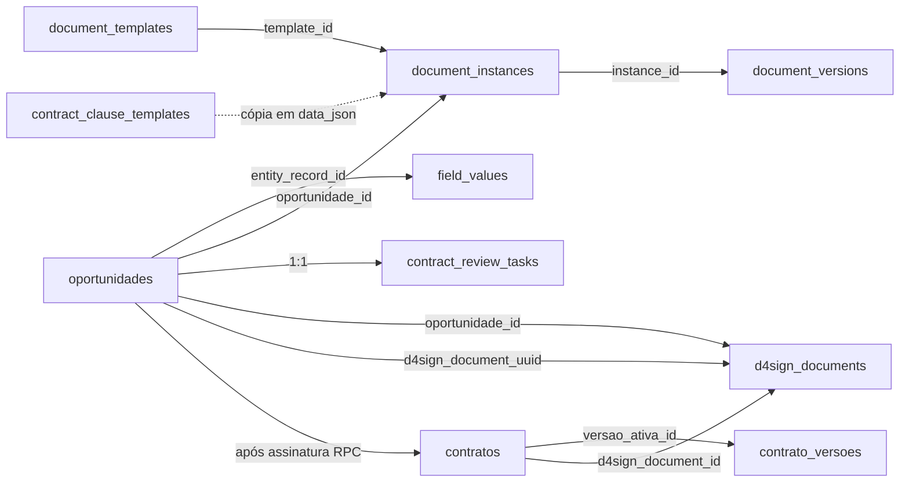

# Auditoria técnica — Propostas, Contratos, Preview, DOCX, PDF e D4Sign

**Projeto:** `crm/` (Next.js 16 + React 19 + Supabase)  
**Data da auditoria:** 2026-09-02  
**Escopo:** somente leitura do código. Nenhum arquivo de sistema foi alterado além deste documento.  
**Destinatário:** IA externa sem acesso ao repositório.

**Legenda de confiança**

| Marcador | Significado |
| -------- | ----------- |
| **Confirmado** | Observado no código (arquivo + função citados). |
| **Inferido** | Conclusão lógica a partir do código, sem execução. |
| **Legado** | Código existente que não é o caminho da UI atual. |
| **Aparentemente não usado** | Arquivo/rota/função sem importador ou sem chamada no builder. |
| **NÃO FOI POSSÍVEL DETERMINAR PELO CÓDIGO** | Ausência de evidência no repositório. |

---

# 1. RESUMO EXECUTIVO

O CRM tem **dois eixos documentais distintos** e um **terceiro eixo financeiro** que também se chama “contrato”:

| Eixo | O que é | Onde vive |
| ---- | ------- | --------- |
| **A — Proposta comercial** | Formulário + escopo + investimento → preview HTML + Word (template `.docx`) + PDF (`pdf-lib`) | Builder do lead, `document_instances` / `document_versions` |
| **B — Contrato jurídico (lead)** | Formulário CC + cláusulas + pins → preview HTML + Word **programático** (`docx`) → D4Sign | Builder do lead, mesmas tabelas `document_*` + `contract_review_tasks` + `d4sign_documents` |
| **C — Gerenciador de contratos (pós-venda)** | Cobrança, vigência, fechamentos | `contratos` / `contrato_versoes` — **não gera DOCX/PDF/preview jurídico** |

Este documento foca A e B. C aparece só quando cruza D4Sign (rascunho financeiro após assinatura).

## Como uma PROPOSTA nasce? (confirmado)

1. Lead/oportunidade já existe no pipeline.
2. Usuário abre `PropostaDocumentBuilder` em `src/app/(crm)/crm/leads/[id]/proposta-document-builder.tsx` (montado por `lead-detail-view.tsx`).
3. Campos `cp_*` vêm de `field_values` + `field_definitions` (etapa de proposta).
4. Escopo vive em `cp_escopo_detalhe_json` (JSON). Catálogo vem de `/api/crm/proposal-catalog` (DB) com fallback estático.
5. `GET /api/crm/leads/:id/document` garante `document_instances` (`ensureInstance`, status `draft`).
6. Preview é **client-side**: `buildPropostaLivePreview` → `ProposalPagePreviewDocument`.
7. “Gerar Word/PDF” salva se dirty e chama `generatePropostaFile`.

## Como um CONTRATO nasce? (confirmado)

1. Mesma oportunidade, etapa de confecção de contrato.
2. `ContratoDocumentBuilder` em `src/app/(crm)/crm/leads/[id]/contrato-document-builder.tsx`.
3. Campos `cc_*` em `field_values`; empresa/endereço herdados de `cp_*` via `resolvePropostaEmpresaPrincipal`.
4. Cláusulas e pins em `document_instances.data_json` (`clausulas_selecionadas`, `pins_signatarios`).
5. Preview client-side: `buildContratoDocumentPagePreview(data, draftSelectedClauses)`.
6. Revisão: `POST .../contrato/review-task` cria/atualiza `contract_review_tasks` (1:1 por oportunidade).
7. Word: `POST .../contrato/generate-docx` → `generateContratoDocxBuffer` (**sem template `.docx`**).
8. D4Sign: `POST .../contrato/send-d4sign` **regenera** DOCX e envia.

## De onde vêm os templates?

| Tipo | Fonte do arquivo | Metadados |
| ---- | ---------------- | --------- |
| Proposta | Filesystem `crm/public/{template_path}` (default `MODELO-PROPOSTA-1.docx`) | Tabela `document_templates` (`document_type = 'proposta'`) |
| Contrato | **Não há arquivo Word.** Layout hardcoded em `generate-contrato-docx.ts` e no JSX do preview | `document_templates` (`document_type = 'contrato'`) só escolhe instância / nome / `template_path` **não lido na geração** |

**Confirmado:** no momento desta auditoria **não há nenhum `.docx` em `crm/public/`**. `renderPropostaDocx` falha se o arquivo não existir. Script: `pnpm run generate:modelo-proposta` → `scripts/generate-modelo-proposta-docx.mjs`.

## Onde os dados ficam salvos?

- Campos editáveis: `field_values.value_json` (entity `oportunidade`).
- Escopo/investimento: JSON em `cp_escopo_detalhe_json`.
- Rascunho de cláusulas/pins: `document_instances.data_json`.
- Snapshot na geração: `document_versions.data_snapshot` (qualidade **desigual** — ver §9).
- Arquivo gerado: **bytes no HTTP response**; `generated_file_path` é string planejada (`documentos/propostas/...`) **sem upload** para Storage.
- D4Sign: UUID em `oportunidades.d4sign_document_uuid` e `d4sign_documents.uuid_doc`.
- PDF assinado (cache): bucket `d4sign-contracts/{uuid}.pdf`.

## Como o preview é produzido?

**Estratégia E — HTML React próprio**, montado no browser a partir de um DTO (`PropostaDocumentPagePreview` / `ContratoDocumentPagePreview`).

- **Não** abre o `.docx`.
- **Não** usa mammoth / docx-preview / PDF.js / iframe / Blob do documento.
- APIs `POST .../document/preview` e `POST .../contrato/preview` existem, retornam JSON `{ page }`, e **não são chamadas por nenhum componente** (grep zero em `src/`).

## Como o Word é produzido?

- **Proposta:** `docxtemplater` + `pizzip` sobre o `.docx` de `public/` + pós-processamento OOXML (`formatPropostaDocumentXml`).
- **Contrato:** lib `docx` (devDependency) monta `Document` + `Packer.toBuffer` em `generateContratoDocxBuffer`.

## Como o PDF é produzido?

- **Proposta:** `pdf-lib` desenha A4 a partir do **mesmo DTO do preview HTML** (`renderPropostaPdf(snapshot.page)`). **Não** converte DOCX→PDF.
- **Contrato:** **NÃO EXISTE IMPLEMENTAÇÃO** de “Gerar PDF”. PDF só aparece depois, baixado da D4Sign (conversão do lado D4Sign).

## Como o documento chega à D4Sign?

`send-d4sign` regenera DOCX na hora, cria `Blob` MIME Word, chama `D4SignConnector.sendDocumentForSignature` (upload no cofre `safeUuid` + signatários + pins + sendtosigner).

## Preview, Word, PDF e D4Sign usam a mesma fonte de dados?

**Parcialmente. Não há fonte única da verdade visual.**

| Artefato | Fonte de dados | Motor visual |
| -------- | -------------- | ------------ |
| Preview proposta | `draftValues` + catálogo (client) | JSX/Tailwind |
| Word proposta | `field_values` + catálogo DB + template `.docx` | docxtemplater |
| PDF proposta | `field_values` + catálogo DB + DTO `page` | pdf-lib / Helvetica |
| Preview contrato | `draftValues` + `draftSelectedClauses` (client) | JSX Times |
| Word contrato (botão) | `field_values` **sem cláusulas adicionais** | `docx` |
| D4Sign | `field_values` + `data_json.clausulas_selecionadas` (DB) | mesmo `docx`, **regenerado** |

## Existe uma fonte única da verdade?

**Não.** Há sobreposição de:

1. React draft
2. `field_values` (canônico dos campos)
3. `document_instances.data_json` (cláusulas/pins)
4. `document_versions.data_snapshot` (histórico incompleto)
5. Template `.docx` (proposta) vs código TypeScript (contrato)
6. Arquivo na D4Sign (após envio)
7. PDF cacheado (após download)

## Existem implementações paralelas?

**Sim.** Ver §11 e §29.

```mermaid
flowchart LR
  subgraph Prop["PROPOSTA"]
    PF[PropostaBuilderDialog<br/>draftValues] --> PS[PATCH field_values<br/>PATCH /document]
    PS --> PT[document_templates.template_path<br/>public/*.docx]
    PF --> PPrev[buildPropostaLivePreview<br/>ProposalPagePreviewDocument]
    PS --> PSnap[buildPropostaDocumentSnapshot]
    PSnap --> PDocx[renderPropostaDocx<br/>docxtemplater]
    PSnap --> PPdf[renderPropostaPdf<br/>pdf-lib]
  end

  subgraph Cont["CONTRATO"]
    CF[ContratoBuilderDialog<br/>draftValues + cláusulas] --> CS[PATCH field_values<br/>PATCH /contrato data_json]
    CS --> RT[contract_review_tasks]
    CF --> CPrev[buildContratoDocumentPagePreview<br/>ContratoBodyDocument]
    CS --> CDocx[generateContratoDocxBuffer<br/>lib docx]
    RT --> Gate[isContractReviewApproved]
    Gate --> Send[send-d4sign<br/>REGENERA DOCX]
    Send --> D4[D4Sign API]
    D4 --> WH[/api/integrations/d4sign/webhook]
    WH --> Fin[finalize_d4sign_opportunity]
    Fin --> Hub[contratos / contrato_versoes]
  end
```

---

# 2. MAPA COMPLETO DE ARQUIVOS

Tabela do núcleo. “Importado por” lista os consumidores principais, não todos os testes.

## Proposta

| Arquivo | Tipo | Responsabilidade | Importado por | Dependências importantes |
| -------- | ---- | ---------------- | ------------- | ------------------------ |
| `src/app/(crm)/crm/leads/[id]/proposta-document-builder.tsx` | UI | Builder split + preview + gerar Word/PDF | `lead-detail-view.tsx` | `proposta-docx-data`, escopo, investimento |
| `src/app/(crm)/crm/leads/[id]/proposta-escopo-por-area.tsx` | UI | Escopo por área; debounce 280 ms | builder proposta | `proposta-escopo-json`, catalog |
| `src/app/(crm)/crm/leads/[id]/proposta-escopo-area-coordenacao.tsx` | UI | Coordenação de solicitações de área | builder proposta | APIs solicitar/notificar |
| `src/app/(crm)/crm/leads/[id]/gerar-proposta-docx-button.tsx` | UI | Botão legado Word | **Aparentemente não usado** | `POST .../proposta-docx` |
| `src/app/(crm)/crm/leads/[id]/lead-detail-view.tsx` | UI | Monta builders por etapa | página do lead | builders |
| `src/components/crm/justified-document-text.tsx` | UI | Texto justificado do preview | builder proposta | — |
| `src/components/crm/proposta-investimento-consolidado-form.tsx` | UI | Investimento consolidado | builder | investimento libs |
| `src/components/crm/proposta-investimento-parcelas-fields.tsx` | UI | Parcelas | form investimento | — |
| `src/components/crm/proposta-brl-currency-input.tsx` | UI | Input BRL | investimento | — |
| `src/components/crm/proposta-escopo-entry-form.tsx` | UI | Entrada de escopo/subtipo | escopo por área | catalog |
| `src/lib/crm/proposta-docx-data.ts` | domínio | Placeholders + live preview DTO | builder, snapshot, render | empresa, escopo, investimento |
| `src/lib/crm/proposta-document-data.ts` | domínio | Snapshot, templates, paths, pending | APIs document/* | catalog DB, field_values |
| `src/lib/crm/render-proposta-docx.ts` | motor | docxtemplater + OOXML | `generate-proposta-file`, rota legada | pizzip, fs |
| `src/lib/crm/render-proposta-pdf.ts` | motor | pdf-lib A4 | `generate-proposta-file` | DTO preview |
| `src/lib/crm/generate-proposta-file.ts` | orquestração | Versiona + gera bytes | generate-docx/pdf | snapshot + motors |
| `src/lib/crm/proposta-escopo-preview.ts` | domínio | Merge `[CHAVE]` nos textos de catálogo | docx-data | — |
| `src/lib/crm/proposta-placeholder-labels.ts` | domínio | Rótulos UI de placeholders | admin/forms | — |
| `src/lib/crm/proposta-escopo-json.ts` | domínio | parse/stringify JSON escopo | vários | — |
| `src/lib/crm/proposta-escopo-entry.ts` | domínio | Entrada de escopo | vários | — |
| `src/lib/crm/proposta-investimento-consolidado.ts` | domínio | Resolve investimento documento | docx-data, forms | — |
| `src/lib/crm/proposta-investimento-parcelas.ts` | domínio | Parcelas | investimento | — |
| `src/lib/crm/proposta-tributacao.ts` | domínio | Frase tributação | investimento texto | — |
| `src/lib/crm/proposta-empresa-principal.ts` | domínio | Empresa do header | proposta + contrato | intake |
| `src/lib/crm/proposta-valor-brl-extenso.ts` | domínio | Valor por extenso | investimento | — |
| `src/lib/crm/proposta-escopo-direcionamento.ts` | domínio | Direcionamento de áreas | escopo | — |
| `src/lib/crm/proposta-escopo-permissions.ts` | domínio | Quem edita qual área | escopo UI | — |
| `src/lib/crm/proposta-escopo-solicitacoes.ts` | domínio | Solicitações de preenchimento | APIs | — |
| `src/lib/crm/proposta-solicitar-escopo-area.ts` | domínio | Pedido a gestor | API | — |
| `src/lib/crm/proposta-notificar-outras-areas.ts` | domínio | Notifica áreas | API | — |
| `src/lib/crm/proposal-catalog-db.ts` | persistência | Lê catálogo | snapshot, API | Supabase |
| `src/lib/crm/proposal-catalog-utils.ts` | domínio | Utils catálogo | vários | — |
| `src/lib/crm/proposal-catalog-write.ts` | persistência | Escreve catálogo admin | admin API | — |
| `src/lib/crm/pipeline-field-values.ts` | persistência | `field_values` | snapshot | — |
| `src/data/proposta-tipos-catalog.ts` | estático | Fallback catálogo escopo | client até API | — |
| `src/data/proposta-investimento-catalog.ts` | estático | Fallback investimento | client até API | — |
| `src/app/api/crm/leads/[id]/document/route.ts` | API | GET/PATCH instância | builder | admin client |
| `src/app/api/crm/leads/[id]/document/preview/route.ts` | API | Preview JSON server | **Aparentemente não usado** | snapshot |
| `src/app/api/crm/leads/[id]/document/generate-docx/route.ts` | API | Word versionado | builder | `generatePropostaFile` |
| `src/app/api/crm/leads/[id]/document/generate-pdf/route.ts` | API | PDF versionado | builder | `generatePropostaFile` |
| `src/app/api/crm/leads/[id]/proposta-docx/route.ts` | API | Word legado sem versão | botão órfão | `renderPropostaDocx` |
| `src/app/api/crm/document-templates/route.ts` | API | Lista templates | builder | DB |
| `src/app/api/crm/proposal-catalog/route.ts` | API | Catálogo lead | builder | DB |
| `src/app/api/admin/proposal-catalog/route.ts` | API | Admin catálogo | admin UI | write |
| `src/app/(crm)/crm/admin/documentos/page.tsx` | UI admin | Lista templates (somente leitura) | rota admin | `loadDocumentTemplates` |
| `src/app/(crm)/crm/admin/proposta-escopo/page.tsx` | UI admin | Catálogo escopo | — | catalog admin |
| `scripts/generate-modelo-proposta-docx.mjs` | script | Gera `public/MODELO-PROPOSTA-1.docx` | npm script | `docx` |

## Contrato (documento jurídico)

| Arquivo | Tipo | Responsabilidade | Importado por | Dependências importantes |
| -------- | ---- | ---------------- | ------------- | ------------------------ |
| `src/app/(crm)/crm/leads/[id]/contrato-document-builder.tsx` | UI | Builder + preview + Word + D4Sign | `lead-detail-view.tsx` | `contrato-docx-data`, gate |
| `src/lib/crm/contrato-docx-data.ts` | domínio | Placeholders + DTO preview contrato | builder, APIs | empresa principal |
| `src/lib/crm/generate-contrato-docx.ts` | motor | DOCX programático | generate-docx + send-d4sign | `docx` |
| `src/lib/crm/contrato-signature-pins.ts` | domínio | Pins A4 / placeholder `__client__` | builder, send | — |
| `src/lib/crm/contract-send-gate.ts` | domínio | Gate `status === concluido` | builder, send-d4sign | — |
| `src/app/api/crm/leads/[id]/contrato/route.ts` | API | GET/PATCH instância + cláusulas | builder | admin client |
| `src/app/api/crm/leads/[id]/contrato/preview/route.ts` | API | Preview JSON **sem cláusulas** | **Aparentemente não usado** | snapshot |
| `src/app/api/crm/leads/[id]/contrato/generate-docx/route.ts` | API | Word **sem cláusulas adicionais** | builder | `generateContratoDocxBuffer` |
| `src/app/api/crm/leads/[id]/contrato/send-d4sign/route.ts` | API | Regenera + envia D4Sign | builder | connector, gate |
| `src/app/api/crm/leads/[id]/contrato/review-task/route.ts` | API | CRUD revisão | builder | notificações |
| `src/app/api/crm/contract-clauses/route.ts` | API | Lista cláusulas ativas | builder | DB |
| `src/app/api/crm/admin/contract-clauses/route.ts` | API | CRUD admin | admin UI | — |
| `src/app/api/crm/admin/contract-clauses/[id]/route.ts` | API | Item cláusula | admin UI | — |
| `src/app/(crm)/crm/admin/clausulas/page.tsx` | UI admin | CRUD cláusulas | — | — |
| `src/components/crm/clause-templates-admin-panel.tsx` | UI | Painel cláusulas | admin | — |
| `src/lib/d4sign/firm-signers.ts` | integração | Sócios hardcoded / env | send, UI | — |
| `src/lib/d4sign/env.ts` | integração | Env D4Sign | vários | — |
| `src/modules/crm/infrastructure/integrations/d4sign-client.ts` | integração | HTTP D4Sign | send, sync | — |
| `src/app/api/integrations/d4sign/webhook/route.ts` | API | POSTBack HMAC | D4Sign | RPC finalize |
| `src/app/api/crm/d4sign/documents/[uuid]/view/route.ts` | API | PDF cache bucket | dashboard | `d4sign-contracts` |
| `src/lib/d4sign/pdf-precache.ts` | integração | Precache PDF | cron | storage |
| `src/app/(crm)/crm/leads/[id]/lead-d4sign-panel.tsx` | UI | Painel D4Sign no lead | detail view | — |

## Gerenciador pós-assinatura (adjacente)

`src/modules/contracts/**`, `src/components/crm/contracts/**`, `src/app/api/crm/contracts/**`, migrations `2026081212*`. **Não participa do preview/Word do builder.**

## Banco / tipos

`src/lib/supabase/database.types.ts` — schema TypeScript das tabelas (DDL de `document_*` **não está** nas migrations locais).

---

# 3. DEPENDÊNCIAS E BIBLIOTECAS DE DOCUMENTOS

Fonte: `crm/package.json` + imports em `crm/src` e `crm/scripts`.  
**Confirmado: as bibliotecas abaixo que não aparecem na tabela NÃO estão no projeto.**

| Biblioteca | Versão | Onde é usada | Para quê | Proposta/Contrato | Ainda usada? |
| ---------- | ------ | ------------ | -------- | ----------------- | ------------ |
| `docxtemplater` | 3.69.3 | `render-proposta-docx.ts` | Substituir `[chave]` no `.docx` | Proposta | Sim |
| `pizzip` | ^3.2.0 | `render-proposta-docx.ts`, `scope-import/text-extraction.ts` | ZIP OOXML; extrair texto de DOCX importado | Proposta + import escopo | Sim |
| `pdf-lib` | ^1.17.1 | `render-proposta-pdf.ts` | Gerar PDF A4 do DTO | Proposta | Sim |
| `unpdf` | ^1.8.0 | testes PDF + `scope-import` | Extrair texto de PDF | Testes / import | Sim (não no preview) |
| `docx` | ^9.6.1 **devDependency** | `generate-contrato-docx.ts`, `scripts/generate-modelo-proposta-docx.mjs` | Montar DOCX do zero | Contrato (runtime) + script proposta | Sim — **risco de empacotamento**: está em `devDependencies` mas é importada em runtime |
| `date-fns` | ^4.1.0 | vários | Datas, filenames, vigência | Ambos | Sim |
| `openai` | ^7.4.0 | scope-import | IA de catálogo | Adjacente | Sim |

**Confirmado ausentes** (procuradas e não encontradas em `package.json` / imports do app):

`docx-preview`, `mammoth`, `pdf.js` / `pdfjs-dist`, `react-pdf`, `@react-pdf/*`, `jspdf`, `html2canvas`, `puppeteer`, `playwright`, `libreoffice`, `unoconv`, `officeparser`, Microsoft Graph SDK.

`@pdf-lib/standard-fonts` e `@pdf-lib/upng` entram só como transitivas de `pdf-lib`.

---

# 4. INVESTIGAÇÃO ESPECÍFICA DO PREVIEW

## Pergunta fundamental

O preview atual é:

**A. HTML criado separadamente.**

Não é B (HTML derivado do DOCX), nem C (DOCX no browser), nem D (PDF).

**Prova**

1. Comentário em `proposta-docx-data.ts` (`buildPropostaDocumentPagePreview`): *“sem abrir o .docx nem Mammoth”*.
2. Builder proposta: `useMemo` → `buildPropostaLivePreview` → JSX `ProposalPagePreviewDocument` (cabeçalho BP, faixa dourada, rodapé hardcoded).
3. Builder contrato: `useMemo` monta o dicionário de chaves **duplicando** `buildContratoDocxTemplateData` e chama `buildContratoDocumentPagePreview(..., draftSelectedClauses)` → `ContratoBodyDocument`.
4. Nenhum `iframe`, `URL.createObjectURL` (exceto download Word/PDF), `docx-preview` ou `<embed pdf>`.
5. Endpoints de preview **não são usados** pela UI.

## Passo a passo — PROPOSTA (confirmado)

```
Usuário altera campo cp_*
↓
fieldChange(code, value) atualiza draftValues
↓
useMemo([draftValues, previewEscopoJson, catalogs]) dispara
↓
buildPropostaLivePreview({ fieldByCode: merged, scopeCatalog, investmentCatalog, generatedAt: new Date() })
↓
buildPropostaDocxPayload → templateData + escopoSections
↓
buildPropostaDocumentPagePreview → page
↓
ProposalPagePreviewDocument renderiza HTML
```

Escopo:

```
Usuário edita área
↓
estado local escopo
↓
setTimeout 280ms (proposta-escopo-por-area.tsx)
↓
onEscopoDraftChange → syncEscopoJsonFromDraft → setEscopoJson
↓
previewEscopoJson = useDeferredValue(escopoJson)
↓
mesmo useMemo do preview
```

**Sem HTTP no preview.** Catálogo: `GET /api/crm/proposal-catalog` ao abrir o dialog (uma vez).

## Passo a passo — CONTRATO (confirmado)

```
Usuário altera cc_* ou cláusulas
↓
draftValues / draftSelectedClauses
↓
useMemo monta Record de placeholders (cópia local, não chama buildContratoDocxTemplateData)
↓
buildContratoDocumentPagePreview(data, draftSelectedClauses)
↓
ContratoBodyDocument (Times 11pt, A4 CSS)
```

`DATA_ASSINATURA` no preview = `format(new Date(), "dd/MM/yyyy")` **a cada recálculo** (data de “hoje”, não data persistida).

## Frontend — checklist

| Item | Proposta | Contrato |
| ---- | -------- | -------- |
| Componente do preview | `ProposalPagePreviewDocument` | `ContratoBodyDocument` |
| Filhos | `JustifiedDocumentText`, `SignatureBlock` | cláusulas numeradas no próprio arquivo |
| Estado | `draftValues`, `escopoJson`, catalogs | `draftValues`, `draftSelectedClauses` |
| Debounce | 280 ms só no escopo; resto imediato | Nenhum |
| Hook de adiamento | `useDeferredValue(escopoJson)` | Não |
| HTTP preview | Não | Não |
| Cache | Não (recompute) | Não |
| Loading | Ponto verde “ao vivo”; sem skeleton de página | Sem skeleton de página |
| Erro | `console.error("[live preview]")` + empty state se throw | useMemo não tem try/catch |
| Atualização automática | Sim, a cada tecla (exceto escopo 280 ms) | Sim, a cada tecla |
| Scroll | Painel direito `overflow-y-auto` independente | Idem (`w-[54%]`) |
| Zoom | Não | Não |
| Paginação | Página única contínua | Corpo + bloco visual de assinaturas (`D4SIGN_A4_HEIGHT`) |
| Tamanho A4 | `max-w-[720px]` `min-h-[980px]` (aproximado) | `max-w-[794px]` (~A4 @96dpi) |
| CSS | Tailwind + cores `#0d2031` `#d3ad67` | Times inline + accent `#2dc8b7` |
| HTML próprio | Sim | Sim |
| iframe / lib / Blob / object URL | Não no preview | Não no preview |

## Backend preview

| | Proposta | Contrato |
| | -------- | -------- |
| Endpoint | `POST /api/crm/leads/[id]/document/preview` | `POST /api/crm/leads/[id]/contrato/preview` |
| Função | `buildPropostaDocumentSnapshot` + `buildPropostaDocumentPagePreview(mergedTemplateData)` | `buildContratoDocumentSnapshot` + `buildContratoDocxTemplateData` + `buildContratoDocumentPagePreview(templateData)` **sem 2º arg** |
| Template | Metadados; não abre `.docx` | Metadados; não gera Word |
| Resposta | JSON `{ ok, data: { page, previewFormat: "document_page", pending } }` | JSON `{ ok, data: { page, empresa, previewFormat: "document_page" } }` |
| HTML/DOCX/PDF/Base64 | Não | Não |

**Bug de fidelidade se alguém voltar a usar a API de contrato:** ela **omite cláusulas adicionais**. O builder atual não sofre isso porque não chama a API.

---

# 5. PREVIEW X DOCUMENTO REAL

| Elemento | Preview | Word | PDF | D4Sign |
| -------- | ------- | ---- | --- | ------ |
| Fonte de dados | Draft React (não persistido) | DB `field_values` (+ catálogo DB na proposta) | Mesmo snapshot da proposta | DB no instante do envio + `data_json` cláusulas |
| Template | JSX hardcoded | Proposta: `.docx` em `public/`. Contrato: código `docx` | Código pdf-lib (só proposta) | Mesmo motor Word do contrato, **nova geração** |
| Engine | React DOM | docxtemplater **ou** `docx` | pdf-lib | D4Sign converte o DOCX enviado (lado deles) |
| CSS/estilos | Tailwind / inline | Estilos do Word / Aptos (script modelo) | Helvetica | Render D4Sign/PDF |
| Margens | `px-[13.5%]` proposta; `px-[11%]` contrato | Contrato: 1701 twips (~3 cm). Proposta: as do `.docx` | 56/52/48 pt | D4Sign |
| Fontes | Sistema / Times (contrato) | Template Word / Times (contrato) | Helvetica / HelveticaBold | D4Sign |
| Quebra de página | **Não** (folha única) | Proposta: do Word. Contrato: `PageBreak` antes das assinaturas | pdf-lib paginação real | PDF D4Sign |
| Cabeçalho | JSX marca BP | Template / JSX equivalente no contrato | Header simplificado navy/gold | Do DOCX |
| Rodapé | Barra navy proposta; linha contrato | `[P]`/`[F]` = `"1"` (proposta); texto endereço (contrato) | Footer desenhado | Do DOCX |
| Numeração | Sem “Página X de Y” | Placeholders estáticos `"1"` | Páginas reais no PDF proposta | D4Sign |
| Tabelas | Não (proposta). Contrato: detalhes em parágrafos | Contrato: tabela de assinaturas | Não | — |
| Negrito | CSS `font-extrabold` / prefixo subtipo | OOXML `boldLeadingLabelsInParagraphs` (proposta); `TextRun` bold (contrato) | HelveticaBold | — |
| Assinaturas | Blocos Gustavo/Ricardo no preview | Iguais no PDF proposta; página dedicada no Word contrato | Iguais ao preview (proposta) | Pins D4Sign + página de assinaturas |
| Cláusulas | Preview contrato **inclui** `draftSelectedClauses` | **generate-docx omite** cláusulas adicionais | N/A contrato | **send-d4sign inclui** cláusulas do `data_json`/body |

## O preview pode divergir do Word?

**SIM.**

- Layout/fonte/paginação diferentes (HTML vs Word).
- Preview usa draft; Word usa DB (proposta salva antes se dirty; contrato `handleGenerate` também persiste).
- Catálogo estático no client até a API responder vs DB no server.
- **Contrato: Word do botão não inclui cláusulas adicionais; o preview inclui.** Evidência: `contrato/generate-docx/route.ts` linha que chama `buildContratoDocumentPagePreview(templateData)` sem segundo argumento.
- Proposta: preview é “página 1” estilizada; Word é o modelo completo (capas/rodapé em caixa de texto).

## O preview pode divergir do PDF?

**SIM.** Só existe PDF de proposta. Mesmo DTO textual, mas Helvetica vs CSS, paginação real vs folha única, `toPdfSafe` remove caracteres fora Latin-1.

## O PDF pode divergir do Word?

**SIM.** Motores diferentes. PDF **não** é conversão do DOCX. Fonte, capas, numeração `[P]/[F]`, e tipografia Aptos vs Helvetica divergem por construção.

## O documento enviado à D4Sign é exatamente o visualizado?

**Não há garantia.**

1. Preview ≠ Word (cláusulas, layout).
2. `handleSend` **não chama** `persistAllFields` — envia o que está no **DB**, não o draft da tela.
3. `send-d4sign` **regenera** o DOCX; não reutiliza o arquivo baixado em “Gerar Word”.
4. `DATA_ASSINATURA` é `generatedAt` do request de envio (pode ser outro dia que o preview).
5. D4Sign ainda converte/renderiza o DOCX do lado deles (inferido pela API; o CRM não controla o PDF final).

---

# 6. GERAÇÃO DO DOCX

## 6.1 Proposta

**Template:** `resolveModeloPropostaTemplatePath` → `path.resolve(cwd, "public", templatePath)` com guardrail de path traversal (`startsWith(publicRoot)`).  
**Carga:** `fs.readFileSync`. **Não** Storage, **não** bytea no banco.  
**Biblioteca:** `Docxtemplater` + `PizZip`, delimitadores `[` `]`, `paragraphLoop: true`, `linebreaks: true`.  
**Função:** `renderPropostaDocx(templateBuffer, data)`.

Pós-processamento OOXML em `word/document.xml` apenas (não header/footer XML além do que o docxtemplater já substituiu):

- `convertSoftBreaksToParagraphs`
- `boldLeadingLabelsInParagraphs` (labels de `ESCOPO_SUBTIPO_LABELS`)
- `restyleMatchingAreaHeadings`
- `stripSinteseDemandaParagraphs` se `PROPOSTA_INCLUDE_SINTESE_DEMANDA === false`

**Campos vazios:** string vazia no payload; preview mostra `…`.  
**Loops/condições nativas do docxtemplater:** habilitadas (`paragraphLoop`), mas o payload atual é **plano** (`Record<string, string>`), sem arrays de loop.  
**Imagens:** NÃO FOI POSSÍVEL DETERMINAR no motor (nenhum módulo de imagem docxtemplater). O preview desenha logo “BP” em CSS; o `.docx` real depende do arquivo (ausente no clone).  
**Cabeçalho/rodapé:** vêm do arquivo Word. `[P]` e `[F]` são texto `"1"` de propósito (comentário: caixa de texto + PAGE/NUMPAGES corrompia o arquivo).  
**Investimento / extenso:** `resolveInvestimentoDocumento` + `buildInvestimentoDocumentoText` + `proposta-valor-brl-extenso.ts`.  
**Vigência:** `formatDataVigenciaProposta(generatedAt)` = generatedAt + 7 dias.

### Payload real (estrutura, dados fictícios)

```json
{
  "EMPRESA": "ACME LTDA",
  "CIDADE": "Campinas",
  "UF": "SP",
  "CEP": "13025-002",
  "NUMERO": "100",
  "DOCUMENTO": "12.345.678/0001-90",
  "AREA": "Trabalhista",
  "AREAS": "Trabalhista, Cível",
  "ESCOPO_AREA": "<texto mesclado do catálogo>",
  "ESCOPO_AREAS": "<mesmo>",
  "ESCOPO_ANTES_SINTESE": "<escopo sem síntese>",
  "RESUMO": "",
  "RESUMO_SINTESE": "",
  "INVESTIMENTO": "Investimento\n<texto consolidado + tributação>",
  "INVESTIMENTOS": "<mesmo>",
  "ESCOPO_SUBTIPO_LABELS": "Consultivo\nContencioso",
  "DATA VIGENCIA": "09/09/2026",
  "P": "1",
  "F": "1"
}
```

Orquestração: `generatePropostaFile` grava `document_versions` **antes** de renderizar (se o render falhar, a versão já existe sem arquivo — ver §28).

## 6.2 Contrato

**Template `.docx`:** NÃO EXISTE. Comentário em `generate-docx/route.ts`: geração programática para refletir o preview.

**Função:** `generateContratoDocxBuffer(page: ContratoDocumentPagePreview)`.

- Fonte Times New Roman 11 pt, justificado.
- Cláusulas numeradas dinamicamente (`N()`).
- Qualificação CONTRATADA **hardcoded** (CNPJ `26.080.152/0001-35`, sócios, endereço).
- `PageBreak` + página de assinaturas.
- Margens ~3 cm.
- `page.clausulasAdicionais` **é** renderizado **se** o DTO as trouxer.

**Quem monta o DTO:**

| Caminho | Passa cláusulas? |
| ------- | ---------------- |
| Preview UI | Sim (`draftSelectedClauses`) |
| `generate-docx` | **Não** |
| `send-d4sign` | Sim (`clausulasAdicionais` body ou `data_json`) |
| API preview | **Não** |

**Metadados Word:** só o que a lib `docx` grava por default. Sem custom properties / hash.

---

# 7. GERAÇÃO DO PDF

## Existe geração real de PDF?

**Proposta: sim.**  
**Contrato: não** (no CRM). O PDF do contrato é o arquivo que a D4Sign devolve após upload/assinatura.

### Clique “Gerar PDF” (proposta)

```
Botão em PropostaBuilderDialog
→ generateDocument("pdf")
→ persistAllFields() se isDirty
→ POST /api/crm/leads/:id/document/generate-pdf
→ generatePropostaFile({ format: "pdf" })
→ buildPropostaDocumentSnapshot
→ renderPropostaPdf(snapshot.page)   // pdf-lib, A4 595.28×841.89
→ bytes no response + download Blob
→ URL.revokeObjectURL após click
```

- **Não** é DOCX→PDF.
- **Não** é HTML→PDF.
- **Não** Microsoft Graph, LibreOffice, Puppeteer, Vercel converter.
- Backend Node gera; o browser só baixa.
- Versão incrementada como no Word (`status: generated`).

### Contrato

NÃO EXISTE IMPLEMENTAÇÃO PARA ESTE ITEM NO ESTADO ATUAL DO PROJETO (botão “Gerar PDF” no builder de contrato).

O PDF em `d4sign-contracts/{uuid}.pdf` é **download da API D4Sign** (`type=0`), não o `pdf-lib` do CRM.

---

# 8. D4SIGN

## Caminho completo (confirmado)

```
Builder (rascunho cc_* + cláusulas + pins)
→ Salvar (opcional — handleSend NÃO salva)
→ POST review-task (prazo) → Societário
→ PATCH review-task status=concluido → etapa contrato_elaborado
→ handleSend → POST /contrato/send-d4sign
    → gate isContractReviewApproved
    → buildContratoDocumentSnapshot (DB)
    → cláusulas/pins de body OU data_json
    → generateContratoDocxBuffer(page COM cláusulas)
    → Blob DOCX
    → D4SignConnector.sendDocumentForSignature
         uploadMainDocument (safeUuid)
         createSignersList
         addPinsToDocument (dimensions última página)
         sendToSigner
         getSignatureLink
    → oportunidades.d4sign_document_uuid / etapa contrato_enviado
    → document_versions (snapshot parcial, sentToD4Sign)
    → upsert d4sign_documents
    → enrichDocuments
    → registerWebhook → /api/integrations/d4sign/webhook
→ webhook type_post=1 → RPC finalize_d4sign_opportunity
→ ensure_contract_draft_for_opportunity (eixo C)
```

**Arquivo enviado:** DOCX, gerado **no momento do envio**.  
**Não reutiliza** o buffer de “Gerar Word”.  
**Hash:** não.  
**Versão congelada do arquivo:** não.  
**Conteúdo pode mudar entre aprovação e envio:** **sim** (gate não olha versão; campos/cláusulas editáveis).  
**UUID:** `oportunidades.d4sign_document_uuid`, `d4sign_documents.uuid_doc`.  
**Storage local do DOCX enviado:** **não**. Só PDF posterior no bucket.  
**Signatários:** `getFirmSigners()` + CONTRATANTE do body; `handleSend` **não envia pins/cláusulas no JSON** — pins/cláusulas vêm do `data_json` salvo.

## Garantia arquivo aprovado === arquivo enviado?

**Não. Risco crítico.**

Revisão é um **status de tarefa**, não um artefato. Não há `approved_file_hash`, não há `approved_version_id` no gate, não há bytes persistidos da revisão.

---

# 9. VERSIONAMENTO DOCUMENTAL

## Tabelas

| Tabela | Papel |
| ------ | ----- |
| `document_instances` | 1 linha por (`oportunidade_id`, `template_id`). `status` livre (`draft`, `generated`, `sent` no código). `data_json` rascunho. `current_version` contador. |
| `document_versions` | Histórico de gerações/envios. `data_snapshot` JSON. `generated_file_path` **metadado**. Sem coluna de hash. |
| `contrato_versoes` | Versões de **cobrança** do gerenciador. Independente do Word jurídico. Imutabilidade de versão `ativa` via trigger SQL. |

**Proposta é versionada?** Sim, a cada Gerar Word/PDF (`current_version++`, insert version). É versionamento de **evento de export**, não de rascunho por tecla.  
**Contrato é versionado?** Sim, em generate-docx e send-d4sign (outro incremento).  
**Dados ou arquivo?** Snapshot JSON dos **campos** (qualidade variável). Arquivo **não** é guardado.  
**Status draft/review/approved/sent/signed?** Parcial: instance `draft|generated|sent`; revisão em outra tabela; assinatura em `d4sign_*` / etapa da oportunidade. **Não** há enum único.  
**Versão imutável?** O row de `document_versions` não é atualizado depois; mas o **arquivo** não existe para ser imutável, e o rascunho `field_values` continua mutável.  
**Versão aprovada pode ser alterada?** Não existe “versão aprovada”. A task pode ficar `concluido` enquanto os campos mudam.  
**Versão enviada pode ser regenerada?** Sim — novo envio cria nova versão e **novo** documento D4Sign (sem lock).  
**Audit trail?** `generated_by`, `generated_at`, activity events no envio, `transicoes_etapa`. Sem diff de conteúdo.  
**Checksum?** Não.  
**Snapshot dos dados?** Proposta generate: `templateId`, `templateName`, `templatePath`, `format`, `fields`, `templateData`, `areas`. Contrato generate: `fields` + `templateData` **sem cláusulas**. Contrato send: `fields`, `sentToD4Sign`, `d4signDocumentUuid`, `signerEmail` — **sem `templateData`, sem cláusulas**.

```
V1 - rascunho          → instance status draft, version 0 (hoje)
V2 - gerar Word        → version 1 generated (hoje, se o usuário gerar)
V3 - ajustes + gerar   → version 2 (hoje)
V4 - aprovado          → NÃO EXISTE como versão de documento (só task concluido)
V4 - enviado D4Sign    → nova version N sent (hoje)
V4 - assinado          → etapa/webhook; sem nova document_versions obrigatória
```

O exemplo acima é **parcialmente hoje** (export/envio incrementam). O ciclo “aprovado = V4 congelada” é **arquitetura desejável, não implementada**.

---

# 10. FONTE ÚNICA DA VERDADE

Canônicos **operacionais**:

- Campos: `field_values`
- Cláusulas/pins atuais: `document_instances.data_json`
- Documento assinado: D4Sign + PDF em `d4sign-contracts` (se cacheado)
- Cobrança: `contrato_versoes`

### Se eu abrir um contrato daqui a 6 meses, reconstruo EXATAMENTE o enviado?

**Não de forma byte-a-byte no CRM.**

| Fonte | Recupera | Falha |
| ----- | -------- | ----- |
| PDF `d4sign-contracts/{uuid}.pdf` | Aparência pós-D4Sign | Pode não existir se ninguém visualizou/precacheou |
| API D4Sign download | Idem | Quota, retenção externa |
| `data_snapshot` do send | Campos da época | Sem cláusulas, sem templateData, sem bytes |
| `data_json` atual | Cláusulas de agora | Pode ter sido editado depois |
| Regenerar com código atual | Aproximação | Código/template/data mudaram; `DATA_ASSINATURA` nova |

### Se o template DOCX for alterado amanhã, um contrato antigo pode ser regenerado diferente?

**Proposta: SIM** — `readModeloPropostaTemplateBuffer` lê o arquivo **atual** em `public/`. Snapshot guarda `templatePath` e `templateData`, mas a regeneração (se alguém reimplementasse) usaria o arquivo novo. O CRM **não** guarda o `.docx` gerado.

**Contrato: SIM** — não há template arquivo; qualquer mudança em `generate-contrato-docx.ts` altera regenerações. Snapshot do send nem guarda `templateData`.

`document_templates.version` existe (número) e aparece no select da UI (`v{t.version}`), mas **não há histórico de arquivos de template** nem `template_version_id` na instância além do `template_id` atual.

---

# 11. PROPOSTA X CONTRATO

| Item | Proposta | Contrato |
| ---- | -------- | -------- |
| Builder | `proposta-document-builder.tsx` | `contrato-document-builder.tsx` |
| Dados | `cp_*` + JSON escopo | `cc_*` + `cp_*` herdados + `data_json` |
| Template | `.docx` filesystem | Código TS |
| Preview | HTML React (layout comercial) | HTML React (Times jurídico) |
| DOCX | docxtemplater | lib `docx` |
| PDF | pdf-lib | Não |
| Versionamento | `generate-proposta-file` | Inline nas rotas |
| Aprovação | Pendências de campo | Pendências + `contract_review_tasks` |
| Storage | Path metafórico | Path metafórico (pasta `propostas/`!) |
| D4Sign | Não | Sim |

## Duplicações

| Duplicação | Classificação |
| ---------- | ------------- |
| Dois builders split-pane quase gêmeos | Dívida / candidata a unificação de shell |
| Dois DTOs `*DocumentPagePreview` | Justificável (conteúdo diferente) |
| Dois `ensureInstance` copiados | Dívida |
| `buildGeneratedDocxFilePath` compartilhado (pasta `documentos/propostas/` no contrato) | Bug / dívida |
| Preview contrato reimplementa o mapa de `buildContratoDocxTemplateData` | Dívida — risco de drift (já existe a função e o builder não a usa) |
| APIs preview mortas vs live client | Legado |
| `proposta-docx` vs `document/generate-docx` | Legado |
| Dois eixos “contrato” (jurídico vs faturamento) | Justificável se bem nomeado; perigoso semanticamente |
| Placeholders `[P]/[F]` copiados no contrato sem uso real de template | Ruído |

---

# 12. DOCUMENT ENGINE

**NÃO EXISTE** abstração `DocumentEngine` (grep zero).

Responsabilidades espalhadas:

```
buildData     → proposta-docx-data / contrato-docx-data / proposta-document-data
validate      → listPendingFields / listContratoPendingFields / gate
renderPreview → builders (client) + rotas preview mortas
renderDocx    → render-proposta-docx / generate-contrato-docx
renderPdf     → render-proposta-pdf (só proposta)
freezeVersion → generate-proposta-file / inserts soltos nas rotas de contrato
sendSign      → send-d4sign + D4SignConnector
```



---

# 13. PERFORMANCE DO PREVIEW

| Pergunta | Resposta |
| -------- | -------- |
| Recalcula a cada tecla? | Sim (proposta: campos imediatos; escopo 280 ms + `useDeferredValue`) |
| Debounce | 280 ms só escopo proposta |
| Gera DOCX a cada alteração? | **Não** |
| Chama servidor no preview? | **Não** |
| Roda só no browser? | **Sim** |
| Payload médio | N/A (sem request) |
| Arquivos temporários | Não |
| Blobs / object URLs | Só no download; `revokeObjectURL` imediato |
| Memory leak | Baixo no happy path do download. Preview não cria URLs. |
| Race HTTP de preview | **Não se aplica** (sem request). Race **existe** no save (`Promise.all` de PATCHes) e no catálogo assíncrono. |
| AbortController | Não no preview/geração |
| Preview antigo por race de rede | O live preview em si não. **Catálogo:** se a API chegar depois, o preview **muda** do fallback estático para o DB — usuário pode ver “salto”. |
| Cache / memo | `useMemo` por dependências; sem cache persistente |

Cenário A/B request fora de ordem: **protegido no preview** porque não há request. **Não protegido** se no futuro ligarem as APIs `/preview` sem token de geração / AbortController.

---

# 14. ERROS E ESTADOS DE UI

| Caso | O que o usuário vê |
| ---- | ------------------ |
| Loading save/generate | Spinner no botão (`Loader2`) |
| Skeleton preview | Não |
| Retry | Não automático |
| Erro geração | Faixa vermelha `saveError` com `json.error` ou `Erro {status}` |
| Template Word ausente | 500 com mensagem *Modelo Word não encontrado em public/...* (proposta) |
| Placeholder faltante | docxtemplater lança; vira 500 genérico |
| Word corrompido | 500 |
| PDF falha | 500 “Falha ao gerar o PDF.” |
| Pendências | 422 + lista; botões Gerar desabilitados se `pending.length > 0` (proposta). Contrato: generate mostra erro 422 |
| Timeout | Mensagem genérica de fetch |
| Rede | Mensagem genérica |
| D4Sign down | 500 com `error.message` |
| Arquivo grande | NÃO FOI POSSÍVEL DETERMINAR limite no CRM |
| Sessão expirada | `requireAuthApi` → 401 (texto depende do helper) |
| Preview throw (proposta) | `console.error` + “Preview indisponível” |
| Preview throw (contrato) | **Erro de React** (sem try/catch) |
| Save proposta com PATCH parcial falhando | `Promise.all` **não checa** `res.ok` de cada campo — pode mostrar “Rascunho salvo” com campo perdido (**erro silencioso**) |
| Save contrato | `persistAllFields` **não checa** respostas dos fetches — mesmo risco |
| API preview morta | Usuário atual não vê |

---

# 15. RESPONSIVIDADE E UX DO PREVIEW

Ambos os dialogs: `w-[98vw] max-w-[98vw] h-[95vh]`.

| Medida | Valor |
| ------ | ----- |
| Painel esquerdo | `w-[46%] shrink-0 overflow-y-auto` |
| Preview | `w-[54%] flex-1 overflow-hidden` + scroll interno |
| Split resize | **Não** (fixo 46/54) |
| Sticky header | Header do dialog + barra “Preview …” `shrink-0` |
| Desktop 1920 | Cabe; preview ~1040 px úteis |
| 1366×768 | Inferido: apertado (46% ≈ 620 px de form + 54% preview); scroll duplo |
| Mobile | Dialog 98vw; colunas lado a lado **sem breakpoint que empilhe** — UX ruim em viewport estreita |

| Feature | Existe? |
| ------- | ------- |
| Páginas vs contínuo | Contínuo (proposta 1 folha falsa). Contrato: corpo + bloco assinatura com altura 1123 px |
| Separação visual de páginas | Só a folha de assinatura do contrato |
| “Página X de Y” | Não |
| Zoom | Não |
| Fullscreen | Dialog quase fullscreen (95vh) |
| Imprimir | Não |
| Download | Word (ambos); PDF (só proposta) |
| Visualização final | Não (o preview é o rascunho ao vivo) |

---

# 16. CSS E FIDELIDADE VISUAL

## Proposta (`ProposalPagePreviewDocument`)

- Container: `min-h-[980px] max-w-[720px] bg-white shadow-[0_24px_70px_rgba(16,31,46,0.22)]`
- Header 110 px, círculos dourados, pill `#0d2031`
- Corpo `px-[13.5%]`, `text-[13.5px] leading-[1.75]`
- Box cliente: `bg-[#faf9f5] border-[#0d2031]/35`
- Footer `border-t-4 border-[#d3ad67] bg-[#0d2031]`
- Justificação: `[text-justify:inter-word] [text-align-last:left]`
- Fundo mesa: `radial-gradient` `#f7f0df` → `#e6e1d4`

## Contrato

- `CONTRACT_BODY_STYLE`: Times New Roman, 11pt, line-height 1.65, justify, `#111`
- `A4_PAGE_CLASS`: `max-w-[794px] px-[11%] py-10` mesma sombra
- Word real: margens 3 cm, PageBreak, tabela de assinaturas

## Diferenças inevitáveis (confirmadas)

HTML não reproduz pagination Word, cabeçalhos de seção OOXML, Aptos, text boxes do rodapé, nem a conversão D4Sign→PDF. Preview proposta ~720 px vs A4 794 px. PDF proposta usa Helvetica e `toPdfSafe`.

---

# 17. TEMPLATES

| Template | Caminho | Usado por | Ativo | Campos |
| -------- | ------- | --------- | ----- | ------ |
| `MODELO-PROPOSTA-1.docx` | `public/MODELO-PROPOSTA-1.docx` (const `MODELO_PROPOSTA_FILENAME`) | `renderPropostaDocx` / fallback DB | **Arquivo ausente no clone** | Placeholders §18 |
| Row `document_templates` proposta | `template_path` relativo a `public/` | `loadDefaultDocumentTemplate` | `is_active` | `document_template_fields` |
| Row `document_templates` contrato | `template_path` **ignorado na geração** | `loadDefaultContratoTemplate` | `is_active` | campos CC vêm de `field_definitions`, não do template file |

**Trocar template (admin):** página `admin/documentos` é **somente leitura** (stats + campos mapeados). Troca real = UPDATE em `document_templates` / deploy de arquivo em `public/` / `pnpm run generate:modelo-proposta`.  
**UI de upload de `.docx`:** NÃO EXISTE IMPLEMENTAÇÃO.  
**Versionamento do arquivo de template:** coluna `version` numérica; sem V1/V2 de arquivo.  
**Substituir arquivo:** propostas antigas **não** reproduzem o Word antigo (bytes não guardados).

---

# 18. PLACEHOLDERS E SCHEMA DOCUMENTAL

## Proposta (`buildPropostaDocxPayload`)

| Grupo | Chaves | Onde calcula |
| ----- | ------ | ------------ |
| Cliente/empresa | `EMPRESA`, `DOCUMENTO` | `resolvePropostaEmpresaPrincipal` |
| Endereço | `CIDADE`, `UF`, `CEP`, `NUMERO` | `cp_cliente_*` |
| Áreas | `AREA`, `AREAS` | `cp_areas_objeto` |
| Objeto/escopo | `ESCOPO_AREA`, `ESCOPO_AREAS`, `ESCOPO_ANTES_SINTESE`, `ESCOPO_SUBTIPO_LABELS` | catálogo + JSON |
| Resumo | `RESUMO`, `RESUMO_SINTESE` | hoje vazio (`PROPOSTA_INCLUDE_SINTESE_DEMANDA = false`) |
| Investimento | `INVESTIMENTO`, `INVESTIMENTOS` | consolidado + tributação |
| Datas | `DATA VIGENCIA` | generatedAt + 7d |
| Página | `P`, `F` | `"1"` |

Placeholders **internos de catálogo** (`[NOME EMPRESA]`, `[VALORMENSAL]`, …): `mergeEscopoTemplate` / `mergeInvestimentoTemplate` em `proposta-escopo-preview.ts`.

## Contrato (`buildContratoDocxTemplateData`)

| Grupo | Chaves |
| ----- | ------ |
| Empresa/endereço herdados | `EMPRESA`, `DOCUMENTO`, `LOGRADOURO`, `NUMERO`, `BAIRRO`, `CIDADE`, `UF`, `CEP` |
| Investimento herdado | `INVESTIMENTO` ← `cp_investimento_resumo` |
| Instrumento | `TIPO_INSTRUMENTO`, `OBJETO_CONTRATO` |
| Pagamento | `VALORES`, `TIPO_PAGAMENTO` |
| Prazos | `PRAZO_CONFECCAO` (legado), `PRAZO_REVISAO` (workflow; **não vai para o corpo** se só revisão) |
| Áreas toggles | `INCLUIR_*` + limites/horas/êxito |
| Data | `DATA_ASSINATURA` |
| Página | `P`, `F` |

**Duplicação:** o builder de contrato **repete** esse mapa no `useMemo` em vez de chamar `buildContratoDocxTemplateData` — risco de campo novo no helper e sumir no preview.

---

# 19. CLÁUSULAS

- Tabela: `contract_clause_templates` (`title`, `content`, `category`, `sort_order`, `is_active`).
- CRUD admin: `/api/crm/admin/contract-clauses`.
- Builder: seleciona, reordena, edita cópia local → salva em `data_json.clausulas_selecionadas` `{ id, title, content, order }`.
- **Não é FK viva.** É snapshot textual no save.
- Versionamento da cláusula no contrato: só o JSON salvo. Sem tabela de cláusula-por-versão.

### Se uma cláusula padrão for atualizada amanhã, contratos antigos são afetados?

**Não os já salvos/enviados** (usam cópia em `data_json` / o que foi enviado).  
**Sim os rascunhos que ainda buscam o catálogo** ao adicionar cláusula nova.  
Regenerar Word pelo botão **não inclui** cláusulas de qualquer forma (bug). Enviar D4Sign usa a cópia salva.

---

# 20. BANCO DE DADOS

| Tabela | Função | FK | Dados importantes |
| ------ | ------ | -- | ----------------- |
| `field_values` | Valores de campos do pipeline | `field_definition_id`, `entity_record_id` | `value_json`, `updated_by` |
| `field_definitions` | Schema dos `cp_*` / `cc_*` | — | `stage_code`, `condition_json` |
| `document_templates` | Metadados de modelo | — | `document_type`, `template_path`, `version`, `is_active` |
| `document_template_fields` | Mapa de campos do modelo (proposta) | `template_id` | `field_code`, `is_required`, `section` |
| `document_instances` | Instância por lead+template | `oportunidade_id`, `template_id` | `status`, `current_version`, `data_json` |
| `document_versions` | Histórico de geração | `instance_id` | `data_snapshot`, `generated_file_path` |
| `contract_clause_templates` | Catálogo de cláusulas | `created_by` | `content`, `is_active` |
| `contract_review_tasks` | Revisão 1:1 | `oportunidade_id` unique | `status`, `prazo_revisao` |
| `d4sign_documents` | Espelho D4Sign | `oportunidade_id` | `uuid_doc`, `signers`, `safe_uuid` |
| `d4sign_webhook_events` | Dedup webhook | — | uuid + type_post + email |
| `d4sign_api_usage` | Quota | — | endpoint, status |
| `oportunidades` | Lead | — | `etapa`, `d4sign_document_uuid`, `d4sign_signers` |
| `contratos` | Hub financeiro | `oportunidade_id`, `versao_ativa_id`, `d4sign_document_id` | lifecycle |
| `contrato_versoes` | Versão de cobrança | `contrato_id` | `status` rascunho/ativa/… |
| `lead_intakes` | Empresas do intake | `oportunidade_id` | qualificação |
| `proposta_escopo_solicitacao` | Pedidos de escopo | oportunidade | adjacente |
| `transicoes_etapa` | Audit de etapa | oportunidade | envio/revisão |
| `crm_in_app_notifications` | Sino revisão | user | — |

**DDL de `document_*` / `contract_review_tasks`:** NÃO FOI POSSÍVEL DETERMINAR nas 11 migrations locais; schema vem de `database.types.ts` (remoto).



---

# 21. STORAGE

| Bucket | Privado | MIME | Path | Quem escreve | Quem lê | Signed URL | Limpeza |
| ------ | ------- | ---- | ---- | ------------ | ------- | ---------- | ------- |
| `d4sign-contracts` | Sim (service_role) | PDF | `{uuid}.pdf` | `view` route + `precacheD4SignPdfs` | view route (auth + policy) | NÃO FOI POSSÍVEL DETERMINAR TTL de signed URL — a rota **serve o PDF** após checagem | NÃO FOI POSSÍVEL DETERMINAR retenção |
| `scope-import-documents` | — | PDF/DOCX import | import IA | admin | admin | — | adjacente |
| `due-documents` | — | PPT DUE | — | — | — | — | adjacente |

**Limite de tamanho:** NÃO FOI POSSÍVEL DETERMINAR no código da view (depende do projeto Supabase).

### `d4sign-contracts`

- **O que vai:** PDF baixado da D4Sign (`/documents/{uuid}/download?type=0`), **não** o DOCX enviado.
- **Quando:** 1ª visualização ou cron de precache.
- **Cópia do documento real?** Cópia do **PDF que a D4Sign gerou** (pós-conversão; pode ser pré ou pós-assinatura conforme o status na D4Sign no momento do download).
- **Não é** o DOCX aprovado no builder.

Path `documentos/propostas/...` em `generated_file_path`: **não é bucket**; é string no Postgres.

---

# 22. SEGURANÇA

| Ação | Quem (código) |
| ---- | ------------- |
| Gerar proposta | `admin` \| `comercial` |
| Gerar contrato | `admin` \| `comercial` |
| Ver preview APIs | Qualquer autenticado `requireAuthApi` |
| Editar campos | PATCH lead — **NÃO FOI POSSÍVEL DETERMINAR** restrição de role no recorte lido (usa auth; detalhe em `leads/[id]/route.ts` fora do núcleo documental) |
| Baixar Word/PDF | Mesmas roles de generate |
| Enviar D4Sign | `admin` \| `comercial` |
| Alterar após aprovação | **Permitido** (builder não trava campos; só o painel de envio usa `formLocked` enquanto revisão não concluída) |
| Concluir revisão | PATCH review-task: **qualquer autenticado** (sem checagem de área Societário) |
| Endpoints | `createSupabaseAdminClient()` = **bypass RLS** |

### IDOR (análise estática, sem teste destrutivo)

Padrão: UUID da oportunidade na URL + admin client. **Qualquer usuário autenticado** que conheça o UUID pode `GET` document/contrato/preview. Generate/send exigem role comercial/admin, **sem** checagem de “é o dono / assigned_to desta oportunidade”.

```
GET /api/crm/leads/{OUTRO_UUID}/contrato
GET /api/crm/leads/{OUTRO_UUID}/document/preview
```

**Risco IDOR confirmado no desenho** (authz por autenticação + role, não por ownership).

View D4Sign é mais restrita: `canViewD4SignDocument` + `canViewD4SignDocumentRecord` (exige `oportunidade_id` ligado, exceto admin).

`/api/integrations/d4sign/send`: upload manual **sem gate de revisão**.

---

# 23. CONCORRÊNCIA

| Cenário | Comportamento |
| ------- | ------------- |
| Duas pessoas no builder | Last write wins em `field_values` / `data_json`. Sem `expected_updated_at`. |
| Societário revisa / Comercial edita | Sem lock. Revisão não pina versão. |
| Duas abas | Mesmo last-write-wins. |
| Envio + save | Sem transação única. Send lê DB; save paralelo pode intercalá-los. |
| Preview durante save | Preview é local; save não invalida de forma transacional. |
| Optimistic locking | **Só no gerenciador financeiro** (`expected_version_updated_at`). **Não** no documento jurídico. |
| Dois envios D4Sign | Sem lock — dois documentos D4Sign possíveis. |

---

# 24. AUTOSAVE

**Não existe autosave global.**

- Proposta: botão Salvar → `persistAllFields` (só campos dirty). Escopo: “Salvar esta área”.
- Contrato: botão Salvar → PATCH **todos** os `cc_*` + `data_json`. Se `cc_prazo_revisao` mudou → POST review-task (`status: pendente` — **reinicia** a task).
- Dirty badge / confirm close.
- Gerar Word/PDF proposta e Gerar Word contrato **salvam antes**.
- **Enviar D4Sign não salva antes.**
- Erro de save: faixa vermelha **se** o fluxo chegar no throw; PATCHes ignorados passam silenciosos.
- Usuário pode perder conteúdo: sim (fechar sem salvar; save “ok” com PATCH falho).

---

# 25. REVISÃO SOCIETÁRIO E CONTRATOS

```
Comercial preenche builder
→ define cc_prazo_revisao e Salva
→ POST review-task (upsert, status=pendente, notifica área "Societário e Contratos")
→ Societário PATCH em_revisao | concluido
→ se concluido e etapa confeccao_contrato → contrato_elaborado
→ Comercial envia D4Sign se isContractReviewApproved
```

**Gate:** somente `reviewTask?.status === "concluido"` + zero pendências de campo. **Não** valida `document_versions.version_number`.

### Uma revisão concluída para V2 pode liberar V3 sem nova revisão?

**SIM — risco crítico.** Evidência: `contract-send-gate.ts`; tabela 1:1 por oportunidade; nenhum reset de status ao editar campos/cláusulas (só ao **mudar o prazo** via POST).

`formLocked` no painel de envio: `!isSigned && !reviewApproved` — trava signatários até concluir revisão; **não** trava o formulário jurídico.

---

# 26. TESTES

| Teste | Arquivo | O que garante |
| ----- | ------- | ------------- |
| Payload/preview proposta | `proposta-docx-data.test.ts` | Chaves, vigência, escopo, investimento |
| Paths/sanitize | `proposta-document-data.test.ts` | filenames versionados |
| OOXML + template | `render-proposta-docx.test.ts` | helpers; integração se o `.docx` existir |
| PDF bytes/texto | `render-proposta-pdf.test.ts` | pdf-lib + `unpdf` |
| Merge templates | `proposta-escopo-preview.test.ts` | placeholders de catálogo |
| JSON escopo | `proposta-escopo-json.test.ts` | parse/stringify |
| Investimento | `proposta-investimento-consolidado.test.ts` | resolução |
| Parcelas | `proposta-investimento-parcelas.test.ts` | parcelas |
| Tributação | `proposta-tributacao.test.ts` | frase |
| Direcionamento | `proposta-escopo-direcionamento.test.ts` | áreas |
| Signers sync | `sync-oportunidade-d4sign-signers.test.ts` | JSON signers |
| HMAC | `d4sign/webhook-hmac.test.ts` | webhook |
| Policy | `crm-access-policy.test.ts` | view D4Sign (parcial) |
| Billing | `modules/contracts/**/*.test.ts` | eixo C, não o Word |

### Sem teste (importante)

- `generate-contrato-docx.ts`
- `contrato-docx-data.ts` (cláusulas no preview vs generate)
- `contract-send-gate` + reset de revisão
- `send-d4sign` (regeneração, snapshot incompleto)
- Builders React / race save
- IDOR
- Presença do `.docx` no deploy
- Fidelidade preview↔Word↔PDF
- Cláusulas omitidas no generate-docx

---

# 27. PONTOS DE DÍVIDA TÉCNICA

### 🔴 Gate de revisão sem versão

**Descrição.** Aprovação é booleano de status.  
**Evidência.** `isContractReviewApproved`; `send-d4sign`.  
**Risco.** Contrato alterado após ok jurídico vai para o cliente.  
**Exemplo.** Societário conclui V2; Comercial muda honorários; envia.  
**Recomendação.** Amarração `approved_version_id` + hash; resetar status ao mutar campos/cláusulas.

### 🔴 Sem artefato imutável / hash

**Descrição.** Nenhum SHA do DOCX aprovado ou enviado.  
**Evidência.** `document_versions` sem hash; send regenera.  
**Risco.** Impossível provar arquivo aprovado === enviado.  
**Recomendação.** Persistir bytes + SHA-256 no approve e reutilizar no send.

### 🔴 Cláusulas: preview ≠ Word ≠ D4Sign

**Descrição.** Preview e D4Sign têm cláusulas; generate-docx não. Send não persiste draft.  
**Evidência.** `generate-docx/route.ts` vs `send-d4sign/route.ts` vs `handleSend`.  
**Risco.** Advogado baixa Word “limpo”; cliente assina Word com cláusulas (ou o inverso se draft não salvo).  
**Recomendação.** Um único `buildPage()` compartilhado; send e generate usam o mesmo DTO; persistir antes de enviar.

### 🟠 IDOR + admin client + PATCH review sem role

**Evidência.** Rotas document/contrato; `review-task` PATCH.  
**Risco.** Leitura cruzada; conclusão de revisão por perfil indevido.  
**Recomendação.** Ownership/capability; restringir PATCH à área.

### 🟠 Template Word fora do repo / contrato em código

**Risco.** Deploy sem `public/*.docx` quebra proposta; mudança de TS muda todos os contratos regenerados.  
**Recomendação.** Versionar arquivo no storage com `template_version_id`.

### 🟠 `docx` em devDependencies

**Risco.** Build/produção omitindo devDeps quebra contrato.  
**Recomendação.** Mover para `dependencies`.

### 🟠 Saves sem checar HTTP

**Evidência.** `persistAllFields` proposta/contrato.  
**Risco.** “Salvo” mentiroso.  
**Recomendação.** Checar `res.ok`; transação/batch.

### 🟡 Preview HTML paralelo ao Word

**Risco.** Expectativa de WYSIWYG jurídico.  
**Recomendação.** Ver §36.

### 🟡 Path `documentos/propostas/` no contrato

**Evidência.** `buildGeneratedDocxFilePath` reusado.  
**Risco.** Confusão operacional (mesmo sem upload).

### 🟡 APIs preview e rota `proposta-docx` mortas

**Risco.** Alguém “liga” a API e vê cláusulas sumirem.  
**Recomendação.** Deprecar ou alinhar.

### 🟢 Split 46/54 sem resize / mobile

**Risco.** UX em notebook.

---

# 28. BUGS POTENCIAIS

1. **Cláusulas omitidas no Word do contrato** — confirmado.  
2. **Send D4Sign sem persist** — draft na tela ≠ arquivo enviado.  
3. **Save “sucesso” com PATCH falho** — confirmado.  
4. **DATA_ASSINATURA / vigência = now()** — preview e arquivos mudam de data sem o usuário editar.  
5. **Catálogo estático → DB** — preview salta.  
6. **`toPdfSafe`** — nomes com caracteres Unicode somem no PDF.  
7. **`[P]/[F]` sempre 1** — Word proposta.  
8. **Dois envios D4Sign** — sem idempotência.  
9. **`current_version` incrementado antes do render** — versão órfã se `renderPropostaDocx` throw.  
10. **Preview contrato sem try/catch** — crash de UI.  
11. **Timezone** — `format` de `date-fns` usa TZ do server/browser (pode divergir).  
12. **`handleSend` não manda pins** — pins só se já salvos; pins draft perdidos.  
13. **POST review-task reseta para `pendente`** ao mudar prazo — ok para prazo; outros campos não resetam (inconsistente).  
14. **Locale BRL** — inputs dedicados; risco se string crua for para o Word.  
15. **Stale `pending` da proposta** — `pending` vem de `docState.snapshot` do servidor, não do draft: botão Gerar pode ficar habilitado/desabilitado dessincronizado do que está na tela (inferido).

---

# 29. CÓDIGO MORTO / LEGADO

| Item | Arquivo | Nota |
| ---- | ------- | ---- |
| `GerarPropostaDocxButton` | `gerar-proposta-docx-button.tsx` | Zero imports |
| `POST .../proposta-docx` | `proposta-docx/route.ts` | Sem versioning; ignora `templatePath` do DB |
| `POST .../document/preview` | preview/route.ts | Sem caller |
| `POST .../contrato/preview` | preview/route.ts | Sem caller; sem cláusulas |
| `prazoConfeccao` | `contrato-docx-data.ts` | `@deprecated` |
| `extractTiposByArea` | `proposta-escopo-direcionamento.ts` | `@deprecated` |
| `POST /api/crm/d4sign/sync` | rota | `@deprecated` → vault-sync |
| `POST /api/crm/d4sign/import` | rota | `@deprecated` |
| `POST /api/integrations/d4sign/envelope` | rota | 410 |
| `public/_tmp_docx`, `_unzip_modelo` | artefatos | debug |
| TODO/FIXME/HACK no núcleo | — | Nenhum encontrado nos arquivos principais |

---

# 30. ACOPLAMENTOS PERIGOSOS

| Acoplamento | Onde | Impacto |
| ----------- | ---- | ------- |
| CNPJ / endereço / sócios | `generate-contrato-docx.ts`, preview | Toda regeneração reflete dados da firma no código |
| E-mails `gustavo@bpplaw.com.br`, `ricardo@bpplaw.com.br` | `firm-signers.ts` | Envios e pins; override via `D4SIGN_FIRM_SIGNERS` |
| Aliases domínio antigo | mesmo | Filtros de dashboard |
| `MODELO-PROPOSTA-1.docx` | `render-proposta-docx.ts` | Deploy sem arquivo quebra geração |
| `D4SIGN_SAFE_UUID` | `env.ts` | Cofre de upload |
| String de área `"Societário e Contratos"` | `review-task/route.ts` | Notificação some se o nome da área mudar |
| Status `"concluido"` / `"pendente"` | gate + POST | Typo quebra o fluxo |
| Path `documentos/propostas/` | `proposta-document-data.ts` | Contrato grava path errado |
| Branding BP no JSX/PDF | builders + `render-proposta-pdf.ts` | White-label impossível sem code change |

---

# 31. LOGS E OBSERVABILIDADE

| Mecanismo | Onde |
| --------- | ---- |
| `console.error("[live preview]")` | builder proposta |
| `console.error` view D4Sign | view route |
| `console.warn` enrich/pins/realtime | d4sign libs |
| `d4sign_api_usage` | `logD4SignApiCall` |
| `d4sign_webhook_events` | webhook |
| Activity `recordLeadActivityEvent` | send-d4sign |
| `transicoes_etapa` | revisão / envio |
| Quota/health APIs | `/api/crm/d4sign/quota`, `/health` |

Sem Sentry/Datadog no módulo.

### “O contrato enviado era diferente do que eu aprovei.” Reconstrução

| # | Pergunta | Conseguimos? |
| - | -------- | ------------ |
| 1 | Quem editou | Parcial: `field_values.updated_by` (último), `generated_by`, `sent_by_app_user_id`. Sem histórico campo-a-campo. |
| 2 | Quando | Parcial: `updated_at`, `generated_at`, `d4sign_updated_at`. |
| 3 | Qual versão | `document_versions.version_number` do send, se o insert não falhou. Sem vínculo com a revisão. |
| 4 | Quais dados | Snapshot do send **incompleto** (sem cláusulas). |
| 5 | Qual template | `templateId` no snapshot do send; contrato ignora arquivo. |
| 6 | Qual arquivo local | **Não** (bytes não guardados). |
| 7 | Qual arquivo enviado | UUID D4Sign; PDF cache se existir. Sem hash. |
| 8 | Quem aprovou | `contract_review_tasks` não guarda `approved_by` explícito; PATCH usa `auth.profile` só na transição de etapa. **Frágil.** |

---

# 32. TEMPLATE VERSIONING

`document_templates.version` é um inteiro no row **atual**.  
**Não existe** histórico `Template V1/V2/V3` nem `template_version_id` na instância/versão além do `template_id` apontando para o row mutável.

**Destaque:** alteração do `.docx` em `public/` ou do TS de contrato **não** cria versão de template. Contratos/propostas antigos **não** ficam presos ao layout antigo.

---

# 33. HASH / IMUTABILIDADE

SHA-256 no repo: **HMAC do webhook** (`webhook-hmac.ts`) e comparação de secrets (`webhooks/security.ts`).  
**Nenhum** checksum de DOCX/PDF gerado.

**Não existe forma matemática no CRM de provar `arquivo aprovado === arquivo enviado`.**

---

# 34. CENÁRIOS REAIS

### A — Preview, altera cláusula, gera Word

**Comportamento:** Preview mostra a cláusula. Word **não** (generate-docx sem 2º argumento).  
**Evidência:** `contrato/generate-docx/route.ts` vs `useMemo` do builder.  
**Risco:** comercial confia no Word baixado; o que vai à D4Sign (se salvar) tem cláusulas.

### B — Aprova, muda campo, envia D4Sign

**Comportamento:** Gate ainda `concluido`. Envia.  
**Evidência:** `contract-send-gate.ts`; nenhum reset em `fieldChange`.  
**Risco crítico** jurídico.

### C — Template alterado amanhã, baixa de novo

**Proposta:** novo `.docx` + dados atuais do DB.  
**Contrato:** código atual + dados atuais; generate ainda sem cláusulas.  
**Risco:** documento “histórico” não é histórico.

### D — Dois usuários

**Comportamento:** last write wins.  
**Evidência:** update sem versão.  
**Risco:** perda silenciosa.

### E — D4Sign recebe arquivo; cópia local?

**DOCX enviado:** não.  
**PDF D4Sign:** `d4sign-contracts/{uuid}.pdf` se view/precache rodou.

### F — Cliente questiona em 2 anos

**Melhor evidência:** PDF na D4Sign / bucket.  
**CRM sozinho:** não reconstrói o DOCX byte-a-byte. Snapshot insuficiente.

---

# 35. AVALIAÇÃO DA ARQUITETURA ATUAL

Notas no código, não em intenção de produto.

| Critério | Nota | Justificativa |
| -------- | ---: | ------------- |
| Organização | 6 | Separação proposta/contrato/faturamento é compreensível, mas nomes (`documentos/propostas/` no contrato) e `proposta-document-data.ts` misturando os dois eixos confundem. |
| Manutenibilidade | 5 | Dois builders grandes, mapa de placeholders duplicado no contrato, `ensureInstance` copiado, APIs mortas. |
| Preview | 4 | Funciona ao vivo e é barato (client-side), mas é HTML paralelo — não é o documento. |
| Fidelidade documental | 3 | Três motores (JSX / docxtemplater / pdf-lib ou `docx`) + D4Sign. Cláusulas divergem entre Word e preview/envio. |
| Versionamento | 4 | Contador + snapshot incompleto; sem artefato; eixo C é que tem imutabilidade de verdade. |
| Auditabilidade | 3 | Dá para achar UUID e último editor; não dá para provar o arquivo. |
| Segurança | 4 | Roles no generate/send; admin client + IDOR + PATCH de revisão aberto. |
| Performance | 7 | Preview sem rede é o ponto forte. Save em N PATCHes é o ponto fraco. |
| Escalabilidade | 5 | Gerações síncronas em request; sem fila; D4Sign com quota 10 req/h. |
| UX | 6 | Split 46/54 e live preview ajudam; sem zoom/páginas; mobile ruim; “Gerar Word” mente no contrato (sem cláusulas). |
| Testabilidade | 5 | Proposta bem coberta no domínio; contrato jurídico quase sem testes. |
| Confiabilidade jurídica | 2 | Sem hash, sem freeze, gate por status, regeneração no envio, Word ≠ D4Sign. Inadequado para produção jurídica em escala sem correções. |

---

# 36. POSSÍVEIS ESTRATÉGIAS FUTURAS

O projeto **já possui**: `docxtemplater` + `pizzip` (proposta), `docx` (contrato), `pdf-lib` (PDF proposta), preview HTML próprio, D4Sign recebendo DOCX. **Não possui**: mammoth, docx-preview, PDF.js, LibreOffice, Graph, ONLYOFFICE.

| Estratégia | Compatibilidade com stack | Fidelidade | Performance | Infraestrutura | Complexidade |
| ---------- | ------------------------- | ---------- | ----------- | -------------- | ------------ |
| **A — HTML próprio (hoje)** | Alta (já é o preview) | Baixa vs Word | Alta (client, 280 ms) | Nenhuma | Já paga |
| **B — docxtemplater → DOCX → docx-preview** | Média: docxtemplater já existe; **docx-preview não**. Contrato hoje **não** passa por template. | Alta vs Word gerado | Média/baixa (gerar DOCX a cada tecla ou debounce longo) | Só browser + WASM | Média-grande (unificar contrato em template OU gerar `docx` e alimentar o viewer) |
| **C — DOCX → PDF → PDF.js** | Baixa: não há conversor DOCX→PDF. `pdf-lib` cria PDF **do DTO**, não do Word. | Alta se a conversão for a mesma do D4Sign (hoje não é) | Baixa (conversão server) | Precisa Graph / LO / serviço | Grande |
| **D — ONLYOFFICE Document Server** | Baixa (nada no repo) | Alta (editor real) | Depende do server | VM/container, licença | Grande |
| **E — Microsoft Graph DOCX→PDF** | Nenhuma lib/env no projeto | Alta (Word online) | Média + cota Graph | Azure app, secrets | Grande |
| **F — LibreOffice headless** | Nenhuma | Alta | Ruim em serverless (Vercel) | Binário / worker persistente | Grande |

**Leitura a partir do que já existe (não é escolha de vencedor genérico):**

- Unificar o **DTO** (`CanonicalDocumentData`) é pré-requisito de qualquer estratégia — hoje o contrato já diverge internamente.
- **B** é a evolução mais próxima da proposta (já tem docxtemplater). Exigiria (1) tornar o contrato também template **ou** serializar o `docx` gerado e (2) adicionar `docx-preview`, com debounce/AbortController (§13 hoje não precisa disso).
- **C/E/F** só fazem sentido se a meta for “o preview é o PDF que o cliente assina”. Hoje o cliente assina o **DOCX** na D4Sign; o PDF é derivado **lá**. Preview via PDF.js mostraria um PDF **diferente** se gerado com `pdf-lib`.
- **A** continua válida como rascunho operacional, desde que a UI deixe explícito que **não é a via jurídica**.

---

# 37. O QUE PODERIA SER UNIFICADO

Alvo conceitual (não implementar):

```
Document Rendering Engine
CanonicalDocumentData
        ↓
DocumentTemplate (arquivo OU renderer TS versionado)
        ↓
renderDocx()
        ↓
renderPreview()   // derivado do mesmo DOCX ou do mesmo DTO congelado
        ↓
renderPdf()       // se necessário; hoje só proposta
        ↓
freezeVersion()   // bytes + hash + snapshot completo
        ↓
sendForSignature() // reutiliza bytes congelados
```

**Já existe:** `buildPropostaLivePreview` / `buildContratoDocumentPagePreview` como embrião de DTO; `generatePropostaFile` como orquestrador da proposta; `document_instances` + `document_versions`; gate de envio (fraco).

**Precisaria mudar:** um `buildPage()` no contrato (hoje o builder duplica o mapa); generate-docx e send-d4sign alinhados; persistir bytes; hash; `approved_version_id`; mover `docx` para `dependencies`; deprecar rotas mortas.

**Arquivos candidatos a consolidar:** os dois `ensureInstance`; os dois builders (shell); `proposta-document-data.ts` (separar contrato); paths de arquivo; APIs `/preview`.

---

# 38. DIAGRAMA FINAL DE ARQUITETURA ATUAL



---

# 39. DIAGRAMA DE DADOS



Relações reais: `document_instances` é por par lead+template (proposta e contrato são instâncias **diferentes** se os `template_id` diferem). `contrato_versoes` **não** aponta para `document_versions`.

---

# 40. TOP 20 PERGUNTAS PARA DECISÃO

1. **Qual biblioteca faz o preview hoje?** Nenhuma de documentos. É React/Tailwind + DTO. Cap. 4.
2. **O preview usa o DOCX real?** Não. Comentário explícito em `buildPropostaDocumentPagePreview`; contrato nem tem `.docx` de template. Cap. 4–6.
3. **Preview e Word podem divergir?** Sim: layout, draft vs DB, cláusulas no contrato. Cap. 5.
4. **Word e PDF podem divergir?** Sim (só proposta). pdf-lib ≠ docxtemplater. Cap. 5 e 7.
5. **Word e D4Sign podem divergir?** Sim. Word do botão sem cláusulas; D4Sign regenera com cláusulas do DB; send não persiste draft. Cap. 5, 8, 28.
6. **Existe PDF real hoje?** Sim na proposta (`renderPropostaPdf`). Não no contrato (só PDF D4Sign). Cap. 7.
7. **Quem gera o PDF?** Backend Node + `pdf-lib` (proposta). D4Sign (contrato após upload). Cap. 7–8.
8. **Existe fonte única da verdade?** Não. Cap. 10.
9. **Versionamento real de proposta?** Eventos de export em `document_versions`, sem arquivo. Cap. 9.
10. **Versionamento real de contrato?** Mesmo mecanismo + task de revisão desconectada da versão. Cap. 9 e 25.
11. **Versionamento de template?** Só inteiro `document_templates.version` no row atual. Cap. 32.
12. **Documento aprovado fica imutável?** Não. Cap. 8, 25, 33.
13. **Alteração pós-aprovação exige nova revisão?** Não, salvo mudança de `cc_prazo_revisao`. Cap. 25.
14. **Hash do arquivo aprovado?** Não. Cap. 33.
15. **Hash do arquivo enviado?** Não. Cap. 33.
16. **Conseguimos provar qual arquivo foi enviado?** Só o UUID D4Sign + PDF cache se existir. Cap. 31.
17. **Reconstruir contrato antigo exatamente?** Não no CRM; talvez o PDF D4Sign. Cap. 10, 34F.
18. **Implementações duplicadas?** Sim (builders, ensureInstance, previews, eixos “contrato”). Cap. 11.
19. **Maior risco técnico atual?** Envio D4Sign sem artefato/versão/hash + cláusulas divergentes. Cap. 27, 41.
20. **O que corrigir primeiro?** Gate por versão + persistir o DOCX enviado/aprovado com hash; alinhar cláusulas no generate-docx. Cap. 42.

---

# 41. TOP 10 RISCOS

| # | Risco | Severidade | Probabilidade | Impacto |
| -: | ----- | ---------- | ------------- | ------- |
| 1 | Revisão concluída libera envio de conteúdo posterior (V3 sem nova revisão) | Crítica | Alta | Contrato errado assinado |
| 2 | D4Sign regenera DOCX; não há hash do aprovado | Crítica | Alta | Impugnabilidade / disputa |
| 3 | Preview e Word de contrato divergem nas cláusulas; send não salva draft | Crítica | Alta | Comercial e jurídico veem documentos diferentes |
| 4 | PATCH review-task sem role de Societário | Alta | Média | Aprovação indevida |
| 5 | IDOR: UUID + admin client nas APIs documentais | Alta | Média | Vazamento entre oportunidades |
| 6 | `.docx` da proposta ausente / fora do git | Alta | Alta neste clone | Generate Word/PDF quebra em deploy |
| 7 | Snapshot do send sem cláusulas/`templateData` | Alta | Certa no código atual | Auditoria impossível |
| 8 | Last-write-wins sem lock no builder | Média | Média | Perda de cláusula/valor |
| 9 | `docx` só em devDependencies | Média | Baixa/média conforme CI | Contrato some em prod |
| 10 | PDF proposta ≠ Word (operadores acham que é o mesmo) | Média | Alta | Cliente recebe PDF “diferente” do Word |

---

# 42. TOP 10 MELHORIAS RECOMENDADAS

Ordenadas por segurança/integridade → bugs → UX → performance. Sem implementar.

1. **Freeze + hash no envio/aprovação**  
   *Hoje:* regenera e descarta bytes. *Mudança:* gravar DOCX + SHA-256; send reutiliza. *Benefício:* prova de integridade. *Complexidade:* média.

2. **Gate por versão de documento**  
   *Hoje:* `status === concluido`. *Mudança:* `approved_instance_version`; reset ao mutar campos/cláusulas. *Benefício:* fecha o furo V2→V3. *Complexidade:* média.

3. **Um `buildContratoPage()` compartilhado**  
   *Hoje:* preview com cláusulas, generate sem, send com. *Mudança:* mesma função + persist antes de send. *Benefício:* elimina o bug #1 de cláusulas. *Complexidade:* pequena.

4. **Authz por oportunidade + role na revisão**  
   *Hoje:* autenticado + admin client. *Mudança:* ownership/capability; PATCH só Societário/admin. *Benefício:* IDOR/aprovação. *Complexidade:* média.

5. **Snapshot completo no send**  
   *Hoje:* fields parciais. *Mudança:* `templateData` + cláusulas + pins + hash. *Benefício:* auditoria. *Complexidade:* pequena.

6. **Checar `res.ok` no save + batch de campos**  
   *Hoje:* Promise.all cego. *Benefício:* para de mentir “salvo”. *Complexidade:* pequena.

7. **Versionar o template (arquivo ou hash do renderer)**  
   *Hoje:* row mutável. *Benefício:* reproduzir layout antigo. *Complexidade:* grande.

8. **Deixar explícito na UI que o preview não é o Word/D4Sign**  
   *Hoje:* “Atualiza ao digitar” parece WYSIWYG. *Complexidade:* pequena.

9. **Mover `docx` para dependencies + commitar/gerar `MODELO-PROPOSTA-1.docx` no CI**  
   *Complexidade:* pequena.

10. **Zoom / páginas / empilhar split no notebook**  
    *Complexidade:* média. Só depois da integridade.

---

# 43. ARQUIVOS QUE OUTRA IA DEVERIA LER

## Arquivos essenciais

```
1. `crm/src/lib/crm/proposta-docx-data.ts`
   Motivo: DTO e placeholders da proposta; `buildPropostaLivePreview`.

2. `crm/src/lib/crm/render-proposta-docx.ts`
   Motivo: motor Word real (docxtemplater + OOXML).

3. `crm/src/lib/crm/render-proposta-pdf.ts`
   Motivo: PDF paralelo (pdf-lib), não conversão.

4. `crm/src/lib/crm/generate-proposta-file.ts`
   Motivo: orquestração + versionamento da proposta.

5. `crm/src/app/(crm)/crm/leads/[id]/proposta-document-builder.tsx`
   Motivo: preview HTML, save, generate Word/PDF.

6. `crm/src/lib/crm/contrato-docx-data.ts`
   Motivo: DTO e placeholders do contrato.

7. `crm/src/lib/crm/generate-contrato-docx.ts`
   Motivo: Word programático; cláusulas; página de assinaturas.

8. `crm/src/app/(crm)/crm/leads/[id]/contrato-document-builder.tsx`
   Motivo: preview, cláusulas, pins, handleSend sem persist.

9. `crm/src/app/api/crm/leads/[id]/contrato/generate-docx/route.ts`
   Motivo: omite cláusulas; incrementa versão.

10. `crm/src/app/api/crm/leads/[id]/contrato/send-d4sign/route.ts`
    Motivo: regeneração, gate, snapshot incompleto, D4Sign.

11. `crm/src/lib/crm/contract-send-gate.ts`
    Motivo: gate só por status.

12. `crm/src/app/api/crm/leads/[id]/contrato/review-task/route.ts`
    Motivo: upsert pendente; PATCH sem role.

13. `crm/src/lib/crm/proposta-document-data.ts`
    Motivo: snapshots, templates, paths compartilhados.

14. `crm/src/modules/crm/infrastructure/integrations/d4sign-client.ts`
    Motivo: upload DOCX, pins, sendtosigner.

15. `crm/src/app/api/integrations/d4sign/webhook/route.ts`
    Motivo: finalização e RPC.

16. `crm/src/lib/d4sign/pdf-precache.ts` e `.../d4sign/documents/[uuid]/view/route.ts`
    Motivo: o único arquivo persistido (PDF D4Sign).

17. `crm/package.json`
    Motivo: o que existe e o que não existe de libs.

18. `crm/src/lib/supabase/database.types.ts`
    Motivo: colunas reais de `document_*`, `d4sign_*`, `contract_*`.
```

## Arquivos secundários

- `proposta-escopo-por-area.tsx` (debounce 280 ms)
- `justified-document-text.tsx`
- `proposta-escopo-preview.ts` / catalogs
- `contrato-signature-pins.ts`, `firm-signers.ts`, `env.ts`
- `gerar-proposta-docx-button.tsx` + `proposta-docx/route.ts` (legado)
- `document/preview` e `contrato/preview` (APIs mortas)
- `admin/documentos/page.tsx`, `admin/clausulas/page.tsx`
- `scripts/generate-modelo-proposta-docx.mjs`
- migrations `2026081212*` (eixo faturamento)
- testes listados no cap. 26

---

# 44. ANEXO — PACKAGE.JSON RELEVANTE

```json
{
  "scripts": {
    "generate:modelo-proposta": "node scripts/generate-modelo-proposta-docx.mjs"
  },
  "dependencies": {
    "date-fns": "^4.1.0",
    "docxtemplater": "3.69.3",
    "pdf-lib": "^1.17.1",
    "pizzip": "^3.2.0",
    "unpdf": "^1.8.0"
  },
  "devDependencies": {
    "@types/pizzip": "^3.0.5",
    "docx": "^9.6.1",
    "vitest": "4.1.10"
  }
}
```

UI do builder (não são motores de documento, mas estão no dialog): `@radix-ui/react-dialog`, `@radix-ui/react-alert-dialog`, `lucide-react`, `tailwindcss`, `framer-motion`.

---

# 45. ANEXO — ROTAS

### Proposta / documento

| Método | Rota |
| ------ | ---- |
| GET | `/api/crm/document-templates` |
| GET | `/api/crm/proposal-catalog` |
| GET/PATCH | `/api/crm/leads/:id/document` |
| POST | `/api/crm/leads/:id/document/preview` |
| POST | `/api/crm/leads/:id/document/generate-docx` |
| POST | `/api/crm/leads/:id/document/generate-pdf` |
| POST | `/api/crm/leads/:id/proposta-docx` (legado) |
| POST | `/api/crm/leads/:id/proposta-solicitar-escopo-area` |
| POST | `/api/crm/leads/:id/proposta-notificar-outras-areas` |
| PATCH | `/api/crm/leads/:id` (campos) |

### Contrato jurídico

| Método | Rota |
| ------ | ---- |
| GET/PATCH | `/api/crm/leads/:id/contrato` |
| POST | `/api/crm/leads/:id/contrato/preview` |
| POST | `/api/crm/leads/:id/contrato/generate-docx` |
| GET/POST/PATCH | `/api/crm/leads/:id/contrato/review-task` |
| POST | `/api/crm/leads/:id/contrato/send-d4sign` |
| GET | `/api/crm/contract-clauses` |
| CRUD | `/api/crm/admin/contract-clauses` |

### D4Sign / PDF

| Método | Rota |
| ------ | ---- |
| POST | `/api/integrations/d4sign/send` |
| POST | `/api/integrations/d4sign/webhook` |
| POST | `/api/integrations/d4sign/envelope` (410) |
| GET | `/api/crm/d4sign/documents/:uuid/view` |
| GET/POST | `/api/crm/d4sign/vault-sync`, `/sync` (deprecated), `/import` (deprecated) |
| GET | `/api/crm/d4sign/vault`, `/folders`, `/firm-signers`, `/quota`, `/health` |
| GET | `/api/crm/d4sign/debug` (404 em production) |
| POST | `/api/cron/d4sign-sync` |

### Gerenciador financeiro (não é o Word)

`/api/crm/contracts/ensure`, `/:id/configuration`, `/activate`, `/versions`, `/closings`, `/consumptions`, `/renewals`.

---

# 46. ANEXO — FUNÇÕES PRINCIPAIS

| Função | Arquivo | Entrada | Saída | Usada por |
| ------ | ------- | ------- | ----- | --------- |
| `buildPropostaDocxPayload` | `proposta-docx-data.ts` | fields + catálogos + data | `{ templateData, escopoSections }` | live preview, template data |
| `buildPropostaDocxTemplateData` | idem | idem | `Record<string,string>` | render Word |
| `buildPropostaLivePreview` | idem | idem | `{ templateData, page }` | builder, snapshot |
| `buildPropostaDocumentPagePreview` | idem | templateData | `PropostaDocumentPagePreview` | preview HTML + PDF |
| `buildPropostaDocumentSnapshot` | `proposta-document-data.ts` | supabase, lead, template | snapshot + pending + page | generate, preview API |
| `renderPropostaDocx` | `render-proposta-docx.ts` | Buffer + data | Buffer DOCX | `generatePropostaFile`, rota legada |
| `formatPropostaDocumentXml` | idem | XML + data | XML | `renderPropostaDocx` |
| `readModeloPropostaTemplateBuffer` | idem | cwd, path | Buffer | geração proposta |
| `renderPropostaPdf` | `render-proposta-pdf.ts` | `page` | `Uint8Array` | `generatePropostaFile` |
| `generatePropostaFile` | `generate-proposta-file.ts` | format docx/pdf | bytes + version | rotas generate-* |
| `buildContratoDocxTemplateData` | `contrato-docx-data.ts` | fields + intake | placeholders | APIs (não o useMemo do builder) |
| `buildContratoDocumentPagePreview` | idem | data + cláusulas? | `ContratoDocumentPagePreview` | preview, generate, send |
| `listContratoPendingFields` | idem | fields, empresa | string[] | generate, send, UI |
| `generateContratoDocxBuffer` | `generate-contrato-docx.ts` | page | Buffer | generate-docx, send-d4sign |
| `isContractReviewApproved` | `contract-send-gate.ts` | task | boolean | send, UI |
| `canSendContractToD4Sign` | idem | task + pending | boolean | UI |
| `normalizeLegacySignaturePins` | `contrato-signature-pins.ts` | pins | pins | send |
| `getFirmSigners` | `firm-signers.ts` | env | lista | send, UI |
| `sendDocumentForSignature` | `d4sign-client.ts` | blob + signers + pins | uuid + links | send-d4sign |
| `precacheD4SignPdfs` | `pdf-precache.ts` | uuids | cached/skipped | cron |
| `ensureInstance` | várias rotas (copiada) | lead + template | row | GET/generate |
| `persistAllFields` | os dois builders | — | PATCH N vezes | save / generate |
| `handleSend` | contrato builder | signers | POST send-d4sign | botão enviar |
| `resolvePropostaEmpresaPrincipal` | `proposta-empresa-principal.ts` | intake + json | empresa | ambos |

---

# 47. ANEXO — COMPONENTES PRINCIPAIS

| Componente | Arquivo | Responsabilidade | Estado principal |
| ---------- | ------- | ---------------- | ---------------- |
| `PropostaDocumentBuilder` | `proposta-document-builder.tsx` | Abre dialog | `open` |
| `PropostaBuilderDialog` | idem | Form + preview + generate | `draftValues`, `escopoJson`, catalogs |
| `ProposalPagePreviewDocument` | idem | Folha HTML da proposta | `preview.page` |
| `PropostaEscopoPorArea` | `proposta-escopo-por-area.tsx` | Escopo; debounce 280 ms | `escopo` local |
| `PropostaInvestimentoConsolidadoForm` | `components/crm/...` | Investimento | JSON escopo |
| `JustifiedDocumentText` | `justified-document-text.tsx` | Parágrafos justificados | `text` |
| `ContratoDocumentBuilder` | `contrato-document-builder.tsx` | Shell | `open` |
| `ContratoBuilderDialog` | idem | Form + cláusulas + preview + Word | `draftValues`, cláusulas, pins |
| `ContratoBodyDocument` | idem | Folha HTML jurídica | `page` |
| `GerarPropostaDocxButton` | `gerar-proposta-docx-button.tsx` | Legado | — |
| Painel envio D4Sign | dentro do builder contrato | Signatários + send | `canSend`, `contratantes` |
| `lead-d4sign-panel` | `lead-d4sign-panel.tsx` | Status no lead | uuid/status |
| Admin documentos | `admin/documentos/page.tsx` | Lista templates | server |
| Admin cláusulas | `admin/clausulas/page.tsx` | CRUD | — |

---

# 48. CONCLUSÃO

Se este CRM fosse colocado amanhã para produzir centenas de propostas e contratos jurídicos reais, os pontos que eu validaria ou corrigiria **antes** são:

1. **Integridade do envio.** Hoje não existe garantia técnica de que o arquivo que o Societário “viu/aprovou” é o arquivo que a D4Sign recebeu. O gate é um status; o DOCX é regenerado; não há hash nem bytes congelados.

2. **Furo V2 → V3.** Uma revisão `concluido` autoriza qualquer conteúdo posterior. Isso sozinho desqualifica o fluxo para operação jurídica em escala.

3. **Divergência de cláusulas.** O preview (e o envio, se o JSON estiver salvo) inclui cláusulas adicionais; o botão “Gerar Word” não. O envio ainda por cima **não persiste o draft**. Três mundos.

4. **Três motores visuais.** Preview HTML, Word (template ou `docx`) e PDF (`pdf-lib` ou D4Sign) não compartilham layout. O preview é útil como rascunho operacional e **não** como prova de fidelidade.

5. **Proposta sem o `.docx` no clone.** A geração Word/PDF da proposta depende de `public/MODELO-PROPOSTA-1.docx`. Sem o arquivo no deploy, o módulo quebra.

6. **Audit trail insuficiente.** Dá para achar UUID e timestamps. Não dá para responder com rigor “qual arquivo, quais cláusulas, quem aprovou aquela versão”.

7. **Segurança das APIs.** `service_role` + UUID previsível + PATCH de revisão aberto. Antes de volume, fechar IDOR e papéis.

8. **O eixo financeiro (`contratos` / `contrato_versoes`) não resolve o eixo jurídico.** Tem locking e imutabilidade — no lugar errado para a pergunta do Word/D4Sign.

O módulo é um **bom builder comercial** (preview rápido, catálogo, escopo por área, PDF de proposta de verdade) acoplado a um **pipeline jurídico incompleto**. Unificar DTO + congelar bytes + amarrar revisão à versão é o mínimo antes de escala. Estratégias de viewer (docx-preview, PDF.js, Graph, LibreOffice) só valem depois dessa fonte única — senão o preview “mais fiel” continua apontando para um arquivo que não é o aprovado.

---

## Checklist das 48 seções

1. Resumo executivo — ok  
2. Mapa de arquivos — ok  
3. Bibliotecas — ok  
4. Preview — ok  
5. Preview × documento real — ok  
6. DOCX — ok  
7. PDF — ok  
8. D4Sign — ok  
9. Versionamento — ok  
10. Fonte da verdade — ok  
11. Proposta × contrato — ok  
12. Document engine — ok  
13. Performance preview — ok  
14. Erros/UI — ok  
15. UX preview — ok  
16. CSS — ok  
17. Templates — ok  
18. Placeholders — ok  
19. Cláusulas — ok  
20. Banco — ok  
21. Storage — ok  
22. Segurança — ok  
23. Concorrência — ok  
24. Autosave — ok  
25. Revisão — ok  
26. Testes — ok  
27. Dívida — ok  
28. Bugs — ok  
29. Código morto — ok  
30. Acoplamentos — ok  
31. Logs — ok  
32. Template versioning — ok  
33. Hash — ok  
34. Cenários — ok  
35. Notas — ok  
36. Estratégias futuras — ok  
37. Unificação — ok  
38. Diagrama arquitetura — ok  
39. Diagrama dados — ok  
40. Top 20 perguntas — ok  
41. Top 10 riscos — ok  
42. Top 10 melhorias — ok  
43. Arquivos para outra IA — ok  
44. package.json — ok  
45. Rotas — ok  
46. Funções — ok  
47. Componentes — ok  
48. Conclusão — ok  
