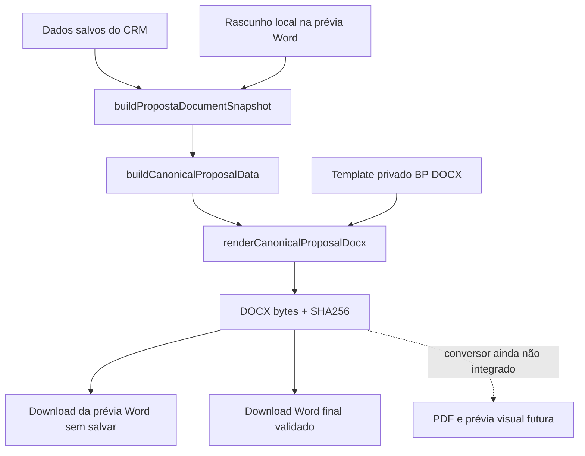

# Motor documental da proposta BP

## Situação da entrega — 02/09/2026

O Word oficial fornecido é a fonte canônica. O CRM gera uma prévia **em arquivo Word** a partir do rascunho e uma versão final a partir dos dados salvos, usando o mesmo payload e renderer. A composição institucional não é reconstruída em React.

**Limitação objetiva:** a visualização paginada no navegador e o download PDF estão temporariamente indisponíveis. O ensaio com `docx-preview@0.4.0` perdeu caixas de texto da capa e alterou a disposição dos objetos deste modelo. A biblioteca foi removida. Não foi encontrado um conversor DOCX → PDF operacional na aplicação. Portanto, o aceite de prévia visual no navegador permanece pendente; não se afirma equivalência visual entre o antigo preview e o Word.

## Diagnóstico e fontes

Referências analisadas integralmente: `docs/AUDITORIA-PROPOSTAS-CONTRATOS-PREVIEW.md`, `public/Propostas - BP.docx` e `public/Propostas - BP (1).pdf`.

Antes, `buildPropostaLivePreview`/`ProposalPagePreviewDocument` desenhavam páginas React, `renderPropostaDocx` preenchia outro modelo com pós-processamento XML e `renderPropostaPdf` criava um terceiro layout com pdf-lib. Existia também a rota Word legada `/proposta-docx`.

O DOCX fornecido contém 37 anchors e 24 conteúdos de caixas de texto no corpo (incluindo representações alternativas), 20 arquivos de mídia e composição adicional em cabeçalhos/rodapés. As biografias são imagens institucionais de página. Reconstruir esse material em HTML perderia a fonte visual da verdade.

O original e o exemplo gerado foram abertos no Microsoft Word instalado, em modo somente leitura, e exportados para PDF local para inspeção. O original tem seis páginas nesse Word. DOCX e PDF de referência não são perfeitamente coincidentes: logo/título/empresa da capa estão aproximadamente 26 pt acima no DOCX; o início do escopo e a caixa de vigência também têm diferenças de posição. Esses deslocamentos do arquivo-base foram preservados e registrados, sem redesenhar a composição. Não se afirma igualdade pixel a pixel com o PDF fornecido.

## Arquitetura atual

`CanonicalProposalData` reúne `templateData`, `escopoSections` e `generatedAt`. As regras existentes de empresa principal, escopo, consolidação de investimento, forma de pagamento, tributação e valores por extenso são reutilizadas.

O mesmo `generatedAt` é capturado ao abrir o editor e enviado nos dois pedidos. Para os mesmos dados canônicos e template, o DOCX é determinístico: metadados temporais das entradas ZIP são normalizados. As rotas retornam `X-Document-SHA256`; a versão oficial também retorna `X-Document-Version`. Não há cache de artefato entre pedidos: a igualdade pressupõe que dados, catálogo e template permaneçam iguais.

## Template privado e marcadores

Arquivo usado em runtime: `templates/proposta/PROPOSTA-BP-V1.docx`. O código não carrega os arquivos públicos enviados pelo usuário. Esses originais foram preservados como referências locais.

| Marcador no Word | Origem |
| --- | --- |
| `[EMPRESA]` | Empresa principal resolvida do intake e `cp_proposta_empresas_json` |
| `[RESPONSAVEL]` | Campo **Enviado por**, salvo em `document_instances.data_json.responsavel` |
| `[DATA_PROPOSTA]` | Data por extenso em `America/Sao_Paulo` |
| `[@ESCOPO_AREAS]` | Parágrafos OOXML gerados dos blocos de escopo do catálogo |
| `[@INVESTIMENTO]` | Investimento consolidado, pagamento, tributação e extenso |
| `[DATA_VIGENCIA]` | Data local da geração + sete dias, preservando a regra existente |

O prefixo `@` é o marcador raw XML do docxtemplater. O cliente envia somente campos de dados; não pode enviar XML, caminhos de arquivo ou substituir o template. Texto dinâmico é escapado antes da inserção no Word.

Não havia uma fonte inequívoca para o remetente. `oportunidades.criado_por` identifica o criador e não demonstra responsabilidade comercial. Por isso foi incluído o campo explícito **Enviado por**, sem nome padrão e obrigatório para a versão final. Não foi necessário alterar schema ou criar migration. Nomes institucionais nas biografias e assinaturas continuam no modelo.

Preparação reproduzível por `scripts/prepare-proposta-bp-template.py`:

- Corrige o marcador truncado `[INVESTIMEN` para `[@INVESTIMENTO]`.
- Troca o marcador de escopo por `[@ESCOPO_AREAS]`.
- Substitui a data fixa `08/09/2026` por `[DATA_VIGENCIA]`. Essa ocorrência está sobreposta pela imagem do perfil do sócio no modelo; não foi deslocada nem eliminada.
- Remove apenas `w:lastRenderedPageBreak`, cache de paginação do editor. Quebras manuais reais continuam no documento.
- Acrescenta estilos Word para blocos variáveis. Corpo Times New Roman 12 pt, títulos de área 14 pt em negrito, parágrafos justificados, espaçamento posterior de 8 pt e entrelinha 278/240, conforme tipografia/regras do arquivo-base. Títulos acompanham o próximo parágrafo; o corpo pode dividir entre páginas.
- Copia as demais partes ZIP sem alteração: mídias, relationships, cabeçalhos, rodapés e conteúdo institucional. Não usa round-trip por python-docx para reconstruir desenhos.

Há uma única seção por área e rótulos de subtipo em negrito. O escopo usa parágrafos reais; não há cálculo manual de altura/paginação. A preservação de imagens e partes gráficas é verificada por hashes.

O identificador legado `MODELO-PROPOSTA-1.docx` é aceito como alias do template privado, para continuar usando a linha já existente em `document_templates`. Caminhos desconhecidos são rejeitados. `next.config.ts` inclui explicitamente o template no tracing das funções de proposta.

## Editor, prévia, salvamento e Word

**Baixar prévia Word** envia os campos atuais e o responsável para `POST /api/crm/leads/:id/document/preview`. Esse endpoint é somente leitura: aceita pendências, mescla o draft sobre os campos do banco e retorna o DOCX canônico, sem criar versão ou persistir o draft. O arquivo incompleto é uma prévia, identificada pelo nome de download.

Não há requisição por tecla nem debounce de renderização: a prévia é solicitada por botão enquanto o visualizador não estiver disponível. A interface indica a indisponibilidade visual, oferece a prévia Word e mantém o PDF desabilitado. A implementação React que desenhava páginas foi retirada.

**Gerar Word** verifica as pendências do draft atual, salva os campos alterados pelas APIs já existentes e aguarda cada resposta. Depois salva o responsável e solicita a geração oficial. Qualquer falha HTTP ou resposta sem `ok: true` interrompe a sequência e aparece no editor. O estado salvo não é avançado por simples eco do rascunho; depende de confirmação da API. O salvamento restrito de escopo atualiza somente a área efetivamente enviada.

As operações do editor são serializadas, com estados de carregamento e bloqueio de edição/fechamento durante a operação. O recebimento valida MIME e assinatura ZIP antes do download; URLs de Blob são revogadas após o uso e na desmontagem.

No servidor, `generatePropostaFile` relê os dados persistidos e revalida empresa, documento, responsável, áreas/itens, investimento e campos obrigatórios. O DOCX é renderizado antes de gravar qualquer metadado de versão. Falha de renderização não cria versão. A versão guarda dados canônicos, campos, timestamp e hashes do DOCX/template.

O Word tem cerca de 8,96 MB devido às imagens originais. As respostas utilizam `ReadableStream` em blocos de 64 KiB, sem `Content-Length`, preservando todos os bytes. Isso segue a orientação de streaming para respostas acima do limite de 4,5 MB de funções Vercel com resposta em buffer. O transporte foi testado localmente; não houve deploy nesta tarefa. [Documentação Vercel](https://vercel.com/kb/guide/how-to-bypass-vercel-body-size-limit-serverless-functions).

## APIs

Todas as rotas de geração continuam autenticadas e restritas a `admin`/`comercial`.

| Rota | Comportamento |
| --- | --- |
| `POST /api/crm/leads/:id/document/preview` | DOCX binário do rascunho; substitui o antigo JSON visual |
| `POST /api/crm/leads/:id/document/generate-docx` | DOCX binário dos dados salvos, validado e registrado como versão |
| `POST /api/crm/leads/:id/document/generate-pdf` | HTTP 503 com mensagem de indisponibilidade; não gera layout paralelo |
| `PATCH /api/crm/leads/:id/document` | Persiste `data.responsavel`; exige modelo ativo do tipo proposta |
| `POST /api/crm/leads/:id/proposta-docx` | HTTP 410 orientando usar a rota canônica |

Os pedidos de geração aceitam `templateId` e `generatedAt`; a prévia também aceita `draftValues` (`cp_*`) e `responsavel`. Schemas Zod restringem formatos e tamanhos. A geração final usa o responsável salvo, nunca um override não persistido.

## Prévia visual/PDF: ensaio e próximo passo

`docx-preview@0.4.0` foi instalado apenas para ensaio local com o arquivo real, em navegador. A capa perdeu os textos de DrawingML; os objetos flutuantes mudaram de posição e a separação de páginas não reproduziu o Word. A inspeção do parser confirmou que a composição com caixas `wps` desse arquivo não é tratada como as imagens `pic`. O pacote foi removido e não permanece como dependência. A limitação é deste template com essa biblioteca, não uma alegação genérica de incompatibilidade com React 19/Next 16. [Código da biblioteca](https://github.com/VolodymyrBaydalka/docxjs).

A alternativa apropriada é converter **os bytes DOCX já gerados** em PDF e exibir esse PDF, mantendo o Word original para download. Uma integração Microsoft Graph pode converter DOCX armazenado em drive para PDF; um serviço interno LibreOffice também oferece conversão. Ambos precisam passar pela comparação deste mesmo modelo antes da adoção. Não existe fidelidade presumida só por aceitar DOCX. [Microsoft Graph](https://learn.microsoft.com/en-us/graph/api/driveitem-get-content-format?view=graph-rest-1.0), [LibreOffice](https://help.libreoffice.org/latest/en-US/text/shared/guide/pdf_params.html).

Antes de integrar, é necessário definir qual serviço já está disponível e como ele armazenará temporariamente o documento. Nenhum arquivo foi enviado a esses serviços e nenhuma infraestrutura externa foi criada. O Microsoft Word instalado nesta máquina serviu apenas para QA local; não é um conversor disponível nas funções de produção.

Quando houver conversor validado, a prévia automática deverá usar debounce de aproximadamente 600 ms, cancelamento/token de geração, retenção da imagem anterior durante atualização e descarte de resultados obsoletos. PDF e Word devem compartilhar a mesma geração identificada por hash. Esses mecanismos não foram simulados para uma prévia inexistente.

## Arquivos desta implementação

Criados:

- `templates/proposta/PROPOSTA-BP-V1.docx`
- `scripts/prepare-proposta-bp-template.py`, `scripts/verify-proposta-bp.ts`
- `src/lib/crm/proposta-word-blocks.ts`
- `src/lib/crm/proposta-render-request.ts`
- `src/lib/crm/proposta-document-client.ts` e teste
- `src/lib/crm/proposta-document-validation.ts` e teste
- `src/lib/crm/proposta-escopo-draft.ts` e teste
- `src/lib/crm/proposta-docx-stream.ts` e teste
- `src/lib/crm/canonical-proposal.test.ts`, `src/lib/crm/proposta-document-flow.test.ts`
- `docs/PROPOSTA-DOCUMENT-ENGINE.md` e `docs/superpowers/plans/2026-09-02-proposta-document-engine.md`

Alterados:

- `src/lib/crm/proposta-docx-data.ts`, `proposta-document-data.ts`, `render-proposta-docx.ts`
- `src/lib/crm/generate-proposta-file.ts` (já existia não rastreado no checkout)
- `src/app/(crm)/crm/leads/[id]/proposta-document-builder.tsx`
- `src/app/(crm)/crm/leads/[id]/proposta-escopo-por-area.tsx`
- As cinco rotas descritas acima (a rota PDF já existia não rastreada)
- `next.config.ts`, `.gitignore`, `docs/system-context.md`
- `src/lib/crm/render-proposta-pdf.ts`: somente anotação de depreciação; implementação anterior preservada, sem consumidores em produção

Nenhum arquivo de produção foi excluído. `ProposalPagePreviewDocument`, seu estado/JSX documental e imports antigos foram removidos do builder. Os helpers/DTOs legados e renderer PDF permanecem deprecados para testes de regressão; não são chamados pelas rotas de proposta. O script antigo que gerava outro modelo também não é o processo de preparação do template oficial.

Nenhuma dependência de produção adicionada. São reutilizados docxtemplater, pizzip e demais bibliotecas já presentes. Python/lxml são necessários apenas para preparar o template; Microsoft Word/PDFium foram ferramentas locais de QA. As alterações prévias de `pdf-lib` em package.json/lock e demais mudanças alheias da árvore de trabalho foram preservadas. Não houve stage, commit, push, deploy ou migration remota.

## Como trocar o template

1. Produzir uma nova versão editável do Word mantendo os marcadores e estilos necessários. Manter o arquivo canônico fora de `public`.
2. Para reaplicar a preparação ao original fornecido, executar `python scripts/prepare-proposta-bp-template.py` na raiz do CRM. Opcionalmente passar o caminho do DOCX original como primeiro argumento. O script é específico deste modelo e falha se os marcadores esperados mudarem; não aplicar cegamente a um layout novo.
3. Para uma nova versão oficial, gerar um arquivo com novo nome em `templates/proposta`, atualizar a constante/allowlist de `render-proposta-docx.ts` e os testes correspondentes. Se necessário, atualizar o cadastro do modelo pelo fluxo administrativo autorizado. Não aceitar caminho arbitrário vindo do browser.
4. Executar os testes do motor, gerar fixtures com `npx tsx scripts/verify-proposta-bp.ts` e abrir os documentos no Word. Comparar capa, institucional, todas as páginas variáveis, perfis e fechamento com a referência aprovada.
5. Confirmar a inclusão do template no tracing do build. Atualizar esta documentação com o nome e resultado visual da nova versão.

## Validação e limites

Os testes cobrem template privado obrigatório, tags, assinatura ZIP, XML, caracteres especiais, mídia/relationships/cabeçalhos preservados, geração determinística, empresa/responsável/datas de São Paulo, vigência +7, escopo vazio, múltiplas áreas, mensal, parcelamento, tributação, extenso, validação de pendências, falhas de save, baseline do escopo, MIME/ZIP de download e transporte de 9 MB com cancelamento.

A fixture Zincatec usa dados sintéticos: empresa solicitada, responsável de teste, áreas Trabalhista e Societário e Contratos, R$ 19.100,48 mensal e data de geração 02/09/2026 (vigência 09/09/2026). O texto variável é fixture de teste; não representa contratação real. `tmp/proposta-engine` contém Word/PDF e imagens locais, ignorados pelo Git.

| Comparação visual no Word | Resultado |
| --- | --- |
| Capa | Fundo, logo, título, empresa, remetente/data e redes preservados; diferença de posição DOCX/PDF original registrada |
| Quem Somos | Texto institucional, indicadores, marca d'água e reconhecimentos preservados |
| Escopo/investimento | Área e subtipos dinâmicos, texto justificado, valor e extenso preenchidos; sem tags residuais |
| Sócios | Fotos, nomes, textos, ícones e grafismos preservados |
| Fechamento | Assinaturas e identidade preservadas; vigência preenchida |
| Exemplo padrão | Seis páginas; Word abriu sem recuperação |
| Escopo extenso | Nove páginas; conteúdo flui e desloca os perfis/fechamento sem sobreposição |

Verificação automatizada final: 51 arquivos de teste e 334 testes passaram. Os testes de fluxo exercitam as rotas com mocks, incluindo ausência de mutações na prévia, renderer compartilhado e falha de renderização antes da criação de versão. TypeScript e build passaram; o template foi localizado nos manifests de tracing das rotas.

Limites remanescentes:

- Prévia visual no navegador e PDF dependem do conversor descrito acima. A alternativa disponível nesta entrega é a prévia em arquivo Word.
- Não houve exercício ponta a ponta com sessão autenticada e persistência real no CRM; os saves foram testados com respostas simuladas. Nenhum dado de produção foi alterado na validação.
- Salvamento por campo não é transacional. Uma falha intermediária pode deixar parte dos campos salva, mas impede exportação e não marca todo o draft como confirmado.
- O versionamento existente continua com inserts/updates separados; não resolve corrida entre clientes simultâneos. Não se introduziu versionamento jurídico nem nova migration.
- `generated_file_path` é metadado: não foi implantado armazenamento durável dos bytes. Hash/snapshot registram a geração, mas não substituem um arquivo arquivado.
- Nomes excepcionalmente longos podem exceder as caixas fixas da capa oficial. Não foram impostos limites visuais inventados nem reduzida automaticamente a tipografia.
- A equivalência visual foi observada no Word local e não é garantia para outros renderizadores/fontes/versões.

## Resultado dos comandos obrigatórios

| Comando | Resultado |
| --- | --- |
| `npm test` | Aprovado: 51 arquivos, 334 testes |
| `npx tsc --noEmit` | Aprovado, exit 0 |
| `npm run build` | Aprovado, exit 0; 67 páginas estáticas e rotas dinâmicas compiladas |
| `npm run lint` | Falha preexistente: 1 erro em `src/components/crm/app-shell.tsx:402` (`react-hooks/set-state-in-effect`) e 10 avisos; nenhum erro novo no escopo |

`app-shell.tsx` foi comparado ao HEAD e não possui alterações locais. Logs finais estão em `tmp/proposta-engine/{tests,typescript,build,lint}-final.log`. A revisão adicional do save de escopo confirmou que o eco do draft não avança mais o estado salvo.
