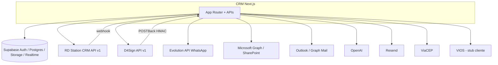
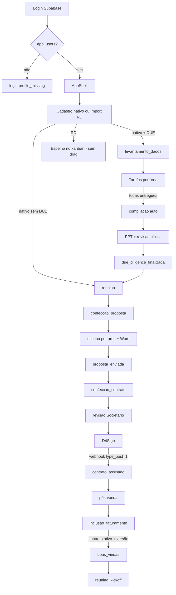

# CRM Jurídico — manual técnico de ponta a ponta

Documento gerado a partir do código em `crm/` e do schema/dados do projeto Supabase ligado (`user-supabase-crm-new`), em **1 de setembro de 2026**.

Se este arquivo e o código divergirem, **o código prevalece**. O contexto operacional mais curto para agentes continua em `docs/system-context.md`; este arquivo é o mapa completo.

---

## Índice

1. [O que o sistema é](#1-o-que-o-sistema-é)
2. [Stack e organização do código](#2-stack-e-organização-do-código)
3. [Como um pedido atravessa o sistema](#3-como-um-pedido-atravessa-o-sistema)
4. [Autenticação, sessão e autorização](#4-autenticação-sessão-e-autorização)
5. [Modelo de dados](#5-modelo-de-dados)
6. [Funis, etapas e motor de workflow](#6-funis-etapas-e-motor-de-workflow)
7. [Ciclo de vida do lead](#7-ciclo-de-vida-do-lead)
8. [Kanban](#8-kanban)
9. [Ficha do lead](#9-ficha-do-lead)
10. [Due diligence por área](#10-due-diligence-por-área)
11. [Proposta e catálogo de escopos](#11-proposta-e-catálogo-de-escopos)
12. [Contrato no lead e D4Sign](#12-contrato-no-lead-e-d4sign)
13. [Gerenciador de contratos e faturamento](#13-gerenciador-de-contratos-e-faturamento)
14. [Clientes, indicadores e dashboard](#14-clientes-indicadores-e-dashboard)
15. [Notificações, notas e histórico](#15-notificações-notas-e-histórico)
16. [Administração](#16-administração)
17. [Integrações externas](#17-integrações-externas)
18. [Jobs agendados](#18-jobs-agendados)
19. [Catálogo de APIs](#19-catálogo-de-apis)
20. [Realtime](#20-realtime)
21. [Storage](#21-storage)
22. [RPCs e funções SQL](#22-rpcs-e-funções-sql)
23. [UI, shell e padrões obrigatórios](#23-ui-shell-e-padrões-obrigatórios)
24. [Variáveis de ambiente](#24-variáveis-de-ambiente)
25. [Testes, CI e qualidade](#25-testes-ci-e-qualidade)
26. [Estado real do banco e limites](#26-estado-real-do-banco-e-limites)
27. [Mapa de pastas](#27-mapa-de-pastas)

---

## 1. O que o sistema é

CRM operacional de um escritório de advocacia (Bismarck Pires / “CRM Jurídico”). Cobre o funil comercial da abertura do lead até o kick-off de pós-venda, com:

- **Pipeline de vendas** (kanban) e **pós-venda**
- **Due diligence (DUE)** por área de prática, com tarefas, revisão e ajustes
- **Proposta** por área (catálogo + Word/DOCX + notificações)
- **Contrato** (builder DOCX + revisão Societário e Contratos + envio D4Sign)
- **Carteira contratual** (versões, cobrança, fechamentos, renovações, alertas)
- **Espelho do RD Station CRM** (importação + webhook; leads RD são só visualização no kanban)
- **Admin** de usuários, campos dinâmicos, catálogo, cláusulas, integrações

O produto **não** emite boleto, NF ou título financeiro. O VIOS continua sendo o sistema de contas a receber; o CRM só guarda a **referência** do lançamento.

Números no projeto remoto na data deste documento (ordens de grandeza):

| Entidade | Linhas |
|----------|-------:|
| `app_users` | 18 |
| `oportunidades` | 372 |
| `clientes` | 454 |
| `rd_deal_reconciliacao` | 370 |
| `lead_intakes` (cadastros nativos do CRM) | 6 |
| `d4sign_documents` | 217 |
| `field_definitions` | 155 |
| `lead_activity_events` | 621 |

A maior parte das oportunidades veio do RD; o cadastro nativo (`POST /api/leads/new` → `lead_intakes`) é o fluxo “de verdade” para mover etapas no CRM.

---

## 2. Stack e organização do código

### 2.1 Stack

| Camada | Tecnologia |
|--------|------------|
| App | Next.js **16.2** (App Router), React **19**, TypeScript |
| UI | Tailwind **v4**, shadcn/ui, Base UI (`@base-ui/react`), Radix (dialog/popover/avatar), dnd-kit, Framer Motion, Lucide |
| Auth / DB | Supabase Auth + Postgres + RLS + Realtime + Storage |
| Validação | Zod 4 |
| Documentos | `docxtemplater` + PizZip (proposta/contrato), `unpdf` (PDF na importação de escopos), OpenAI (extração/consolidação) |
| Testes | Vitest |
| Deploy | Vercel (`vercel.json` com 3 crons) |
| Node | `>= 20.9` |

App em `crm/`. Dev: `npm run dev` (webpack). Entrada: `http://localhost:3000` → redireciona para `/login`.

### 2.2 Arquitetura em camadas

```
UI (src/app, src/components)
        │
        ▼
Route Handlers (src/app/api)  ← Zod na borda
        │
        ▼
Application (src/modules/*/application)  ← casos de uso
        │
        ▼
Domain (src/modules/*/domain)  ← regras puras, sem I/O
        │
        ▼
Infrastructure (repositórios Supabase, conectores HTTP)
```

Módulos:

- `src/modules/crm` — oportunidades, workflow, overview, abertura de demanda, e-mail de lead, conectores RD / D4Sign / Evolution / SharePoint / VIOS
- `src/modules/contracts` — dinheiro em **centavos (`bigint`)**, projeção anual, cálculo de fechamento, validação, rascunho, persistência

Helpers de produto (não são “domínio puro”, mas orquestram o CRM) ficam em `src/lib/crm`, `src/lib/d4sign`, `src/lib/auth`, `src/lib/scope-import`, `src/lib/microsoft-mail`, `src/lib/webhooks`.

### 2.3 Clientes Supabase

| Cliente | Arquivo | Uso |
|---------|---------|-----|
| Browser | `src/lib/supabase/client.ts` | Realtime, sessão no cliente |
| Server (cookies) | `src/lib/supabase/server.ts` | RSC, `requireAuth`, login |
| Admin (`service_role`) | `src/lib/supabase/admin.ts` | Quase todas as APIs de mutação; bypass de RLS |

Tipos gerados: `src/lib/supabase/database.types.ts` (PostgREST 14.5).

A UI **não** escreve nas tabelas financeiras. Route Handlers autenticam, checam capability e chamam RPC/`service_role`.

---

## 3. Como um pedido atravessa o sistema

### 3.1 Páginas `/crm/*`

1. `src/proxy.ts` (matcher `/crm`, `/crm/:path*`, `/login`) valida sessão Supabase Auth.
2. Sem `NEXT_PUBLIC_SUPABASE_*` → redirect `/login?reason=missing_supabase_env`.
3. Sem user em `/crm` → `/login?next=...`.
4. `/crm/admin/*` exige `app_users.role = admin`; senão redirect `/crm`.
5. `src/app/(crm)/crm/layout.tsx` chama `requireAuth`: precisa de user **e** linha em `app_users`. Sem perfil → `/login?reason=profile_missing`.
6. O layout monta `AppShell` com o utilizador da sessão.
7. A página (RSC ou client) lê dados via admin client ou `GET /api/crm/...`.

`/` (`src/app/page.tsx`) só faz `redirect("/login")`.

### 3.2 APIs autenticadas

1. `requireAuthApi()` / `requireAdminApi()` (`src/lib/auth/server.ts`).
2. Body/query validado com Zod.
3. Serviço de aplicação ou helper em `src/lib/crm`.
4. Persistência via `createSupabaseAdminClient()` e, nas mutações críticas, RPC atómica.
5. Efeitos colaterais: `lead_activity_events`, `crm_in_app_notifications`, WhatsApp, e-mail, SharePoint, D4Sign.
6. Resposta `{ ok, error?, ... }`.

### 3.3 Webhooks e crons

- Webhooks: segredo partilhado (RD) ou HMAC (D4Sign); fail-closed se o secret não existir.
- Crons: `Authorization: Bearer <CRON_SECRET>` ou `x-cron-secret`.

---

## 4. Autenticação, sessão e autorização

### 4.1 Identidade

- Login: e-mail + senha (Supabase Auth) em `/login` (`LoginForm`).
- Perfil de negócio: `app_users` ligado por `auth_user_id`.
- Campos: `full_name`, `role`, `area`, `avatar_url`.
- Avatar oficial: `src/lib/official-photos` sobrepõe `avatar_url` quando existe foto no catálogo interno (cache de processo 5 min).

Sem linha em `app_users`, o utilizador autentica mas **não entra** no CRM.

### 4.2 Papéis (`user_role`)

```
admin | comercial | controladoria | financeiro
```

| Papel | Papel típico |
|-------|----------------|
| `admin` | Tudo: admin UI, campos, catálogo, usuários, documentos órfãos D4Sign, transições, exclusão de lead |
| `comercial` | Kanban, ficha, DUE, proposta, contrato no lead, cadastro de lead, exclusão de lead **criado no CRM** |
| `controladoria` | Configurar/ativar contrato, aprovar fechamento, renovação/aditivo |
| `financeiro` | Ver contratos, preparar fechamento, consumos, referência VIOS |

`app_users.area` **não** decide capability de contrato. Decide:

- quem recebe tarefa DUE / revisão
- quem edita escopo da própria área (`canEditEscopoArea`)
- quem pede ao gestor de outra área para preencher escopo

Áreas de prática canónicas (`src/lib/crm/crm-areas.ts`):

```
Cível
Trabalhista
Societário e Contratos
Recuperação de Créditos
Tributário
Reestruturação e Insolvência
```

Áreas só de perfil interno: `Socio`, `Distressed Deals`, `Operacoes Legais`, `Outro`.

### 4.3 Capabilities de contrato

`src/lib/auth/crm-access-policy.ts`:

| Capability | Quem |
|------------|------|
| `view` | todos os 4 papéis |
| `configure`, `approve_closing`, `manage_renewal` | admin, controladoria |
| `ensure_draft` | admin, comercial, controladoria |
| `prepare_closing`, `register_vios` | admin, controladoria, financeiro |

Outras regras no mesmo ficheiro:

- `canPatchLeadDetail`: admin/comercial em tudo; outros só `cp_escopo_detalhe_json` se tiverem `area`
- `canViewD4SignDocument`: os 4 papéis
- `canViewD4SignDocumentRecord`: documento órfão (sem `oportunidade_id`) **só admin**

### 4.4 Guardas de admin de usuários

`evaluateAdminUserMutation` + RPCs `admin_change_user_role` / `admin_delete_user`:

- não apagar a própria conta
- não apagar / despromover o **último** admin
- senha inicial: ≥ 12 chars, minúscula, maiúscula, número (`adminInitialPasswordSchema`)

### 4.5 Proxy (`src/proxy.ts`)

Next.js 16 usa `proxy.ts` no lugar de `middleware.ts`. Não há `middleware.ts` neste repo.

---

## 5. Modelo de dados

Schema `public`, RLS ligado em todas as tabelas de negócio. Helper de role: existem **duas** funções `auth_user_role()` — `private` (policies antigas) e `public` (policies recentes). Ambas `SECURITY DEFINER STABLE` com `search_path = ''`.

### 5.1 Enums

| Enum | Valores |
|------|---------|
| `opportunity_stage` | ver [§6](#6-funis-etapas-e-motor-de-workflow) |
| `user_role` | `admin`, `comercial`, `controladoria`, `financeiro` |
| `demand_type` | `novo_lead`, `novo_contrato`, `aditivo` |
| `indicator_status` | `pendente_aprovacao`, `aprovado`, `mesclado` |
| `contract_status` | `rascunho`, `enviado`, `assinado` (legado de assinatura) |
| `contract_lifecycle_status` | `rascunho`, `em_revisao`, `ativo`, `suspenso`, `encerrado` |
| `contract_version_status` | `rascunho`, `ativa`, `substituida`, `cancelada` |
| `contract_closing_status` | `a_calcular`, `em_revisao`, `aprovado`, `lancado_vios`, `cancelado` |

### 5.2 Núcleo comercial

#### `app_users`

Utilizador interno. `auth_user_id` → `auth.users`. `role` + `area` + `avatar_url`.

#### `clientes`

Cadastro único por documento (dedupe em `dedupeClientesByDocument` na UI). Colunas: `razao_social`, `documento`, `email_principal`, `telefone_principal`.

#### `contatos_cliente`

Contactos extra do cliente (tabela existe; volume remoto atual: 0).

#### `oportunidades`

Unidade do pipeline. Colunas relevantes:

| Coluna | Função |
|--------|--------|
| `tipo` | `novo_lead` / `novo_contrato` / `aditivo` |
| `etapa` | enum do funil |
| `havera_due_diligence` | inclui bloco DUE na jornada |
| `solicitante_nome` | **razão social / nome do lead** (título no kanban) |
| `solicitante_email` | e-mail do colaborador solicitante interno |
| `criado_por` | `app_users.id` de quem abriu |
| `cliente_id`, `contrato_base_id` | para contrato/aditivo |
| `link_proposta`, `link_contrato` | pré-condições de transição |
| `d4sign_document_uuid`, `d4sign_status`, `d4sign_updated_at`, `d4sign_signers` | espelho D4Sign no card |
| `due_revision_cycle`, `due_compilacao_entrada_em`, `due_revisao_entrada_em` | ciclos DUE |
| `encerramento` | `ganho` / `perdido` (RD) |
| `indicador_nome_digitado` | nome livre de indicação |
| `crm_rd_field_overrides` | overrides locais de campos RD |

**Não confundir** `solicitante_nome` (empresa/lead) com o colaborador interno (`lead_intakes.solicitante_nome` + `solicitante_email`).

#### `lead_intakes`

1:1 com oportunidade **criada no CRM**. Empresas em `empresas_json`, áreas em `areas_analise[]`, DUE, reunião, tipo de lead, indicação, auditoria SharePoint.

#### `pipelines` / `stages`

Dois pipelines seedados: `vendas` (12 etapas) e `pos_venda` (5). A **autoridade da etapa da oportunidade** é `oportunidades.etapa`, não a tabela `stages`.

#### `field_definitions` / `field_values`

Campos dinâmicos por `pipeline_code` + `stage_code`. Valores em `field_values` com `entity_name = 'oportunidade'` e `entity_record_id = oportunidade.id`. `condition_json` controla visibilidade (`field_equals`, `field_contains`, `field_not_empty`, `field_in`).

Contagens ativas no remoto (aprox.): `confeccao_proposta` 23, `confeccao_contrato` 43, `cadastro_lead` 15, `inclusao_faturamento` 31, `cadastro_novo_cliente` 14 — total ~132 ativos (155 linhas na tabela, incluindo inativos).

#### `transicoes_etapa`

Auditoria de cada mudança de etapa (`etapa_origem`, `etapa_destino`, `alterado_por`).

#### `oportunidade_etapa_periodos`

Permanência materializada (entrada/saída) via trigger `sync_oportunidade_etapa_periodo`. Alimenta a timeline e “dias na etapa”.

#### `lead_activity_events`

Timeline unificada (ver [§15](#15-notificações-notas-e-histórico)).

#### `indicadores`

Fila de nomes de indicação. Status `pendente_aprovacao` notifica admins no dashboard.

#### `import_batches` / `rd_deal_reconciliacao`

Lote de import RD + snapshot do deal (`detalhes` JSON). Presença de reconciliação = lead **origem RD** = kanban view-only.

### 5.3 DUE

- `due_area_tasks` — uma linha por área no levantamento
- `due_area_review_tasks` — revisão por área **e ciclo** (`revision_cycle`)
- `due_documents` — metadados de PPT no bucket `due-documents`
- `whatsapp_due_config` — destinos Evolution por `use_case`

### 5.4 Proposta

- `proposal_scope_types` / `proposal_scope_subtypes`
- `proposal_investment_types` / `proposal_investment_subtypes`
- `proposta_escopo_solicitacao` — pedido de preenchimento por área (prazo default 72h)
- `document_templates` / `document_template_fields` / `document_instances` / `document_versions`
- `scope_import_*` — pipeline IA de importação de catálogo

O JSON operacional da proposta vive em `field_values` do campo `cp_escopo_detalhe_json` (não numa tabela própria). Chave reservada `__investimentoDocumento__` guarda tipo/subtipo e placeholders do investimento **consolidado** no Word.

### 5.5 Contrato no lead / assinatura

- `contract_review_tasks` — revisão Societário e Contratos (gate de envio D4Sign)
- `contract_clause_templates` — cláusulas admin
- `d4sign_documents` — catálogo local do cofre
- `d4sign_webhook_events` — POSTBack (idempotência na finalização)
- `d4sign_api_usage` — quota (limite default 10 req/hora)

### 5.6 Carteira contratual

- `contratos` — 1 contrato por `oportunidade_id` (índice único parcial)
- `aditivos` — aponta versões origem/resultante
- `contrato_responsaveis`, `contrato_versoes`, `contrato_areas`
- `contrato_componentes_cobranca`, `contrato_parcelas`
- `contrato_rateios_area`, `contrato_participacoes_socios`, `contrato_comissoes`
- `contrato_consumos_mensais`, `contrato_resolucoes_mensais`
- `contrato_fechamentos`, `contrato_fechamento_revisoes`, `contrato_fechamento_itens`
- `contrato_alertas`, `contrato_eventos`

### 5.7 Colaboração

- `crm_in_app_notifications` — `user_id` = `auth.users.id` (não `app_users.id`)
- `lead_notes` / `lead_note_mentions`
- `lead_email_notification_config` / `lead_email_notification_template` / `lead_email_microsoft_oauth`

### 5.8 RLS (matriz resumida)

Policies usam `(select auth.uid())` para evitar reavaliação por linha.

| Área | Leitura | Escrita browser |
|------|---------|-----------------|
| `app_users` | próprio ou admin | próprio ou admin |
| `clientes` | autenticados | comercial, admin |
| `oportunidades` | autenticados | insert comercial/admin; update criador/admin; delete admin |
| `pipelines` / `stages` / `field_definitions` | autenticados | admin |
| `indicadores` | autenticados | admin, controladoria |
| `transicoes_etapa` | autenticados | insert comercial/admin |
| `import_batches` | admin | admin |
| `rd_deal_reconciliacao` | admin, controladoria | admin |
| Tabelas financeiras `contrato_*` | autenticados | **sem** INSERT/UPDATE/DELETE de browser — só RPC `service_role` |
| `d4sign_webhook_events`, `scope_import_*` | RLS on, sem policy de user típica | service role |

---

## 6. Funis, etapas e motor de workflow

### 6.1 Jornada permitida

`getAllowedJourney(hasDueDiligence)` em `src/modules/crm/domain/workflow.ts`.

**Com DUE** (`havera_due_diligence = true`):

```
cadastro_lead
→ levantamento_dados → compilacao → revisao → due_diligence_finalizada
→ reuniao → confeccao_proposta → proposta_enviada
→ confeccao_contrato → contrato_elaborado → contrato_enviado → contrato_assinado
→ aguardando_cadastro → cadastro_novo_cliente → inclusao_faturamento
→ boas_vindas → reuniao_kickoff
```

**Sem DUE**: o bloco `levantamento_dados`…`due_diligence_finalizada` é omitido. Cadastro nativo já nasce em `reuniao`.

`canMoveToStage` permite **avançar ou voltar exatamente uma etapa** (sem pular). Isto é regra de domínio; o kanban RD **não** chama esta API.

### 6.2 Labels e colunas do kanban

Labels: `src/lib/crm/stage-labels.ts`.

Kanban de **vendas** (`SALES_PIPELINE_COLUMNS`) **não** inclui `cadastro_lead`. Começa em Levantamento. `cadastro_lead` só aparece como coluna extra quando o toggle RD está ligado (leads ainda no RD nessa etapa).

Kanban de **pós-venda**: as 5 etapas `POS_VENDA_PIPELINE_COLUMNS`.

### 6.3 Pré-condições de payload

`validateStagePreconditions` (`workflow-rules.ts`):

| Destino | Exige |
|---------|--------|
| `proposta_enviada` | `linkProposta` |
| `contrato_elaborado` | `linkContrato` |
| `contrato_assinado` | `linkContrato` |
| `inclusao_faturamento` → `boas_vindas` | `financeiroConcluido` (contrato ativo + versão ativa + responsáveis + componentes) |

Bloqueio de faturamento: código `contract_billing_setup_required`, CTA para `/crm/contratos/{id}?setup=1` ou ensure draft.

### 6.4 Pré-condições extra na API de transição

`POST /api/crm/leads/transition` acrescenta:

| Destino | Extra |
|---------|--------|
| `reuniao` | local + data + hora da reunião (`lead_intakes` ou modal) |
| `revisao` | ≥ 1 PPT em `due_documents`; se já houve ciclo, todos os ajustes do ciclo anterior concluídos |
| `due_diligence_finalizada` | ciclo ≥ 1 e **todas** as `due_area_review_tasks` do ciclo em `ok` |
| qualquer etapa | `field_definitions` ativos da etapa destino, com `condition_json` e `is_required` |

Campos dinâmicos são filtrados/deduplicados em `compute-transition-requirements.ts` (esconde `cp_razao_social`/`cp_cnpj` na ida para proposta; não pede link duplicado em `proposta_enviada`).

### 6.5 Quem pode transitar

Só `admin` ou `comercial`. Lead com linha em `rd_deal_reconciliacao.detalhes` → **403** (`RD_KANBAN_VIEW_ONLY_MESSAGE`). A etapa desses leads muda no RD e entra pelo import/webhook.

### 6.6 Persistência atómica

1. Domínio: `transitionOpportunity(...)` (puro).
2. RPC `transition_opportunity_atomic`:
   - `SELECT … FOR UPDATE` na etapa esperada
   - se a etapa já mudou → `OPPORTUNITY_STAGE_CONFLICT` (409)
   - atualiza `oportunidades`, opcionalmente `lead_intakes` e `field_values`
   - insere `transicoes_etapa`
   - se o destino é `contrato_assinado`, chama `ensure_contract_draft_for_opportunity`
   - se `inclusao_faturamento → boas_vindas`, aplica o gate de faturamento (`get_contract_billing_transition_state`)
3. Depois da RPC: activity event, sync DUE/proposta, alertas de implantação.

`buildAtomicTransitionRpcArgs` monta os `p_*` da RPC.

### 6.7 Situação comercial

`getLeadPipelineSituation`:

- `perdidas` se `encerramento === "perdido"`
- `vendidas` se `encerramento === "ganho"` **ou** etapa `contrato_assinado`
- senão `em_andamento`

---

## 7. Ciclo de vida do lead

### 7.1 Abertura de demanda (domínio)

`validateOpenDemand` (`open-demand.ts`):

| Tipo | Exige |
|------|--------|
| `novo_lead` | nada |
| `novo_contrato` | `clientId` |
| `aditivo` | `clientId` + `contractId` |

O formulário de produção (`NewDemandForm` → `POST /api/leads/new`) implementa **só `novo_lead`**. Cross Selling na UI pode pré-preencher um cliente existente, mas o insert continua `tipo = novo_lead`. `novo_contrato` / `aditivo` existem no enum, na toolbar e no inferidor do import RD (`inferDemandType` pelo título do deal); não há rota de criação nativa.

### 7.2 Cadastro nativo (`POST /api/leads/new`)

Auth obrigatória. Body: `newLeadPayloadSchema`.

**Campos:**

- `solicitante` — colaborador interno
- `email` — e-mail do solicitante (vai para `oportunidades.solicitante_email`)
- `cadastrado_por` — e-mail de quem cadastrou
- `empresas[]` — CPF/CNPJ + razão social (mín. 1)
- `areas_analise[]` — subset de `CRM_PRACTICE_AREAS`
- `due_diligence` — `Sim` / `Nao`
- reunião (local sempre; data/hora obrigatórios se DUE)
- se DUE: `data_entrega_due` + `horario_entrega_due`; reunião ≥ próximo **dia útil** após o prazo da base
- `tipo_de_lead`: `Indicacao` \| `Lead Ativa` \| `Lead Digital` \| `Lead Passiva` \| `Cross Selling`
- se indicação: `tipo_indicacao` + `nome_indicacao`

**Persistência:**

1. `oportunidades`:
   - `tipo = novo_lead`
   - `etapa = levantamento_dados` se DUE, senão `reuniao`
   - `solicitante_nome` = razão social da **primeira empresa**
   - `criado_por` = `app_users.id` da sessão
2. `lead_intakes` 1:1
3. `lead_activity_events` kind `lead_criado`
4. Se indicação nova → `indicadores` `pendente_aprovacao` + notificação in-app para admins
5. Se DUE:
   - `syncDueAreaTasksForOpportunity`
   - WhatsApp Evolution (`whatsapp_due_config.use_case = due_diligence`)
   - item na lista SharePoint de agendamentos + auditoria no intake
6. E-mail de notificação **não bloqueante** (`sendLeadNotificationEmail` — Graph OAuth ou Resend)

Falhas de WhatsApp/SharePoint viram `warning` no JSON 201; o lead já existe.

### 7.3 Lead vindo do RD

`RdImportConnector` (`rd-import.ts`):

1. API v1 `https://crm.rdstation.com` (`deals` + `contacts`), páginas de 200, máx. 500.
2. Filtro por ano (criação **ou** atualização no ano; default = ano corrente no cron, 2026 no conector se chamado sem ano).
3. Upsert `clientes` + `oportunidades` + `rd_deal_reconciliacao` + `import_batches`.
4. Mapa de etapa: `RD_PIPELINE_STAGE_MAP` (rótulos PT, typos, sufixos de área).
5. Remapeamento comercial quando o RD ainda aponta `cadastro_lead`:
   - `encerramento = perdido` → etapa CRM `reuniao`
   - `encerramento = ganho` → etapa CRM `contrato_assinado` + RPC `ensure_contract_draft_for_opportunity`
6. `resolvePipelineEtapaFromDbAndRd`: se o snapshot RD já avançou e o CRM ainda está em `cadastro_lead`, a UI mostra a etapa do RD.
7. `origemRd` na UI **não** é coluna de `oportunidades`: deriva da existência de linha em `rd_deal_reconciliacao`.

Webhook `POST /api/integrations/rd/webhook`:

- exige `RD_WEBHOOK_SECRET` (senão 503)
- **só** header `x-rd-webhook-secret` (SHA-256 timing-safe). Query `?secret=` **não** é aceite.
- body Zod: `event_name`/`event` + `document`/`deal`/`data`; payload máx. 256 KB
- mesmo conector (`syncWebhookPayload`)

**No kanban, lead RD não se arrasta.** Etapa muda no RD.

### 7.4 Edição de campos na ficha

`PATCH /api/crm/leads/:id` aceita **exatamente um** de:

- `intakeField` — coluna de `lead_intakes`
- `rdField` — override em `crm_rd_field_overrides`
- `pipelineField` — `field_values`

`patchLeadDetail` aplica `canPatchLeadDetail`, grava activity (`campo_*_alterado`) e, no JSON de escopo, atualiza `proposta_escopo_solicitacao.concluido_em`.

### 7.5 Exclusão

`DELETE /api/crm/leads/:id` — admin/comercial → RPC `delete_crm_lead_atomic`.

A RPC está no SQL local (`20260727171000_atomic_crm_mutations.sql`) e nos types. Exige linha em `lead_intakes` e apaga `field_values` + `oportunidades` (CASCADE). No projeto remoto consultado **não havia função `delete_crm_lead_atomic`**. A exclusão atómica falha até essa migration estar aplicada. Sem intake: `LEAD_NOT_CREATED_IN_CRM`.

---

## 8. Kanban

Rota: `/crm/leads` (`leads/page.tsx`, client component).

### 8.1 Carga

1. `GET /api/crm/leads` (auth) monta `Oportunidade[]` com:
   - etapa resolvida (DB + snapshot RD)
   - owner RD → `app_users` por e-mail
   - solicitante interno (criado_por / e-mail)
   - avatares oficiais
   - resumos DUE, revisão, ajustes, escopo, signatários D4Sign, review de contrato
2. Enquanto `loading === true` **não** monta board vazio → `PipelineBoardSkeleton`.
3. Falha sem dados → `PipelineKanbanErrorState` + “Tentar de novo”.
4. Falha com dados → banner; board permanece.
5. Refresh silencioso (Realtime, pós-cadastro, sync) → `PipelineKanbanRefreshIndicator` (pulse ~3s).

### 8.2 Filtros (client-side)

- Tabs: **Vendas** / **Pós-venda**
- Situação: todos / em andamento / vendidas / perdidas
- Responsável (owner)
- Busca (≥ 3 caracteres)
- Toggle **“Leads do RD Station”**: default **off**, persistido em `localStorage` `crm.kanban.prefs.v1`. Sem chave → `false`. `origemRd === true` some do quadro.

### 8.3 Drag-and-drop

`PipelineBoard` (dnd-kit, `ssr: false`).

- Lead nativo: `POST /api/crm/leads/transition` + optimistic UI.
- Lead RD: bloqueado; tooltip da mensagem view-only.
- Modal de requisitos: `GET /api/crm/leads/transition-requirements` lista campos em falta **antes** de confirmar o drop.

### 8.4 Card

`pipeline-lead-card-content.tsx` + painéis em `pipeline-stage-panels.tsx`:

- `MeetingKanbanPanel`, `PropostaEscopoKanbanPanel`, `PropostaEnviadaKanbanPanel`
- `ContractReviewKanbanPanel`, `ContractSignersKanbanPanel`
- `DueLevantamentoKanbanPanel`, `DueRevisaoKanbanPanel`, `DueCompilacaoAdjustmentsKanbanPanel`
- tráfego de permanência (`stage-dwell-traffic`)

Nomes de pessoas: sempre `CrmUserLabel` (avatar + iniciais).

### 8.5 Realtime do quadro

Canal `crm-pipeline-oportunidades` (debounce ~200 ms) escuta `oportunidades`, `due_area_tasks`, `due_area_review_tasks`, `contract_review_tasks`, `d4sign_documents`. Sync de signatários: `use-pipeline-contract-signers-sync` (polling HTTP **só** com `NEXT_PUBLIC_D4SIGN_KANBAN_POLLING` ou `NODE_ENV=development`). Em produção: webhook + Realtime.

---

## 9. Ficha do lead

`/crm/leads/[id]` — RSC carrega `LeadDetailData`; UI em `lead-detail-view.tsx`.

### 9.1 Abas

| Tab | Quando |
|-----|--------|
| Visão geral | sempre |
| Proposta | etapa `confeccao_proposta` (e dados persistidos) |
| Contrato | etapa `confeccao_contrato` em diante |
| Faturamento | `inclusao_faturamento`, `boas_vindas`, `reuniao_kickoff` |
| DUE | se `haveraDueDiligence` |
| CRM / campos | campos de pipeline da etapa |
| Anotações | `lead_notes` |
| Assinatura | D4Sign |
| Histórico | timeline + períodos |

Hero: etapa, DUE sim/não, tipo de lead, badges Ganho/Perdido/RD, chips de reunião, `CrmUserLabel` (“Aberto por”, solicitante interno).

### 9.2 Realtime da ficha

`useLeadDetailRealtime` (debounce 300 ms) escuta:

`oportunidades`, `lead_activity_events`, `oportunidade_etapa_periodos`, `transicoes_etapa`, `due_area_tasks`, `due_area_review_tasks`, `contract_review_tasks`, `proposta_escopo_solicitacao`, `lead_notes`, `field_values`, `lead_intakes`.

### 9.3 Painel Due diligence operacional

`/crm/documentos` (não é biblioteca genérica). Só admin/comercial. Agrega prazos, pontualidade, PPT e timeline DUE de todos os leads com DUE (`DueDiligencePanel`).

---

## 10. Due diligence por área

### 10.1 Levantamento

Ao criar lead com DUE ou ao entrar em `levantamento_dados`: `syncDueAreaTasksForOpportunity` cria `due_area_tasks` para cada área de `lead_intakes.areas_analise` (ou equivalente).

Status: `pendente` → `em_andamento` → `disponibilizado`. Atraso derivado: `prazo_ate` no passado e ainda não disponibilizado (`getDueAreaTaskStatus`).

Entrega válida (`isDueAreaTaskDelivered`):

- `status = disponibilizado` **e** (`pasta_due_confirmada` **ou** `sem_processos_ativos`)

Checklist fixo (`DUE_AREA_TASK_CHECKLIST`): levantar bases, validar CNPJs, pôr arquivos na pasta, confirmar no CRM.

`PATCH /api/crm/leads/:id/due-area-tasks` atualiza status/pasta/sem processos. Quando **todas** as áreas entregam, `tryAutoAdvanceLevantamentoToCompilacao` move para `compilacao` (update direto + `transicoes_etapa` + notifica compilador). **Não** passa pela RPC de transição.

### 10.2 Compilação

- Marca `due_compilacao_entrada_em` na primeira entrada.
- Notifica o compilador: `notifyDueCompilationOwner`. Resolução hardcoded do auth user de **Leonardo Marques** (`leonardo.marques@bismarchipires.com.br`) em `due-area-tasks.ts`.
- PPT: `POST /api/crm/leads/:id/due-documents` (MIME PowerPoint) → bucket `due-documents`. Sem ≥ 1 PPT a API recusa ir para `revisao`.

### 10.3 Revisão (ciclos)

Cada ida a `revisao` incrementa `due_revision_cycle` e `due_revisao_entrada_em`.

- `syncDueAreaReviewTasksForOpportunity` cria tarefas do ciclo
- `notifyDueReviewAreas` avisa gestores da área
- `PATCH .../due-area-review-tasks`: `ok` ou `ajustes_solicitados` + observação
- Ajustes: `PATCH .../due-area-review-adjustments` marca `adjustment_completed_at`
- Voltar a revisão exige ajustes do ciclo anterior concluídos
- Ir a `due_diligence_finalizada` exige **todas** as tasks do ciclo em `ok`

Prazo default de revisão: 120 h.

### 10.4 Canais DUE

| Momento | In-app | E-mail Resend | WhatsApp Evolution | SharePoint |
|---------|--------|---------------|--------------------|------------|
| Cadastro com DUE | indicadores se houver | `sendLeadNotificationEmail` (Graph/Resend) | sim — `whatsapp_due_config.use_case = due_diligence` | item de agendamento |
| Levantamento (tarefa por área) | `due_area_task` | sim | **não** | — |
| Compilação | `due_compilacao` | — | — | — |
| Revisão / resposta | `due_revisao_area`, `due_revisao_resposta` | sim | sim (`sendDueWhatsappText`) | — |

---

## 11. Proposta e catálogo de escopos

### 11.1 Entrada na etapa

Transição para `confeccao_proposta` exige campos `cp_*` visíveis (qualificação, áreas objeto, objeto, etc.). `cp_areas_objeto` dispara `syncPropostaEscopoSolicitacoesForOportunidade`: uma `proposta_escopo_solicitacao` por área, gestor = `app_users.area` alinhada (`area-keys-alignment.ts`).

### 11.2 Preenchimento por área

JSON `cp_escopo_detalhe_json`: tipos/subtipos do catálogo + placeholders + textos.

Permissões (`proposta-escopo-permissions.ts`):

- admin: todas as áreas
- comercial sem `area`: todas
- comercial com `area`: só a sua
- comercial de outra área: `POST .../proposta-solicitar-escopo-area` pede ao gestor
- `POST .../proposta-notificar-outras-areas` avisa áreas em falta

Canais: in-app + WhatsApp grupo (`EVOLUTION_GROUP_JID`) + e-mail (`dispatchPropostaEscopoChannelNotifications`).

`refreshSolicitacaoConcluidaForEscopoJson` marca `concluido_em` quando tipo/subtipo/placeholders da área estão completos face ao catálogo.

### 11.3 Investimento no Word

Um parágrafo `[INVESTIMENTO]` com **total consolidado** (soma das áreas, editável, com forma de pagamento). Valores por área ficam no JSON para coordenação interna. Helper: `proposta-investimento-consolidado.ts` + parcelas `proposta-investimento-parcelas.ts`. Extenso: `proposta-valor-brl-extenso.ts`.

### 11.4 Geração DOCX

`POST /api/crm/leads/:id/proposta-docx`:

1. Lê intake + `field_values` + catálogo
2. `buildPropostaDocxTemplateData`
3. Template em disco (`readModeloPropostaTemplateBuffer`)
4. `renderPropostaDocx` (docxtemplater)

Há também o construtor genérico `document_*` (`/document`, `/document/preview`, `/document/generate-docx`) para modelos Ploomes-like.

Preview: `proposta-escopo-preview.ts`. Empresa principal: `proposta-empresa-principal.ts`.

ViaCEP: `GET /api/integrations/viacep?cep=` no modal de endereço da proposta.

### 11.5 Catálogo admin

`/crm/admin/proposta-escopo` + `GET/POST/PATCH/DELETE /api/admin/proposal-catalog`.

Leitura no lead: `GET /api/crm/proposal-catalog`.

### 11.6 Importação IA

`/crm/admin/proposta-escopo/importacao`:

1. `POST /api/admin/scope-import` — lote + signed URLs (máx. 40 ficheiros, 25 MB, PDF/DOCX)
2. Upload para `scope-import-documents`
3. `POST .../confirm` → estado `extraindo`
4. `POST .../process` — 1 documento / request (`maxDuration=120`): texto (`unpdf` / extração DOCX) + OpenAI (`SCOPE_IMPORT_OPENAI_MODEL_EXTRACTION`, default `gpt-4.1-mini`)
5. `POST .../consolidate` (`maxDuration=300`, modelo `gpt-4.1`) → `scope_import_suggestions`
6. Revisão humana: editar / aprovar (insere no catálogo) / rejeitar

Estados do lote em `scope-import/batch-state.ts`. Similaridade: `similarity.ts`.

---

## 12. Contrato no lead e D4Sign

### 12.1 Builder

Etapa `confeccao_contrato`: `ContratoDocumentBuilder` + cláusulas (`/api/crm/contract-clauses`, admin CRUD em `/api/crm/admin/contract-clauses`).

`GET/PATCH /api/crm/leads/:id/contrato` — instância/versão. Preview e DOCX: `.../contrato/preview` e `.../contrato/generate-docx` (`generate-contrato-docx.ts`).

### 12.2 Gate de envio

`contract-send-gate.ts`:

1. Campos do builder sem pendências
2. `contract_review_tasks.status === concluido`

Fluxo da task (`.../contrato/review-task`):

- `POST` cria/atualiza (prazo)
- Societário inicia (`em_revisao`) e conclui (`concluido`)
- Sem isto, `POST .../contrato/send-d4sign` recusa

Notificação: `contract_review_requested`.

### 12.3 Envio D4Sign

Dois caminhos equivalentes em espírito:

- `POST /api/crm/leads/:id/contrato/send-d4sign` (fluxo da ficha)
- `POST /api/integrations/d4sign/send` (multipart: PDF/DOC/DOCX/imagem, `opportunityId`, e-mail do signatário)

Cliente HTTP: `D4SignConnector` (`d4sign-client.ts`). Sequência: upload no cofre (`D4SIGN_SAFE_UUID`) → `createlist` → `sendtosigner` → `signaturelink`. Grava `link_contrato`, `d4sign_document_uuid`, timestamps. Se `D4SIGN_WEBHOOK_HMAC_SECRET` existir, regista webhook na D4Sign apontando para `/api/integrations/d4sign/webhook`.

Papéis de signatário: `CONTRATADA` (firma, catálogo `firm-signers.ts`) vs `CONTRATANTE` (cliente). Avatares: `signer-avatar-catalog.ts` / `resolveSignerAvatarUrl`.

`POST /api/integrations/d4sign/envelope` → **410**.

### 12.4 Webhook D4Sign

`POST /api/integrations/d4sign/webhook`:

- Fail-closed sem `D4SIGN_WEBHOOK_HMAC_SECRET` (503)
- Payload form-data, máx. 64 KB
- `Content-Hmac` = HMAC-SHA256 do UUID do documento
- `type_post` ∈ {1,2,3,4} (`isAllowedD4SignTypePost`)
- Insert em `d4sign_webhook_events`; falha de processamento → `processing_status=failed` + 503 Retry-After
- Atualiza signers JSONB e `d4sign_status`
- `type_post=1` (finalizado): `finalize_d4sign_opportunity`; se etapa `contrato_enviado` → `contrato_assinado` + activity + notificações (`contrato_assinado` / parcial / cancelado)

### 12.5 Catálogo D4Sign no hub

Rotas `/api/crm/d4sign/*`: vault, folders, import, vault-sync, sync, enrich-signers, link-lead, firm-signers, quota, health, debug, view PDF.

Quota: tabela `d4sign_api_usage`, janela 1 h, limite 10. View de PDF: `canViewD4SignDocumentRecord` (órfão só admin).

Cron `0 12 * * *` → `/api/cron/d4sign-sync`.

---

## 13. Gerenciador de contratos e faturamento

Migrations aplicadas no remoto (2026-08-13):

- `contract_management_schema`
- `contract_management_rls`
- `contract_management_workflow`

### 13.1 Ideia

Quando a oportunidade chega a contrato assinado / implantação, existe um `contratos` com versões. A configuração financeira completa-se na etapa `inclusao_faturamento`. Entrar na etapa **não** exige config; **sair** para `boas_vindas` exige contrato `ativo` + versão `ativa` + ≥1 responsável + ≥1 componente.

### 13.2 Dinheiro e cálculo

Domínio em `src/modules/contracts/domain`:

- `money.ts` — `MoneyCents` (`bigint`), parse BRL, sem float
- `billing-calculator.ts` — competência mensal
- `annual-reference.ts` — projeção
- `contract-validation.ts` / `partner-share-policy.ts`
- Tipos de componente: mensal fixo, preço fechado (parcelas), escalonado, variável processo/hora, condicionado, spot, manutenção, êxito %/fixo, acordo, km, reembolso, ajuste
- Imposto `added` | `included` em basis points
- Rateio área % ou valor; sócios e comissões

Consumo **manual** (`contrato_consumos_mensais`). Sem import automático de timesheet.

### 13.3 APIs

| Rota | Ação | Capability |
|------|------|------------|
| `POST /api/crm/contracts/ensure` | rascunho idempotente (`ensure_contract_draft_for_opportunity`) | `ensure_draft` |
| `PATCH /api/crm/contracts/:id/configuration` | grava só versão rascunho, concorrência otimista | `configure` |
| `POST /api/crm/contracts/:id/activate` | ativa versão; opcionalmente avança `inclusao_faturamento → boas_vindas` na mesma transação | `configure` |
| `GET/POST .../closings` | lista / prepara competência | view / `prepare_closing` |
| `GET/PATCH .../closings/:closingId` | resolve blocker, aprova, corrige, VIOS | conforme action |
| `GET/PUT .../consumptions` | substitui consumos da competência | `prepare_closing` na escrita |
| `GET/PATCH .../renewals/:alertId` | tarefa de renovação | `manage_renewal` |
| `POST .../versions` | clona rascunho; suspende / retoma / encerra | `configure` / `manage_renewal` |

UI: `/crm/contratos` (`ContractsHub` — Carteira, Fechamentos, Renovações, Indicadores, Assinaturas D4Sign) e `/crm/contratos/[id]` (`ContractDetailShell`, setup em etapas). `/crm/contratos/simulacao` é um **roteiro estático** de setup (IDs de teste), não um simulador de cálculo.

### 13.4 Job diário

`GET/POST /api/cron/contracts-daily` — `0 13 * * *` (UTC no `vercel.json`; lógica usa data de São Paulo). Upserts idempotentes de fechamentos/alertas (`generate-contract-alerts.ts`, `prepare-monthly-closing.ts`).

### 13.5 VIOS no fechamento

Aprovar fechamento ≠ emitir título. `register_contract_closing_vios` / `registrar_lancamento_vios_fechamento` gravam URL/referência. `GET /api/integrations/vios/client` ainda é **stub** (`vios_001`).

---

## 14. Clientes, indicadores e dashboard

### 14.1 Dashboard `/crm`

RSC `force-dynamic`. `SupabaseCrmRepository` + `getCrmOverview`:

- KPIs: oportunidades, clientes, contratos, indicadores pendentes
- Distribuição por etapa
- Fila `IndicatorApprovalQueue`

### 14.2 Clientes `/crm/clientes`

**Não é mock.** Lê `clientes` via admin, dedupe por documento, tabela razão / documento / e-mail / telefone. `GET /api/crm/clients` existe para o mesmo conjunto.

### 14.3 Indicadores

Criação implícita no cadastro de lead por indicação. Admin: `GET /api/admin/indicators`, `PATCH /api/admin/indicators/:id` (aprovar / mesclar).

---

## 15. Notificações, notas e histórico

### 15.1 In-app

Tabela `crm_in_app_notifications`. `user_id` = UUID do **Auth**. Payload JSON: `title`, `preview`, `path`, `originado_por` (snapshot; RLS impede join de `app_users` no browser).

Tipos (`in-app-notification-meta.ts`): indicadores, DUE (4), proposta, menção em nota, contrato assinado/parcial/cancelado, revisão de contrato, implantação/fechamento/renovação/excedente.

API: `GET /api/crm/notifications` (usa `getUser()` direto, não `requireAuthApi`), `PATCH /api/crm/notifications/:id` (marcar lida). Sino: `CrmNotificationsBell`. Página `/crm/notifications`. Realtime: `useCrmInAppNotificationsRealtime`.

Grupo “SLA de etapa” está preparado (`SLA_STAGE_NOTIFICATION_TIPOS`) mas **vazio** — não há job de SLA.

### 15.2 E-mail de lead

Admin: `/api/admin/lead-email-config` + OAuth Microsoft (`/api/admin/microsoft-mail/oauth/*`). Templates interpolados (`lead-email-interpolate.ts`, defaults em `lead-email-default-templates.ts`). Envio: Graph delegado ou Resend.

### 15.3 Notas

`GET/POST /api/crm/leads/:id/notes`, `PATCH/DELETE .../notes/:noteId`. Menções → `lead_note_mentions` + notificação `lead_note_mention`. Soft delete. Activity `nota_adicionada`.

### 15.4 Histórico

`recordLeadActivityEvent` kinds:

`lead_criado`, `etapa_alterada`, `campo_pipeline_alterado`, `campo_intake_alterado`, `campo_rd_alterado`, `proposta_escopo_concluido`, `proposta_escopo_reaberto`, `proposta_escopo_solicitado`, `nota_adicionada`, `due_dados_disponibilizados`, `due_revisao_aprovada`, `due_ajustes_solicitados`, `due_ajustes_concluidos`, `contrato_enviado`, `contrato_assinado`.

UI: `LeadLifecycleTimelinePanel` + períodos de `oportunidade_etapa_periodos`. `GET /api/crm/audit-timeline` responde **410 Gone** — substituído pela aba Histórico da ficha.

---

## 16. Administração

Todas as rotas `/crm/admin/*` passam pelo proxy (`role=admin`) **e** `requireAdmin` nas pages.

| Rota | Função |
|------|--------|
| `/crm/admin/usuarios` | CRUD `app_users` + Auth (`/api/admin/users`, `.../:id`, `.../:id/role`) |
| `/crm/admin/campos` | `field_definitions` + `ConditionBuilder` |
| `/crm/admin/documentos` | catálogo **read-only** de modelos DOCX (`document_templates` + campos) |
| `/crm/admin/proposta-escopo` | catálogo |
| `/crm/admin/proposta-escopo/importacao` | wizard IA |
| `/crm/admin/integracoes` | tabs: RD sync, WhatsApp DUE, Evolution address book, SharePoint, e-mail lead, Outlook OAuth |
| `/crm/admin/clausulas` | `contract_clause_templates` |

`/crm/perfil` — o próprio user edita nome, área, foto.

`DynamicForm` existe (`dynamic-form.tsx`) mas **não** está ligado ao `NewDemandForm` (cadastro continua schema Zod fixo).

---

## 17. Integrações externas



| Sistema | Estado | Notas |
|---------|--------|-------|
| RD Station | **real** | import + webhook + cron; kanban view-only |
| D4Sign | **real** | envio, webhook, vault, quota, PDF |
| Evolution WhatsApp | **real** se env | DUE + grupo de escopo |
| SharePoint Graph | **real** se env | lista de agendamentos DUE; `SHAREPOINT_INTEGRATION_SECRET` no POST interno |
| Microsoft Mail | **real** se OAuth | e-mail de lead |
| OpenAI | **real** se key | só importação de catálogo |
| Resend | **real** se key | fallback e-mail |
| ViaCEP | **real** | **público** (sem sessão); `?cep=` 8 dígitos; cache `revalidate: 3600` |
| VIOS cliente | **stub** | `vios_001` |
| VIOS lançamento | **manual** | URL/referência no fechamento |
| Relatório reconciliação | **real** | agrega `rd_deal_reconciliacao` (já não é stub de dados) |

HTTP externo passa por `fetchWithTimeout`.

Webhooks: `src/lib/webhooks/security.ts` — secret hashing timing-safe, limite de body, allowlist D4Sign `type_post`.

---

## 18. Jobs agendados

`crm/vercel.json` (UTC):

| Cron | Path | Uso |
|------|------|-----|
| `0 11 * * *` | `/api/cron/rd-full-import` | import RD do ano corrente (`maxDuration=300`) |
| `0 12 * * *` | `/api/cron/d4sign-sync` | sync cofre / documentos |
| `0 13 * * *` | `/api/cron/contracts-daily` | fechamentos e alertas (calendário America/Sao_Paulo) |

Auth: `CRON_SECRET` ≥ 8 chars; `Authorization: Bearer` ou `x-cron-secret`. Sem secret → 503.

Admin também dispara RD em `POST /api/admin/integrations/rd-sync` e `POST /api/integrations/rd/import`.

---

## 19. Catálogo de APIs

Convenção: JSON `{ ok: boolean, error?: string }`. Auth de sessão salvo indicação.

### 19.1 Leads e workflow

| Método | Rota | Auth | Função |
|--------|------|------|--------|
| GET | `/api/crm/leads` | sessão | lista kanban enriquecida |
| POST | `/api/leads/new` | sessão | cria lead nativo |
| GET | `/api/crm/lead-form-options` | sessão | opções do formulário |
| PATCH | `/api/crm/leads/:id` | sessão + policy | um campo (intake/RD/pipeline) |
| DELETE | `/api/crm/leads/:id` | admin/comercial | RPC delete atómica |
| POST | `/api/crm/leads/transition` | admin/comercial | muda etapa |
| GET | `/api/crm/leads/transition-requirements` | sessão | o que falta para o destino |
| POST | `/api/workflow/transition` | — | **410** |
| POST | `/api/workflow/validate` | — | **410** |
| GET | `/api/crm/audit-timeline` | — | **410** — usar aba Histórico |

### 19.2 DUE

| Método | Rota | Função |
|--------|------|--------|
| PATCH | `/api/crm/leads/:id/due-area-tasks` | levantamento |
| PATCH | `/api/crm/leads/:id/due-area-review-tasks` | revisão |
| PATCH | `/api/crm/leads/:id/due-area-review-adjustments` | ajustes |
| GET/POST | `/api/crm/leads/:id/due-documents` | lista / upload PPT; `?documentId=` signed URL |

### 19.3 Proposta e documentos

| Método | Rota | Função |
|--------|------|--------|
| POST | `/api/crm/leads/:id/proposta-docx` | Word da proposta |
| POST | `/api/crm/leads/:id/proposta-solicitar-escopo-area` | pede gestor |
| POST | `/api/crm/leads/:id/proposta-notificar-outras-areas` | notifica áreas |
| GET | `/api/crm/proposal-catalog` | catálogo para o lead |
| GET/PATCH | `/api/crm/leads/:id/document` | instância do construtor |
| POST | `/api/crm/leads/:id/document/preview` | preview |
| POST | `/api/crm/leads/:id/document/generate-docx` | DOCX genérico |
| GET | `/api/crm/document-templates` | modelos |

### 19.4 Contrato no lead

| Método | Rota | Função |
|--------|------|--------|
| GET/PATCH | `/api/crm/leads/:id/contrato` | builder |
| POST | `/api/crm/leads/:id/contrato/preview` | preview |
| POST | `/api/crm/leads/:id/contrato/generate-docx` | DOCX |
| GET/POST/PATCH | `/api/crm/leads/:id/contrato/review-task` | revisão Societário |
| POST | `/api/crm/leads/:id/contrato/send-d4sign` | envia se gate OK |
| POST | `/api/crm/leads/sync-contract-signers` | desnormaliza signers no kanban |
| GET | `/api/crm/contract-clauses` | cláusulas ativas |
| GET/POST/PATCH/DELETE | `/api/crm/admin/contract-clauses` | admin |

### 19.5 Contratos / faturamento

Ver [§13.3](#133-apis).

### 19.6 D4Sign

| Método | Rota | Função |
|--------|------|--------|
| POST | `/api/integrations/d4sign/send` | upload + sendtosigner |
| POST | `/api/integrations/d4sign/webhook` | POSTBack |
| POST | `/api/integrations/d4sign/envelope` | **410** |
| GET/POST | `/api/crm/d4sign/sync` | **deprecated** — chama `vault-sync` (compat); cron ou admin/comercial |
| POST | `/api/crm/d4sign/import` | **deprecated** — usar `vault-sync` |
| POST | `/api/crm/d4sign/vault-sync` | caminho canónico (pastas + docs) |
| GET | `/api/crm/d4sign/vault` | lista cofre (cache ~55 min) |
| GET | `/api/crm/d4sign/folders` | pastas |
| GET | `/api/crm/d4sign/firm-signers` | sócios |
| GET | `/api/crm/d4sign/quota` | janela 10/h |
| GET | `/api/crm/d4sign/health` | health |
| GET | `/api/crm/d4sign/debug` | admin; **404 em production** |
| GET | `/api/crm/d4sign/documents/:uuid/view` | PDF (policy) |
| GET/POST | `/api/crm/d4sign/link-lead` | liga órfão ↔ lead |
| POST | `/api/crm/d4sign/enrich-signers` | enriquece JSON |

### 19.7 Admin

| Método | Rota | Função |
|--------|------|--------|
| GET/POST | `/api/admin/users` | lista / cria Auth+perfil |
| PATCH/DELETE | `/api/admin/users/:id` | perfil / apaga |
| PATCH | `/api/admin/users/:id/role` | role (RPC) |
| GET/POST | `/api/admin/fields` | campos |
| PATCH/DELETE | `/api/admin/fields/:id` | campo |
| GET/POST/PATCH/DELETE | `/api/admin/proposal-catalog` | catálogo |
| * | `/api/admin/scope-import/**` | pipeline IA |
| GET | `/api/admin/indicators` | fila |
| PATCH | `/api/admin/indicators/:id` | aprovar |
| GET/PUT/DELETE | `/api/admin/whatsapp-due-config` | destinos WA |
| GET | `/api/admin/evolution-address-book` | grupos/números Evolution |
| GET/POST | `/api/admin/sharepoint-config` | site/lista |
| GET/PUT | `/api/admin/lead-email-config` | templates/destinos |
| GET/POST | `/api/admin/microsoft-mail/oauth/*` | authorize / callback / disconnect |
| POST | `/api/admin/integrations/rd-sync` | import manual |

### 19.8 Outras

| Método | Rota | Auth | Função |
|--------|------|------|--------|
| GET | `/api/crm/clients` | sessão | clientes |
| GET/POST | `/api/crm/leads/:id/notes` | sessão | notas |
| PATCH/DELETE | `/api/crm/leads/:id/notes/:noteId` | sessão | nota |
| GET | `/api/crm/notifications` | sessão | inbox |
| PATCH | `/api/crm/notifications/:id` | sessão | lida |
| GET | `/api/integrations/viacep` | **nenhuma** | CEP (8 dígitos) |
| GET | `/api/integrations/vios/client` | sessão | stub |
| GET | `/api/integrations/reconciliation/report` | admin | sumário RD |
| POST | `/api/integrations/rd/import` | service + token | import |
| POST | `/api/integrations/rd/webhook` | secret | sync evento |
| POST | `/api/integrations/sharepoint/agendamentos` | header `x-sharepoint-integration-secret` (igualdade literal) | cria item Graph |
| GET/POST | `/api/cron/*` | `CRON_SECRET` | jobs |

---

## 20. Realtime

Publicação `supabase_realtime` (migrations `realtime_*`). Hooks cliente:

| Hook | Tabelas | Onde |
|------|---------|------|
| `useLeadDetailRealtime` | 11 tabelas da ficha | `/crm/leads/[id]` |
| `use-in-app-notifications-realtime` | `crm_in_app_notifications` | sino / página |
| `useD4SignDocumentsRealtime` / `useOportunidadeRealtime` | `d4sign_documents`, UPDATE `oportunidades` | hub / builder |
| `use-contract-review-task-realtime` | `contract_review_tasks` | card / ficha |
| canal `crm-pipeline-oportunidades` | `oportunidades`, DUE, review, `d4sign_documents` | `/crm/leads` |

Sem Realtime, a UI depende de refresh manual ou crons.

---

## 21. Storage

Buckets **privados** (remoto):

| Bucket | Limite | MIME | Uso |
|--------|--------|------|-----|
| `due-documents` | — | PPT/PPTX na API | compilação DUE |
| `scope-import-documents` | 25 MB | PDF, DOCX, DOC | importação IA |
| `d4sign-contracts` | 50 MB | PDF | cópias locais de contrato |

Acesso: signed URL gerada no server (`service_role`). O browser não lista o bucket.

---

## 22. RPCs e funções SQL

Presentes no projeto remoto:

| Função | Papel |
|--------|--------|
| `private.auth_user_role` / `public.auth_user_role` | role do JWT para RLS |
| `transition_opportunity_atomic` | mudança de etapa + fields + intake + auditoria |
| `finalize_d4sign_opportunity` | fecha assinatura no lead |
| `admin_change_user_role` / `admin_delete_user` | guarda último admin |
| `ensure_contract_draft_for_opportunity` | rascunho 1:1 |
| `save_contract_configuration_atomic` | config rascunho |
| `activate_contract_version_atomic` | ativa versão (+ gate pós-venda) |
| `manage_contract_version_atomic` | clonar / suspender / encerrar |
| `get_contract_billing_transition_state` | estado do gate Boas-vindas |
| `create_contract_closing_revision` / `approve_contract_closing_revision` / `create_contract_closing_correction` | fechamento |
| `resolve_contract_closing_blocker` | libera blocker de cálculo |
| `upsert_contract_consumptions_atomic` | consumos da competência |
| `register_contract_closing_vios` / `registrar_lancamento_vios_fechamento` | referência VIOS |
| `guard_active_contract_version_immutability` | impede editar versão ativa |
| `guard_approved_contract_closing_revision` | imutável após aprovado/lançado |
| `set_updated_at*` | triggers `updated_at` |
| `sync_oportunidade_etapa_periodo` | materializa permanência |

No SQL local, mas **não listada no remoto** na auditoria desta data: `delete_crm_lead_atomic`.

Execute das RPCs de mutação: **só `service_role`** (REVOKE de `anon`/`authenticated` nas migrations atómicas).

---

## 23. UI, shell e padrões obrigatórios

### 23.1 AppShell

`src/components/crm/app-shell.tsx`.

- Sidebar **recolhida por defeito** (`88px`, `lg:pl-[88px]`). Expandida: `282px`.
- Preferência: `localStorage` `crm.sidebar.collapsed.v1`; ausência = recolhida.
- Hover no desktop expande temporariamente (`hoverExpanded`) sem gravar a preferência.
- Mobile: drawer overlay (`lg:hidden`), não “sempre recolhida”.
- Favoritos: `crm.sidebar.favorites.v1`. Grupos: `crm.sidebar.groups.v2`.
- Nav principal: Dashboard, Leads, Due diligence, Clientes, Contratos.
- Admin (se `role=admin`): Usuários, Campos, Documentos, Catálogo, Integrações, Cláusulas.
- Rodapé: `SidebarAccountMenu` (avatar, perfil, sair) + sino.

### 23.2 Nome + avatar

Regra: nunca só texto para user interno. `CrmUserLabel` (`name`, `avatarUrl`, `size`, `variant`). Iniciais tratam e-mail se o nome não resolveu. Solicitante interno: `fetchAppUsersByEmailLookup` + `resolveSolicitanteInternoDisplay`. Exceção: razão social no título do lead; automação RD/sistema.

### 23.3 Select e Dialog

- Preferir `CrmSelectContent` / `CrmSelectValue` / `CrmSelectItem` — nunca mostrar `all`, uuid, `__empty__` no trigger.
- Dialog + Select: `modal={false}` + `isInteractionFromBaseUiSelectLayer` em `onPointerDownOutside` / `onFocusOutside`. `SelectContent`: `side="bottom"` `align="start"`.

### 23.4 Visual

Root layout: Plus Jakarta Sans + Inter + Geist Mono, `lang="pt-BR"`, tokens `bg-crm-gradient-dark` / `glass-card`. Título metadata: “CRM Jurídico”.

---

## 24. Variáveis de ambiente

Fonte: `crm/.env.example`. `getAppEnv()` só **obriga** URL + anon key (+ opcional service/RD).

| Variável | Obrigatória para |
|----------|------------------|
| `NEXT_PUBLIC_SUPABASE_URL` | tudo |
| `NEXT_PUBLIC_SUPABASE_ANON_KEY` | tudo |
| `SUPABASE_SERVICE_ROLE_KEY` | APIs, webhooks, admin, import |
| `NEXT_PUBLIC_APP_URL` | webhooks, OAuth, links absolutos |
| `CRON_SECRET` | crons |
| `RD_CRM_TOKEN` / `RD_WEBHOOK_SECRET` | RD |
| `D4SIGN_TOKEN` / `D4SIGN_SAFE_UUID` | envio |
| `D4SIGN_API_BASE_URL` | prod vs sandbox |
| `D4SIGN_CRYPT_KEY` | se a conta exigir |
| `D4SIGN_WEBHOOK_HMAC_SECRET` | webhook + registo na D4Sign |
| `NEXT_PUBLIC_D4SIGN_KANBAN_POLLING` | só dev |
| `EVOLUTION_API_URL` (ou `BASE_URL`) / `EVOLUTION_API_KEY` / `EVOLUTION_INSTANCE` | WhatsApp |
| `EVOLUTION_GROUP_JID` | grupo de escopo |
| `RESEND_API_KEY` / `RESEND_FROM_EMAIL` | e-mail fallback |
| `MICROSOFT_TENANT_ID` / `SHAREPOINT_CLIENT_ID` / `SHAREPOINT_CLIENT_SECRET` | Graph app |
| `SHAREPOINT_SITE_ID` / `SHAREPOINT_AGENDAMENTOS_LIST_ID` | lista DUE |
| `SHAREPOINT_INTEGRATION_SECRET` | POST agendamentos |
| `OUTLOOK_FROM_EMAIL` | From Graph |
| `OPENAI_API_KEY` | importação de escopos |
| `SCOPE_IMPORT_OPENAI_MODEL_EXTRACTION` | default `gpt-4.1-mini` |
| `SCOPE_IMPORT_OPENAI_MODEL_CONSOLIDATION` | default `gpt-4.1` |
| `VIOS_API_KEY` | stub (ainda exigida pelo conector) |

---

## 25. Testes, CI e qualidade

```bash
npm run lint
npm test          # vitest run
npm run build
```

Outros: `verify:sheet`, `test:lead-email`, scripts de import/gerar modelo.

CI (`.github/workflows/ci.yml`): em push/PR para `main`/`master` — `npm ci`, test, lint, `tsc --noEmit`, build com placeholders Supabase.

Suítes representativas: workflow, atomic-transition, access policy, admin user guard, money/billing/Ingevity, rascunho/fechamento/alertas, scope-import, proposta JSON/DOCX/investimento, webhooks, fetch-with-timeout.

Padrões: regra de domínio fora da UI; Zod na borda; erro de negócio estruturado; Vitest em mudança de transição.

---

## 26. Estado real do banco e limites

### 26.1 O que já está ligado

- Auth + proxy + RLS
- Kanban e ficha com dados reais
- Transição atómica + DUE + proposta + D4Sign
- Hub de contratos **com schema aplicado** (há contratos, versões, componentes, 1 alerta)
- Import RD + webhook
- Notificações, notas, timeline
- Importação IA de escopos (lotes/documentos já existentes)

### 26.2 Lacunas honestas

- Autorização **fina de visibilidade** na UI (esconder botões por área em todos os ecrãs) ainda incompleta; as policies de API e algumas telas (DUE, admin, órfãos D4Sign, escopo por área) já filtram.
- `novo_contrato` / `aditivo` no domínio **não** têm formulário de produção.
- `DynamicForm` não está no cadastro.
- VIOS consulta = stub; emissão automática = fora de escopo.
- Consumo mensal = manual.
- Job de SLA de etapa = não implementado.
- `delete_crm_lead_atomic` no remoto: ver [§7.5](#75-exclusão).
- `GET /api/crm/audit-timeline` responde **410**.
- `GET /api/crm/d4sign/debug` responde **404** em production.
- `POST /api/crm/d4sign/sync` e `.../import` ainda respondem, mas estão `@deprecated` em favor de `vault-sync`.
- Compilador DUE resolvido por e-mail fixo (Leonardo) — ponto de configuração rígido.

### 26.3 Migrations

O Git em `crm/supabase/migrations/` **não** contém o histórico completo. O remoto tem dezenas de migrations (2026-04-13 → 2026-08-13) aplicadas via MCP/`apply_migration` com versões diferentes dos ficheiros locais (ex. `init_crm` remoto `20260413173906` vs ficheiro antigo citado no system-context).

Para DDL neste repo: gravar SQL em `crm/supabase/migrations/` **e** aplicar com MCP `user-supabase-crm-new` / `apply_migration`.

---

## 27. Mapa de pastas

```
crm/
  src/app/
    page.tsx                    → /login
    login/                      → Auth
    (crm)/crm/                  → páginas protegidas + AppShell
      page.tsx                  → dashboard
      leads/                    → kanban + ficha
      documentos/               → painel DUE operacional
      clientes/
      contratos/                → hub + [id] + simulacao
      notifications/
      perfil/
      admin/                    → usuarios, campos, documentos, proposta-escopo, integracoes, clausulas
    api/                        → Route Handlers
  src/components/crm/           → shell, kanban, D4Sign, contratos, admin
  src/modules/crm/              → domain / application / infrastructure
  src/modules/contracts/
  src/lib/crm/                  → DUE, proposta, RD, activity, patch, realtime…
  src/lib/auth/
  src/lib/d4sign/
  src/lib/scope-import/
  src/lib/supabase/
  src/proxy.ts
  supabase/migrations/          → subset versionado no Git
  docs/                         → este ficheiro, system-context, runbooks
  vercel.json
  .github/workflows/ci.yml
```

---

## Fluxo mestre (resumo visual)



---

*Fim do mapa. Para implementar ou alterar comportamento, atualize o código e este documento no mesmo ciclo.*
