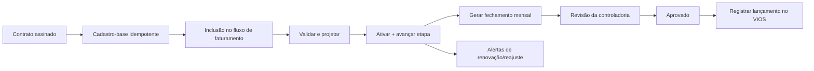

# Design: Gerenciador de Contratos e Faturamento

**Data:** 2026-08-12
**Abordagem:** núcleo contratual normalizado + componentes de cobrança + fechamentos mensais versionados
**Rotas principais:** `/crm/contratos`, `/crm/contratos/[id]` e etapa `inclusao_faturamento` do pós-venda
**Primeira entrega:** cadastro completo, painel, renovações, alertas, cálculo variável e rateios; sem emissão automática no VIOS

## 1) Contexto e problema

O CRM já conduz proposta, contrato, assinatura D4Sign e pós-venda, mas a gestão contratual financeira ainda não está estruturada. A tabela `contratos` atual guarda apenas cliente, título, status de assinatura, link e data de assinatura. A rota `/crm/contratos` funciona como painel do cofre D4Sign, não como carteira contratual.

O processo operacional combina informações de três fontes:

- proposta e contrato assinado;
- planilha mensal `FAT_OUT- 25.xlsx`;
- controles e lançamentos realizados no VIOS.

Na planilha, regras essenciais aparecem como observações livres: reajustes, escalonamentos, parcelas, cobranças por processo ou hora, manutenção, êxito, descontos, tributos, acordos e rateios. Esse formato dificulta validação, cálculo reproduzível, alertas e auditoria. A planilha analisada também contém fórmulas quebradas (`#REF!` e `#NAME?`), reforçando que ela não deve continuar como motor de regras.

O contrato analisado da Ingevity demonstra o requisito central: uma única mensalidade de R$ 14.600,00 cobre simultaneamente três áreas, cada uma com franquias próprias — Trabalhista (20 processos e 12 horas mensais), Cível (2 processos e 8 horas mensais) e Contratos/Societário (6 horas mensais). O contrato define vencimento, reajuste, tributos e KM, mas não define valor para excedentes. Logo, o sistema não pode representar a cobrança com um único tipo ou inventar preço quando a cláusula não o informar.

## 2) Objetivos de sucesso

1. Criar automaticamente um cadastro-base idempotente quando a oportunidade chegar a `contrato_assinado`.
2. Concentrar a definição financeira completa na etapa `inclusao_faturamento` do pós-venda.
3. Representar múltiplas áreas, franquias, rateios e componentes de cobrança no mesmo contrato.
4. Calcular cada competência com memória de cálculo legível, reproduzível e auditável.
5. Alertar sobre dados ausentes, excedentes sem preço, fechamento mensal e renovação/reajuste.
6. Preservar versões históricas quando houver aditivo ou mudança de condição comercial.
7. Impedir a saída de `inclusao_faturamento` enquanto o contrato não puder ser ativado com segurança.
8. Manter o VIOS como sistema de emissão e contas a receber na primeira entrega, registrando no CRM apenas a referência do lançamento.
9. Preservar integralmente o painel de assinaturas D4Sign já existente.

## 3) Fora de escopo da primeira entrega

- Criação automática de títulos, faturas ou notas no VIOS.
- Anexação automática do documento contratual no VIOS.
- Sincronização de pagamentos, recebimentos, inadimplência ou saldo do VIOS.
- Substituição do contas a receber ou da conciliação bancária.
- Disparo automático de e-mail ou WhatsApp ao cliente sobre reajuste ou renovação.
- Importação em massa da planilha histórica; contratos legados poderão ser cadastrados manualmente.
- Cálculo de folha, caixa, contas a pagar ou projeções bancárias presentes em outras abas da planilha.
- Aplicação da migration no Supabase remoto sem solicitação explícita.

## 4) Abordagens consideradas

### A — ampliar `contratos` com muitas colunas

Mais rápida no início, porém inadequada para múltiplas áreas, fases, parcelas e cobranças simultâneas. Criaria muitas colunas opcionais e repetiria o problema de regras escondidas em observações.

### B — núcleo contratual normalizado com componentes de cobrança

**Escolhida.** Separa identidade do contrato, versões, áreas, componentes financeiros, rateios, consumos e fechamentos. Permite cálculo tipado, histórico e testes sem exigir um motor de fórmulas genérico.

### C — motor genérico de fórmulas configuráveis

Flexível, mas complexo para autorizar, validar, explicar e manter. Não é necessário para os casos já mapeados e aumentaria o risco operacional.

## 5) Princípios do desenho

- Etiquetas classificam e facilitam busca; não armazenam fórmulas financeiras.
- A regra estruturada é a fonte de verdade; texto livre apenas complementa.
- Assinatura e gestão contratual possuem estados independentes.
- Uma versão ativada não é reescrita retroativamente.
- Fechamentos aprovados são fotografias imutáveis da competência.
- Nenhum valor adicional é presumido quando o contrato não define preço.
- Ajuste manual exige justificativa e fica auditado.
- Valores de honorários, tributos, reembolsos, participações e comissões permanecem discriminados.
- Regras de domínio ficam fora de componentes React e de integrações externas.

## 6) Ciclo de vida e integração com o pós-venda

### 6.1 Estados independentes

O status de assinatura existente permanece responsável pelo ciclo D4Sign (`rascunho`, `enviado`, `assinado` e estados detalhados no documento D4Sign). Um novo status de gestão controla a operação:

- `rascunho`: cadastro-base criado, ainda incompleto;
- `em_revisao`: preenchimento financeiro iniciado na etapa de faturamento;
- `ativo`: validado e apto a gerar fechamentos e alertas;
- `suspenso`: preservado, mas sem novos fechamentos automáticos enquanto durar a suspensão;
- `encerrado`: vigência finalizada; histórico permanece consultável.

### 6.2 Criação do cadastro-base

Quando uma oportunidade entrar em `contrato_assinado`, o sistema executará uma operação idempotente baseada em `oportunidade_id`. O rascunho receberá somente dados já confiáveis:

- oportunidade e cliente;
- título e documento assinado;
- data da assinatura;
- áreas, gestor, captador e condições encontradas na proposta como sugestões;
- referência D4Sign, quando disponível;
- fotografia dos campos de origem para rastreabilidade.

A existência de uma restrição única por `oportunidade_id` impedirá duplicidade, inclusive quando assinatura por webhook e transição manual ocorrerem próximas.

### 6.3 Definição em `inclusao_faturamento`

O cadastro financeiro completo não será exigido em `contrato_assinado`. Ao entrar em `inclusao_faturamento`, o CRM abrirá um fluxo específico que reaproveita os valores encontrados na proposta e no contrato, mas exige confirmação da controladoria.

Etapas do preenchimento:

1. Dados gerais, gestores e responsáveis.
2. Áreas, escopo, franquias e rateios.
3. Componentes de cobrança, tributos e vencimentos.
4. Origem, captador, comissão e participação dos sócios.
5. Vigência, reajuste, renovação e alarmes.
6. Projeção, validação final e ativação.

Ao entrar nessa etapa, o sistema cria uma tarefa de implantação financeira para a controladoria. A oportunidade só poderá avançar quando a ativação do contrato e a transição para a próxima etapa forem concluídas de forma atômica.

### 6.4 Validações para ativação

- cliente, vigência, primeiro vencimento e responsáveis obrigatórios preenchidos;
- ao menos um componente de cobrança ativo;
- períodos de componentes e versões sem sobreposição inválida;
- rateios percentuais que se aplicam ao mesmo valor fechando em 100%;
- participações dos sócios aplicáveis fechando em 100%;
- áreas referenciadas existentes no contrato;
- primeiro faturamento projetável ou marcado explicitamente como condicionado;
- renovação/reajuste e alarme definidos quando aplicáveis;
- motivo registrado para qualquer override de sugestão originada da proposta.

## 7) Modelo funcional

### 7.1 Contrato

`contratos` continua sendo a entidade de identidade e ciclo de vida. Será ampliada com:

- `oportunidade_id` único e opcional para contratos legados;
- status de gestão;
- início e fim da vigência;
- prazo determinado ou indeterminado;
- primeiro vencimento e dia de vencimento;
- antecedência para preparar faturamento;
- data-base de renovação/reajuste e data de alarme;
- índice de reajuste;
- valor anual de referência;
- pasta/ID de contrato e referência de faturamento;
- opção de ignorar painel de horas;
- referência ao documento D4Sign;
- timestamps e autores de criação, ativação, suspensão e encerramento.

O valor anual de referência será calculado pela projeção dos 12 meses seguintes para contratos recorrentes, excluindo êxito, reembolso e condições ainda não liberadas. Para contrato spot/preço fechado, será o total contratado. A controladoria poderá confirmar ou substituir o valor calculado com justificativa auditada.

### 7.2 Responsáveis

`contrato_responsaveis` permite mais de uma pessoa e registra o papel:

- gestor do contrato;
- responsável por renovação;
- responsável operacional de faturamento;
- responsável de área.

Na primeira configuração, o gestor e a responsável operacional indicada no fluxo — inicialmente Juliana — recebem as tarefas de renovação.

### 7.3 Versões e aditivos

`contrato_versoes` guarda condições com `vigente_de` e `vigente_ate`. Uma versão em rascunho pode ser editada. Depois de ativada, torna-se imutável; mudança financeira gera nova versão, normalmente vinculada a um registro de `aditivos`.

Não poderá haver duas versões ativas cobrindo a mesma data. Fechamentos sempre apontam para a versão efetivamente utilizada.

### 7.4 Áreas e franquias

`contrato_areas` registra por versão:

- `area_key` canônica usada pelo catálogo de escopos;
- processos incluídos;
- horas incluídas;
- valor adicional por processo;
- valor adicional por hora;
- comportamento quando exceder sem preço: `alertar`;
- opção de acompanhar processos, horas ou ambos;
- observações de escopo e limitações.

Campos de franquia e preço são independentes. Franquia preenchida com preço adicional vazio gera alerta, nunca valor automático.

### 7.5 Componentes de cobrança

`contrato_componentes_cobranca` representa linhas independentes que podem coexistir:

| Tipo | Comportamento |
|------|---------------|
| `mensal_fixo` | valor recorrente dentro de um período |
| `mensal_preco_fechado` | valor total parcelado em recorrências definidas |
| `mensal_escalonado` | faixas de valor com vigências sequenciais |
| `variavel_processo` | preço por todos os processos ou somente excedentes |
| `variavel_hora` | preço por todas as horas ou somente excedentes |
| `mensal_condicionado` | recorrência dependente de condição liberada manualmente |
| `spot` | valor único ou parcelado para entrega específica |
| `manutencao` | recorrência iniciada por data ou marco |
| `exito_percentual` | percentual sobre base informada e aprovada |
| `exito_valor_fixo` | valor liberado após evento de êxito |
| `acordo` | valor ou percentual associado a parcelas de acordo |
| `despesa_km` | quilômetros multiplicados pelo preço contratual |
| `reembolso` | despesa documentada, sem participação societária por padrão |
| `ajuste` | desconto ou acréscimo explícito e justificado |

Cada componente informa área opcional, período, recorrência, valor, percentual/base quando aplicável, tratamento tributário, elegibilidade para participação/comissão e condição de liberação.

Mensal escalonado será armazenado como componentes/faixas com períodos não sobrepostos, evitando interpretar frases como “três meses a R$ 10 mil, depois R$ 20 mil”. Parcelas terão número, competência/vencimento e valor explícitos.

### 7.6 Rateio entre áreas

O contrato terá um rateio padrão por área, em percentual ou valor. Um componente poderá sobrescrever o padrão quando sua distribuição for diferente.

- No modo percentual, a soma deve fechar em 100%.
- No modo valor, a soma deve reconciliar com o valor elegível do componente.
- Reembolsos e tributos adicionados não entram no rateio de honorários por padrão.
- A memória de cálculo mostra a origem de cada valor rateado.

### 7.7 Origem, participação dos sócios e comissão

O campo de origem comercial sugere a participação:

| Origem | Regra sugerida |
|--------|----------------|
| captação Gustavo a partir de 2023-04-01 | Gustavo 60%; Ricardo 40% |
| captação Ricardo a partir de 2023-04-01 | Ricardo 60%; Gustavo 40% |
| indicação Corporate | Gustavo 50%; Ricardo 50% |
| Gaspec | Gustavo 50%; Ricardo 50% |
| marketing, orgânico ou indicação de colaborador | Gustavo 63%; Ricardo 37% |
| contrato anterior a 2023-04-01 | captador 100% |
| exceção contratual | percentuais informados e justificados |

`contrato_participacoes_socios` armazena a fotografia aprovada, não apenas a regra que a sugeriu. A sugestão pode ser alterada na implantação, com justificativa. A soma deve fechar em 100%.

Comissão do advogado captador é uma estrutura separada (`contrato_comissoes`), com favorecido, percentual ou valor, período e componentes elegíveis. Participação societária e comissão nunca serão somadas implicitamente.

Por padrão, apenas honorários após descontos são elegíveis para participação e comissão; tributos adicionados e reembolsos ficam fora. Cada componente exibe e permite confirmar essa elegibilidade na etapa de faturamento.

### 7.8 Etiquetas

Etiquetas serão múltiplas e servirão para classificação, filtros e relatórios, por exemplo “mensal”, “êxito”, “acordo” ou “trabalhista”. A presença de uma etiqueta não cria nem altera componente de cobrança.

## 8) Motor de cálculo mensal

### 8.1 Entradas

- contrato e versão válida na competência;
- componentes de cobrança vigentes;
- processos, horas e KM informados por área;
- bases de êxito/acordo e eventos condicionais liberados;
- descontos, acréscimos e justificativas aprovadas;
- data de cálculo e competência.

Na primeira entrega, Juliana/controladoria informa manualmente processos, horas e KM. A captura automática no VIOS fica para etapa posterior.

### 8.2 Ordem de cálculo

1. Selecionar a versão válida para a competência.
2. Materializar mensalidades, escalonamentos, parcelas e manutenções aplicáveis.
3. Aplicar consumos por área.
4. Calcular variáveis por quantidade total ou excedente conforme o componente.
5. Emitir alertas para excesso sem preço e entrada ausente.
6. Incluir êxito, acordo, spot ou condicionado somente após liberação manual.
7. Aplicar descontos, acréscimos e tratamento tributário configurado.
8. Separar honorários, tributos adicionados e reembolsos.
9. Ratear valores elegíveis entre áreas.
10. Calcular participação dos sócios e comissão sobre componentes elegíveis.
11. Produzir total e memória explicativa item a item.

### 8.3 Exemplo Ingevity

Para uma competência com 18 processos e 14 horas trabalhistas, 2 processos cíveis, 7 horas de Contratos e 40 km:

```text
Mensalidade fixa                             R$ 14.600,00
Trabalhista — 18 de 20 processos incluídos        R$ 0,00
Trabalhista — 14 de 12 horas                  Alerta: 2 horas sem preço
Cível — 2 de 2 processos incluídos                 R$ 0,00
Contratos — 7 de 6 horas                      Alerta: 1 hora sem preço
KM — 40 × R$ 2,00                                  R$ 80,00
Total previsto                               R$ 14.680,00
```

Os alertas impedem aprovação automática, mas a controladoria pode registrar uma decisão: não cobrar, criar ajuste fundamentado ou providenciar aditivo.

### 8.4 Fechamentos e revisões

`contrato_fechamentos` identifica unicamente contrato + competência. `contrato_fechamento_revisoes` guarda as sucessivas revisões e seus estados:

- `a_calcular`;
- `em_revisao`;
- `aprovado`;
- `lancado_vios`;
- `cancelado`.

Itens calculados ficam em `contrato_fechamento_itens` como snapshot da versão, entradas, fórmulas tipadas, alertas, rateios e valores utilizados.

Depois de aprovado, uma revisão é imutável. Correção cria revisão seguinte com vínculo à anterior e justificativa. O estado `lancado_vios` exige referência/ID informado manualmente e data/autor do registro.

## 9) Alertas e tarefas

Um job diário idempotente avalia contratos ativos e cria registros de alerta, entregues pela infraestrutura existente de notificações internas.

### 9.1 Renovação e reajuste

- Contrato indeterminado: primeira data-base sugerida para um ano após o início.
- Alarme sugerido: 30 dias antes da data-base.
- Destinatários: gestor do contrato e responsável operacional de renovação.
- A tarefa registra abertura, responsável, cliente avisado em, avisado por, decisão, índice aplicado e conclusão.
- Concluir reajuste cria nova versão com vigência a partir da data-base; não altera fechamentos anteriores.

### 9.2 Fechamento mensal

- O fechamento é criado conforme a antecedência de preparação configurada em relação ao vencimento.
- Contratos suspensos e encerrados não geram novos fechamentos.
- Variáveis ausentes, componente condicionado pendente e excedente sem preço aparecem como pendências.
- A aprovação só é permitida quando pendências bloqueantes forem resolvidas ou dispensadas com justificativa.

### 9.3 Comunicação externa

O CRM não envia mensagens ao cliente na primeira entrega. Ele cria tarefa interna e permite registrar que o aviso foi enviado, quando e por quem.

## 10) Experiência do usuário

### 10.1 Hub `/crm/contratos`

A rota atual passa a ter abas, preservando o painel D4Sign:

- **Carteira:** ativos, suspensos, em implantação, encerrados e próximos do reajuste;
- **Fechamentos:** competências a calcular, em revisão, aprovadas e lançadas no VIOS;
- **Renovações:** alertas, contato com cliente e histórico de reajustes;
- **Assinaturas D4Sign:** dashboard existente sem perda funcional;
- **Indicadores:** valor anual de referência, previsão mensal, variáveis pendentes e distribuição por área.

Filtros principais: cliente, gestor, área, etiqueta, origem, status, tipo de cobrança e período de renovação.

### 10.2 Ficha `/crm/contratos/[id]`

- Visão geral.
- Áreas e franquias.
- Regras de cobrança.
- Rateios, participações e comissões.
- Fechamentos e memórias de cálculo.
- Aditivos e versões.
- Documentos/D4Sign.
- Histórico de eventos.

### 10.3 Painel na etapa `inclusao_faturamento`

O painel apresenta o fluxo de seis etapas, progresso, origem de cada valor pré-preenchido e lista de bloqueios. A tela final mostra projeção do primeiro faturamento, alertas e distribuição antes de oferecer “Ativar contrato e avançar etapa”.

## 11) Permissões e auditoria

| Papel | Permissões da primeira entrega |
|-------|--------------------------------|
| `admin` | acesso integral, inclusive correções administrativas auditadas |
| `controladoria` | configurar, revisar, ativar, versionar, suspender e encerrar contratos |
| `financeiro` | informar consumo, preparar fechamentos e registrar o lançamento no VIOS |
| `comercial` | consultar contratos e memórias; dados da proposta permanecem fonte de sugestão |

Gestores autenticados podem consultar os contratos; edição financeira continua restrita aos papéis acima. A autorização é aplicada na API e em RLS, não apenas escondida na interface.

Aprovação de fechamento, ativação e alteração de versão são exclusivas de `controladoria` e `admin` na primeira entrega. O papel `financeiro` prepara os dados, mas não aprova a própria revisão.

Eventos auditados incluem:

- criação automática;
- alteração de rascunho;
- ativação, suspensão e encerramento;
- criação/ativação de versão ou aditivo;
- override de valor, rateio, participação ou comissão;
- aprovação e revisão de fechamento;
- registro de lançamento no VIOS;
- criação e conclusão de alerta.

## 12) Arquitetura técnica

### 12.1 Limites do módulo

O novo contexto ficará em unidades focadas, seguindo a arquitetura atual:

- domínio: tipos, validações e cálculo puro;
- aplicação: criação de rascunho, ativação, fechamento, revisão e alertas;
- infraestrutura: repositório Supabase e futura integração VIOS;
- bordas: rotas API com Zod e páginas/componentes Next.js.

O plano de implementação definirá os caminhos exatos após mapear os arquivos atuais, preferindo um módulo de contratos focado em vez de aumentar arquivos já extensos do lead.

### 12.2 Persistência proposta

- ampliar `contratos` sem remover campos existentes;
- criar `contrato_responsaveis`;
- criar `contrato_versoes`;
- criar `contrato_areas`;
- criar `contrato_componentes_cobranca`;
- criar `contrato_rateios_area`;
- criar `contrato_participacoes_socios`;
- criar `contrato_comissoes`;
- criar `contrato_consumos_mensais`;
- criar `contrato_fechamentos`;
- criar `contrato_fechamento_revisoes`;
- criar `contrato_fechamento_itens`;
- criar `contrato_alertas`;
- criar `contrato_eventos`;
- relacionar `aditivos` a versões quando aplicável.

Campos monetários usam `numeric` com duas casas; percentuais usam `numeric` com precisão suficiente para quatro casas; datas contratuais usam `date`. JSON fica restrito a snapshot de origem e metadados auxiliares, nunca como representação primária das regras.

### 12.3 Operações atômicas e idempotência

- restrição única de contrato por oportunidade;
- restrição única de fechamento por contrato + competência;
- restrição única de número de revisão por fechamento;
- exclusão de sobreposição de versões ativas;
- criação do rascunho integrada aos caminhos que concluem assinatura;
- RPC transacional para ativar contrato e avançar a oportunidade;
- geração diária de alertas e fechamentos com chaves de idempotência;
- fechamento aprovado protegido contra update/delete comum.

### 12.4 Fluxo



## 13) Tratamento de erros

Erros de negócio retornam código estável, mensagem legível e campos afetados. Casos principais:

- contrato duplicado para oportunidade;
- versão inexistente ou períodos sobrepostos;
- componente incompleto;
- rateio ou participação diferente de 100%;
- consumo ausente;
- excedente sem preço;
- condição de êxito/spot ainda não liberada;
- fechamento já aprovado;
- revisão concorrente desatualizada;
- usuário sem permissão;
- tentativa de avançar `inclusao_faturamento` sem contrato ativo.

Falhas não deixam contrato parcialmente ativado nem oportunidade avançada sem a configuração financeira correspondente.

## 14) Estratégia de testes

### 14.1 Domínio

- mensal fixo;
- mensal escalonado por períodos;
- preço fechado parcelado;
- manutenção iniciada por data e por marco;
- processo/hora sobre quantidade total e sobre excedente;
- múltiplas áreas com preços diferentes;
- limite sem preço gerando alerta e zero automático;
- KM e reembolso;
- descontos, acréscimos e tributos;
- êxito percentual e valor fixo;
- componentes condicionais não liberados;
- rateio percentual e por valor;
- participação 60/40, 50/50, 63/37 e legado anterior a abril de 2023;
- comissão separada da participação;
- seleção de versão por competência;
- memória de cálculo reproduzível.

### 14.2 Aplicação e persistência

- criação idempotente após assinatura;
- ativação bloqueada por dados inválidos;
- ativação e transição atômicas;
- fechamento único por competência;
- revisão imutável após aprovação;
- nova revisão após correção;
- suspensão impedindo novos fechamentos;
- alertas sem duplicidade;
- RLS e autorização por papel.

### 14.3 Interface e regressão

- fluxo completo em `inclusao_faturamento`;
- carteira, filtros e estados vazios;
- revisão da memória mensal;
- registro da referência VIOS;
- renovação e criação de versão;
- dashboard D4Sign preservado;
- responsividade e acessibilidade das telas principais.

Verificação final obrigatória: `npm run lint`, `npm run test`, `npm run build` e smoke visual dos fluxos principais.

## 15) Critérios de aceite

1. Assinar um contrato cria um único rascunho vinculado à oportunidade.
2. Entrar em `inclusao_faturamento` apresenta os dados pré-preenchidos para confirmação.
3. A etapa não avança com rateios inválidos, regra ausente ou projeção impossível.
4. Um contrato com várias áreas aceita franquias e preços distintos.
5. Mensalidade, variável, parcela, manutenção e êxito podem coexistir.
6. Excedente sem preço gera alerta e não aumenta o total automaticamente.
7. A memória explica cada parcela do total, rateio, participação e comissão.
8. Aprovação congela a revisão; correção cria nova revisão auditada.
9. A referência VIOS pode ser registrada sem controlar recebimentos no CRM.
10. Renovação/reajuste cria tarefa interna 30 dias antes por padrão.
11. Aditivo muda somente competências cobertas pela nova versão.
12. Somente controladoria e administrador ativam condições, alteram versões ou aprovam fechamentos.
13. A aba D4Sign continua disponível e funcional.

## 16) Decisões consolidadas

- Escopo escolhido: cadastro/painel/alertas + cobranças variáveis e rateio.
- VIOS permanece responsável por emissão e contas a receber.
- Dados mensais de processos, horas e KM são manuais na primeira entrega.
- Definição financeira completa ocorre em `inclusao_faturamento`, não em `contrato_assinado`.
- Contrato assinado cria apenas o cadastro-base pré-preenchido.
- Etiquetas não substituem regras estruturadas.
- Versões, fechamentos aprovados e overrides são auditáveis e não retroativos.
- Comunicação com cliente é tarefa interna, sem disparo automático nesta etapa.
