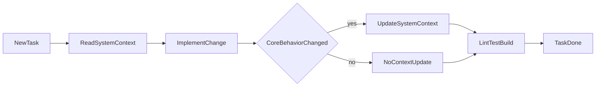

# CRM System Context

## 1) Objetivo deste documento

Este arquivo e a fonte principal de contexto do projeto CRM.

Ele existe para:
- reduzir gasto de tokens em exploração repetida;
- manter decisões técnicas e comportamento funcional centralizados;
- orientar implementação, revisão e manutenção com consistência.

Se houver conflito entre este documento e o código, o código atual prevalece e este documento deve ser atualizado imediatamente.

## 2) Estado atual do produto

O CRM está em produção interna com persistência Supabase e fluxos principais ligados:

- Autenticação Supabase Auth + middleware em `/crm/*`
- Kanban e ficha do lead com dados reais (`oportunidades`, campos dinâmicos, intake)
- Motor de workflow com transições via `POST /api/crm/leads/transition`
- DUE por área (tarefas, revisão, ajustes) e proposta por área
- Contrato/proposta (builders PDF) e integração D4Sign (envio + webhook)
- Histórico do lead (`lead_activity_events`) na aba **Histórico** da ficha
- Admin: usuários, campos dinâmicos, config WhatsApp DUE

Pontos em evolução:

- Funil de pós-venda parcialmente modelado (etapas após `contrato_assinado`)
- Autorização fina na UI (ocultar ações por perfil/área) ainda incompleta em alguns pontos
- Integração RD CRM e VIOS conforme variáveis de ambiente

Variáveis críticas: `NEXT_PUBLIC_SUPABASE_*`, `SUPABASE_SERVICE_ROLE_KEY`, tokens RD/D4Sign conforme `.env.example`.

## 3) Arquitetura em camadas

### 3.1 Stack
- Next.js 16 (App Router)
- TypeScript
- Tailwind v4 + shadcn/ui
- Supabase (schema/modelagem pronta)
- Vitest para testes de domínio/aplicação

### 3.2 Organização de módulos
- `src/modules/crm/domain`: tipos e regras puras
- `src/modules/crm/application`: casos de uso e orquestração
- `src/modules/crm/infrastructure`: repositórios e integrações externas
- `src/app`: rotas web e endpoints API

### 3.3 Fluxo técnico
1. Página/endpoint recebe input.
2. Input é validado (Zod nas APIs).
3. Serviço de aplicação executa regra de negócio.
4. Infra acessa repositório/integração.
5. Resposta estruturada retorna para UI/API.

## 4) Rotas web e comportamento

- `/`: landing técnica para entrada no CRM.
- `/login`: formulário de entrada (Supabase Auth); rotas `/crm/*` exigem sessão (`src/middleware.ts`). Sem `NEXT_PUBLIC_SUPABASE_*` o CRM redireciona para login com aviso de configuração.
- `/crm`: dashboard com KPIs e filas operacionais (dados Supabase).
- `/crm/leads`: kanban interativo, ficha do lead (Visão geral, Histórico, DUE, proposta, contrato, D4Sign).
- `/crm/clientes`: tabela de clientes (mock).
- `/crm/contratos`: tabela de contratos (mock).
- `/crm/admin/usuarios`: listagem real de `app_users` com seletor de role por usuário (usa `SUPABASE_SERVICE_ROLE_KEY`).
- `/crm/admin/campos`: CRUD de `field_definitions` por funil/etapa com drawer de novo campo e ConditionBuilder.
- `/crm/perfil`: edição do próprio `app_users` (nome, área, URL da foto).

Observação: a navegação principal está no `AppShell` — inclui seção "Administração" com links para Usuários e Campos, e rodapé com conta (avatar, link para perfil, sair).

## 5) Fluxos de negócio modelados

### 5.1 Abertura de demanda
- `novo_lead`: não exige cliente prévio.
- `novo_contrato`: exige cliente existente.
- `aditivo`: exige cliente existente e contrato base.

Regra implementada em `src/modules/crm/application/services/open-demand.ts`.

### 5.2 Workflow de pipeline

Etapas base:
- `cadastro_lead`
- bloco condicional de due diligence
- `reuniao` até `contrato_assinado`

Se `haveraDueDiligence = true`, inclui:
- `levantamento_dados`
- `compilacao`
- `revisao`
- `due_diligence_finalizada`

Regras:
- só permite transição para a próxima etapa imediata;
- bloqueia pulo e retrocesso no serviço atual;
- valida pré-condições por etapa:
  - `proposta_enviada` exige `linkProposta`;
  - `contrato_elaborado` e `contrato_assinado` exigem `linkContrato`.

No front de leads, o kanban agora renderiza as 12 etapas em colunas dedicadas e permite arrastar negociações entre colunas com atualização imediata na UI (estado local do board).

## 6) Contratos de API atuais

### 6.0 Admin

- `PATCH /api/admin/users/[id]/role` — atualiza role de usuário (body: `{ role: string }`); usa service_role key.
- `GET /api/admin/fields?pipeline=vendas|pos_venda` — lista field_definitions por pipeline.
- `POST /api/admin/fields` — cria novo campo (body: CreateField schema).
- `PATCH /api/admin/fields/[id]` — edita label, is_required, is_active, sort_order, condition_json.
- `DELETE /api/admin/fields/[id]` — remove campo.

### 6.1 Workflow

- **`POST /api/crm/leads/transition`** — transição autenticada de etapa (uso atual do kanban e da ficha).
- **`POST /api/workflow/validate`** e **`POST /api/workflow/transition`** — **descontinuados (410)**; substituídos pelo endpoint CRM acima.

### 6.2 Integrações
- `POST /api/integrations/rd/import`
  - usa `RD_CRM_TOKEN` e `SUPABASE_SERVICE_ROLE_KEY`;
  - importa negociações e contatos do RD com paginação real da API v1, filtra por ano (default 2026) e persiste em `clientes`, `oportunidades`, `rd_deal_reconciliacao` e `import_batches`.
- `POST /api/integrations/rd/webhook`
  - recebe eventos do RD (`crm_deal_*` e `crm_contact_*`) e sincroniza mudanças no banco em tempo real;
  - exige segredo via header `x-rd-webhook-secret` ou query `?secret=...`, igual a `RD_WEBHOOK_SECRET`.
- `GET /api/integrations/vios/client?document=...`
  - usa `VIOS_API_KEY`;
  - no estado atual retorna cliente stub.
- `POST /api/integrations/d4sign/send` (multipart)
  - sessão Supabase + papel `comercial` ou `admin`;
  - body: `opportunityId`, `signerEmail`, `signerForeign` (0|1), `message` (opcional), `file` (PDF/DOC/DOCX/imagem);
  - env: `D4SIGN_TOKEN`, `D4SIGN_SAFE_UUID` (cofre), opcional `D4SIGN_CRYPT_KEY`, `D4SIGN_API_BASE_URL` (ex. sandbox);
  - fluxo D4Sign: upload → `createlist` → `sendtosigner` → `signaturelink`; grava `link_contrato`, `d4sign_document_uuid` e timestamps na `oportunidades`;
  - se `D4SIGN_WEBHOOK_HMAC_SECRET` estiver definido, tenta `POST .../documents/{uuid}/webhooks` com URL pública `.../api/integrations/d4sign/webhook`.
- `POST /api/integrations/d4sign/webhook`
  - `Content-Type`: form-data (POSTBack D4Sign); valida cabeçalho `Content-Hmac` com `D4SIGN_WEBHOOK_HMAC_SECRET` (HMAC-SHA256 do UUID do documento);
  - regista evento em `d4sign_webhook_events` (idempotência para `type_post = 1` finalizado);
  - atualiza `d4sign_status` na oportunidade; se `type_post = 1` e etapa atual `contrato_enviado`, avança para `contrato_assinado` e insere `transicoes_etapa`.
- `POST /api/integrations/d4sign/envelope` — **410 Gone** (substituído por `/send`).
- `GET /api/integrations/reconciliation/report`
  - retorna resumo de reconciliação por dados stub.

## 7) Modelo de dados canônico (Supabase v1)

Migrações aplicadas:
- `20260413170000_init_crm.sql` — schema inicial (enums, tabelas, triggers, seed vendas pipeline)
- `20260413180000_add_oportunidades_links.sql` — `link_proposta` e `link_contrato` em oportunidades
- `20260413190000_enable_rls_policies.sql` — RLS em todas as 14 tabelas + helper `auth_user_role()`
- `20260413200000_fix_search_path_rls_performance_and_fk_indexes.sql` — `SET search_path = ''`, RLS initplan, FK indexes
- `extend_schema_and_enum` — `avatar_url`, `area` em `app_users`; novos valores no enum `opportunity_stage`; colunas `pipeline_code`, `stage_code`, `sort_order`, `is_active`, `field_options` em `field_definitions`; seed pipeline `pos_venda`
- `20260415120000_d4sign_oportunidades_webhook.sql` — colunas `d4sign_document_uuid`, `d4sign_status`, `d4sign_updated_at` em `oportunidades`; tabela `d4sign_webhook_events` + índice único parcial (finalização idempotente)
- `seed_pos_venda_stages` — 5 etapas do funil pós-venda
- `seed_field_definitions_vendas` — campos completos do funil de vendas com `condition_json`
- `seed_field_definitions_pos_venda` — campos completos do funil de pós-venda com `condition_json`

### 7.1 Entidades centrais
- `app_users` — inclui `avatar_url` e `area` (área de atuação do advogado)
- `clientes`
- `contatos_cliente`
- `oportunidades` — inclui `link_proposta` e `link_contrato` (usados pelas regras de workflow); colunas D4Sign `d4sign_*` quando migração aplicada
- `d4sign_webhook_events` — eventos POSTBack da D4Sign (RLS ativo, sem policies: só service role em uso típico)
- `contratos`
- `aditivos`
- `pipelines`
- `stages`
- `transicoes_etapa`
- `indicadores`
- `import_batches`
- `rd_deal_reconciliacao`
- `field_definitions`
- `field_values`

### 7.2 Regras de integridade e auditoria
- deduplicação de cliente por documento normalizado (índice único);
- índice único de indicador aprovado por nome em lowercase;
- índices de desempenho em oportunidades e transições;
- índices cobrindo todas as FKs para performance de JOIN;
- trigger `set_updated_at` em tabelas com `updated_at` (com `SET search_path = ''`);
- seed inicial de pipeline `vendas` com 12 etapas e pipeline `pos_venda` com 5 etapas;
- `field_definitions` seeded: ~60 campos para vendas (7 etapas) + ~26 campos para pós-venda (2 etapas);
- `condition_json` padronizado: `field_equals`, `field_contains`, `field_not_empty`;
- rateio por área condicional: campos aparecem apenas se área correspondente está selecionada em `areas_objeto_contrato`.

### 7.3 Row Level Security (RLS)
RLS ativo nas tabelas do schema público desde a migration `enable_rls_policies` (inclui novas tabelas como `d4sign_webhook_events` com RLS sem policies de utilizador).

Função helper: `public.auth_user_role()` (SECURITY DEFINER, STABLE, `SET search_path = ''`).

Matriz de acesso por tabela:

| Tabela | SELECT | INSERT | UPDATE | DELETE |
|--------|--------|--------|--------|--------|
| `app_users` | próprio ou admin | admin | próprio ou admin | admin |
| `clientes`, `contatos_cliente` | autenticados | comercial, admin | comercial, admin | admin |
| `contratos`, `aditivos` | autenticados | controladoria, admin | controladoria, admin | admin |
| `oportunidades` | autenticados | comercial, admin | criador ou admin | admin |
| `pipelines`, `stages`, `field_definitions` | autenticados | admin | admin | admin |
| `indicadores` | autenticados | admin, controladoria | admin, controladoria | admin |
| `transicoes_etapa` | autenticados | comercial, admin | admin | admin |
| `import_batches` | admin | admin | admin | admin |
| `rd_deal_reconciliacao` | admin, controladoria | admin | admin | admin |
| `field_values` | autenticados | comercial, admin | comercial, admin | admin |

Policies usando `(select auth.uid())` para evitar re-avaliação por linha.

## 8) Integrações e status operacional

- RD: importação real implementada para API v1 (`deals` + `contacts`) com filtro anual (default 2026), persistência no Supabase e webhook de atualização por movimentação.
- VIOS: conector criado, retorno stub por documento.
- D4Sign: cliente HTTP (`D4SignConnector`), `POST /api/integrations/d4sign/send`, webhook com HMAC; UI no detalhe do lead (`LeadD4SignPanel`).
- Reconciliação: tabela `rd_deal_reconciliacao` já recebe dados reais da importação/webhook; endpoint de relatório ainda está stub.

## 9) Governança técnica vigente

Regras já existentes:
- `.cursor/rules/crm-architecture.mdc`
- `.cursor/rules/crm-typescript-standards.mdc`

Padrões obrigatórios:
- regra de domínio fora de componentes UI;
- validação de entrada na borda de API com Zod;
- retorno estruturado de erro de negócio;
- testes Vitest para mudanças de workflow/transição.

## 10) Testes e qualidade

Testes ativos:
- `workflow.test.ts`
- `transition-opportunity.test.ts`
- `open-demand.test.ts`

Comandos padrão:
- `npm run lint`
- `npm run test`
- `npm run build`

## 11) Cutover e rollback

Referência operacional:
- `docs/cutover-runbook.md`

Resumo:
- pré-cutover com reconciliação e smoke;
- shadow mode de 2 a 5 dias;
- dia da virada com freeze legado e import incremental final;
- rollback com critérios explícitos e comunicação formal.

## 12) Limites conhecidos

- UI principal usa dados mock em áreas críticas (incluindo cards do kanban).
- Repositório em memória ainda é padrão para dashboard/listagens — banco real ainda não conectado às telas.
- Auth (Supabase Auth) ainda não está ligado ao fluxo de UI; RLS está ativo no banco mas não bloqueia as telas enquanto o cliente usa a `anon key` sem sessão autenticada.
- Endpoints de integração VIOS/D4Sign e o relatório de reconciliação ainda estão em stub.
- Tipos TypeScript gerados em `src/lib/supabase/database.types.ts` atualizados com schema v2 (incluindo `opportunity_stage` pos-venda, `field_definitions` extendido, `app_users` com area/avatar).
- Admin pages (`/crm/admin/*`) requerem `SUPABASE_SERVICE_ROLE_KEY` no `.env` para funcionar (usa `createSupabaseAdminClient` em `src/lib/supabase/admin.ts`).
- `DynamicForm` está criado mas ainda não integrado ao `NewDemandForm` — integração é próximo passo.
- 18 usuários criados com senha `123456`; nenhum usuário pendente (Priscila Varga de Morais não foi incluída conforme instrução original).

## 13) Processo obrigatório de atualização deste contexto

Atualizar este arquivo no mesmo ciclo sempre que houver mudança em:
- arquitetura de módulo;
- regra de negócio (workflow, abertura de demanda, pré-condições);
- contrato de endpoint API;
- schema/migração;
- integração externa;
- processo de cutover/rollback.

### 13.1 Fluxo de manutenção contínua

### 13.2 Checklist de consistência (obrigatório)

Antes de concluir qualquer tarefa:
- confirme se este arquivo ainda descreve rotas, APIs e schema corretamente;
- confirme se mudanças de regra de negócio estão refletidas aqui;
- confirme se status de integrações (real vs stub) está atualizado;
- confirme se comandos de validação foram executados quando houver alteração de código;
- confirme que não há seção desatualizada sobre funcionamento do sistema.
