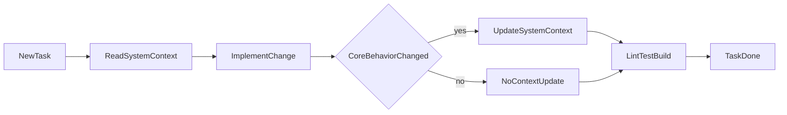

# CRM System Context

## 1) Objetivo deste documento

Este arquivo e a fonte principal de contexto do projeto CRM.

Ele existe para:
- reduzir gasto de tokens em exploração repetida;
- manter decisões técnicas e comportamento funcional centralizados;
- orientar implementação, revisão e manutenção com consistência.

Se houver conflito entre este documento e o código, o código atual prevalece e este documento deve ser atualizado imediatamente.

## 2) Estado atual do produto

O CRM está em produção interna com persistência Supabase e fluxos principais ligados:

- Autenticação Supabase Auth + proxy (`src/proxy.ts`, matcher `/crm`, `/login`) em rotas protegidas
- Kanban e ficha do lead com dados reais (`oportunidades`, campos dinâmicos, intake)
- Motor de workflow com transições via `POST /api/crm/leads/transition`
- DUE por área (tarefas, revisão, ajustes) e proposta por área
- Proposta com Word BP canônico, prévia por download DOCX e geração final validada; prévia visual/PDF dependem de conversor
- Contrato com builder próprio e integração D4Sign (envio + webhook)
- Histórico do lead (`lead_activity_events`) na aba **Histórico** da ficha
- Admin: usuários, campos dinâmicos, config WhatsApp DUE

Pontos em evolução (Ondas 2–3):

- Funil de pós-venda parcialmente modelado (etapas após `contrato_assinado`)
- Autorização fina por área na UI (ocultar ações por perfil/área) — incompleta; prevista para Ondas 2–3
- `/crm/clientes` lista grupos econômicos sincronizados do OrquestrAI, com status Ativo/Inativo (`gestor_atividade`) e resumo de títulos SIOE; o modal do grupo mostra Áreas (atuação jurídica), Indicação, pessoas/CNPJs e **Categoria = Cliente** (Lead fica preparado no tipo da linha `origemLinha`; oportunidades ainda não entram nesta lista); admin/controladoria editam indicação e áreas no modal; a listagem ordena por Grupo (A–Z) e depois Status, com headers clicáveis; um botão copia o **link único** da grade pública `/preencher/carteira/[token]`; `/crm/contratos` é o hub contratual com carteira, fechamentos, renovações, indicadores, o painel D4Sign e o atalho para importar PDFs fechados
- Integração RD CRM e VIOS conforme variáveis de ambiente

Hardening 2026-07-27 (Onda 1):

- Policies RLS admin/CRM reforçadas; webhooks de integração fail-closed
- RPCs transacionais `transition_opportunity_atomic` e `delete_crm_lead_atomic` (service_role)
- `fetchWithTimeout` nos conectores externos
- CI: `.github/workflows/ci.yml` (lint, test, build)

Variáveis críticas: `NEXT_PUBLIC_SUPABASE_*`, `SUPABASE_SERVICE_ROLE_KEY`, tokens RD/D4Sign conforme `.env.example`. Importação de escopos e de contratos fechados usam o mesmo cliente OpenAI (`src/lib/scope-import/openai.ts`): `OPENAI_API_KEY` (server-only), opcionalmente `SCOPE_IMPORT_OPENAI_MODEL_EXTRACTION` (default `gpt-4.1-mini`) e `SCOPE_IMPORT_OPENAI_MODEL_CONSOLIDATION` (default `gpt-4.1`). Contratos aceitam `CONTRACT_IMPORT_OPENAI_MODEL` para sobrescrever o modelo de extração. Para carteira: `ORQESTRAI_SUPABASE_URL`, `ORQESTRAI_SUPABASE_SERVICE_ROLE_KEY` (marketing-system: `email_client_groups`, `email_companies`, `email_people`), `SIOE_SUPABASE_SERVICE_ROLE_KEY` (títulos `financeiro_parcelas`). Rateio por área na importação de PDF vem de `financeiro_parcelas_itens.departamento` nas pessoas do CNPJ raiz/`grupo_cliente` (não é inventado pela IA; o escritório `26080152` é ignorado).

## 3) Arquitetura em camadas

### 3.1 Stack
- Next.js 16 (App Router)
- TypeScript
- Tailwind v4 + shadcn/ui
- Supabase (schema/modelagem pronta)
- Vitest para testes de domínio/aplicação

### 3.2 Organização de módulos
- `src/modules/crm/domain`: tipos e regras puras
- `src/modules/crm/application`: casos de uso e orquestração
- `src/modules/crm/infrastructure`: repositórios e integrações externas
- `src/modules/contracts/domain`: dinheiro em centavos, projeção, cálculo, validação e políticas puras
- `src/modules/contracts/application`: rascunho, configuração, fechamento e planejamento diário
- `src/modules/contracts/infrastructure`: repositório Supabase e consultas tipadas do hub/ficha
- `src/app`: rotas web e endpoints API

### 3.3 Fluxo técnico
1. Página/endpoint recebe input.
2. Input é validado (Zod nas APIs).
3. Serviço de aplicação executa regra de negócio.
4. Infra acessa repositório/integração.
5. Resposta estruturada retorna para UI/API.

## 4) Rotas web e comportamento

- `/`: landing técnica para entrada no CRM.
- `/login`: formulário de entrada (Supabase Auth); rotas `/crm/*` exigem sessão (`src/proxy.ts`, matcher `/crm`, `/login`). Sem `NEXT_PUBLIC_SUPABASE_*` o CRM redireciona para login com aviso de configuração. `/preencher/carteira/[token]` fica fora desse matcher e é a grade pública (sem login) dos grupos já cadastrados.
- `/crm`: dashboard com KPIs e filas operacionais (dados Supabase).
- `/crm/leads`: kanban interativo, ficha do lead (Visão geral, Histórico, DUE, proposta, contrato, D4Sign).
- Na ficha do lead, a razão social permanece como título da oportunidade. O **solicitante interno** é uma identidade separada (`lead_intakes.solicitante_nome` + `oportunidades.solicitante_email`), exibida com nome, avatar e e-mail resolvidos em `app_users`; a edição aceita somente utilizadores ativos do CRM e atualiza nome/e-mail em conjunto.
- `/crm/clientes`: carteira por grupo econômico (espelho OrquestrAI `email_client_groups` / `email_companies` / `email_people`). A coluna **Status** é Cliente ativo/inativo a partir de `email_client_groups.gestor_atividade`, espelhada em `grupos_economicos.gestor_atividade` (o fetch ao vivo só sobrepõe). **Categoria** = `Cliente` | `Lead` (`origemLinha`; hoje só Cliente, porque a lista é `grupos_economicos`). Não é área jurídica e o gestor não escolhe o valor. **Áreas** = atuação jurídica (`responsible_area` ∪ `legal_areas` ∪ rateio/pastas SIOE ∪ manual). **Indicação** = tipo/subtipo/nome do cadastro de lead. Admin/controladoria editam indicação e áreas no modal (`PATCH /api/crm/carteira/grupos/[id]`, capability `configure`); o modal segue o contrato Dialog+Select (`modal={false}` + `dialogSelectOutsideHandlers`) e as áreas são chips `type="button"` (o toggle local funciona mesmo se o PATCH retornar 409). Nome, Status OrquestrAI e Categoria não são editáveis neste lote. CPF vai para Pessoas e CNPJ para Empresas. A tabela ordena por Grupo (A–Z) e, no empate, Status. Abertos/Pagos/Valor aberto continuam sendo o resumo SIOE. Admin/controladoria/comercial copiam **um** link público da grade (`POST /api/crm/carteira/intake-links`) — não há URL por grupo. Caminho para leads: unir `oportunidades` ativas com empresa/grupo (`cliente_id` / `lead_intakes.empresas_json`) que ainda não são linha de carteira, `origemLinha: "lead"`, sem filtrar etapa de funil.
- `/crm/contratos`: hub dinâmico com abas **Carteira**, **Fechamentos**, **Renovações**, **Indicadores** e **Assinaturas D4Sign**. Sem parágrafo descritivo sob o título. A faixa de KPIs mantém Na carteira / Ativos / Em implantação / Referência anual e acrescenta **contratos por área** (áreas canônicas; um contrato em 3 áreas conta nas 3), **grupos Cliente ativo × contratos cadastrados** e alerta **ativos sem contrato** (`email_client_groups.gestor_atividade`, não o enum SIOE de `grupos_economicos.status`). Na carteira o título da linha é o **grupo econômico** e a razão social vai na mesma linha; linhas compactas (1, no máximo 2). O painel D4Sign existente, quota, signatários e documentos órfãos foram preservados. **Renovação/reajuste:** se `data_base_renovacao` estiver vazia, a data exibida e o default de importação/setup são `vigente_de` + 1 ano — inclusive em prazo indeterminado. O alerta, quando não informado, usa a antecedência já do job diário (30 dias). O job de prazo determinado sem data-base continua usando `vigente_ate`. Não há recálculo automático de valor neste lote.
- `/crm/contratos/importacao`: wizard de importação de PDFs já assinados → extração IA → revisão humana → rascunho no gerenciador financeiro (não ativa, não emite título). O vínculo à carteira usa o CNPJ da contratante (raiz + matriz `/0001`), ignora o escritório e o nome de grupo residual de modelo; o título do rascunho é o nome do grupo econômico casado.
- `/crm/contratos/[id]`: ficha dinâmica com visão geral, configuração em seis etapas, áreas/regras, rateios, fechamentos, versões/aditivos, documentos e eventos.
- `/crm/admin/usuarios`: listagem real de `app_users` com seletor de role por usuário (usa `SUPABASE_SERVICE_ROLE_KEY`).
- `/crm/admin/campos`: CRUD de `field_definitions` por funil/etapa com drawer de novo campo e ConditionBuilder.
- `/crm/admin/proposta-escopo`: catálogo de escopos e investimentos (CRUD admin).
- `/crm/admin/proposta-escopo/importacao`: wizard de importação em massa de PDF/DOCX → extração IA → consolidação → revisão/aprovação para o catálogo.

**Proposta — investimento no Word:** o placeholder `[INVESTIMENTO]` recebe um bloco com valor total consolidado (soma das áreas, editável manualmente e com forma de pagamento no builder — mais de uma forma por documento, ver `PropostaInvestimentoDocumentoItem`). Valores por área em `cp_escopo_detalhe_json` permanecem para coordenação interna; a chave reservada `__investimentoDocumento__` no mesmo JSON guarda tipo/subtipo e placeholders do documento. Previews de escopo e investimento (modal da área, catálogo e página do documento) usam texto justificado (`JustifiedDocumentText`). Placeholders `[CHAVE]` no template do catálogo entram no formulário de inclusão (união com `placeholder_keys`); o modal recarrega o catálogo ao abrir e ao voltar para a aba.
- `/crm/perfil`: edição do próprio `app_users` (nome, área, URL da foto).
- `/preencher/carteira/[token]`: grade pública (sem login) para o gestor escolher o grupo na lista e preencher origem/indicação e áreas **na própria linha**. O token é único de campanha (opaco, hash SHA-256 em `grupo_intake_tokens.scope=carteira`), com validade; o mesmo link serve para todos os grupos já cadastrados e pode corrigir enquanto não expirar. Grava em `grupos_economicos` e aparece na aba Clientes.

### 4.1 Motor documental da proposta BP (02/09/2026)

- Fonte canônica privada: `templates/proposta/PROPOSTA-BP-V1.docx`, preparado do Word oficial fornecido. Layout institucional fica no template.
- `buildPropostaDocumentSnapshot` → `buildCanonicalProposalData` → `renderCanonicalProposalDocx`; mesma geração determinística para dados/template iguais.
- `POST /api/crm/leads/:id/document/preview` retorna DOCX binário do draft sem persistir. O antigo preview JSX foi removido; a UI oferece **Baixar prévia Word**. O ensaio com docx-preview perdeu caixas de texto/objetos do modelo; não foi adotado.
- **Gerar Word** aguarda saves confirmados e revalida o estado salvo no servidor; falha de save bloqueia exportação. Validação local acompanha o draft atual.
- **Enviado por** é explícito e obrigatório, persistido em `document_instances.data_json.responsavel`; não se presume que o criador do lead seja o remetente.
- Na ficha do lead em etapa de proposta, a aba abre o builder diretamente. Ao fechar o dialog, fica apenas um ponto compacto para reabrir o editor; os cards intermediários de pendências e histórico foram removidos porque duplicavam informações do próprio builder.
- Data compartilhada entre pedidos em `America/Sao_Paulo`, vigência +7 dias. Escopos usam parágrafos/estilos Word e paginação natural.
- DOCX é transmitido em streaming e retorna SHA256; versão guarda snapshot e hashes. Nenhum arquivo é arquivado em storage por esse fluxo.
- PDF da proposta retorna HTTP 503 até existir conversão real do DOCX. A rota legada `/api/crm/leads/:id/proposta-docx` retorna HTTP 410. Contratos/D4Sign não foram alterados.
- Detalhes, testes, diferenças visuais do DOCX/PDF original e limitações: `docs/PROPOSTA-DOCUMENT-ENGINE.md`.

Observação: a navegação principal está no `AppShell` — inclui seção "Administração" com links para Usuários e Campos, e rodapé com conta (avatar, link para perfil, sair).
O `AppShell` também disponibiliza a busca global de leads em todas as páginas: lupa permanente na sidebar recolhida, botão de pesquisa quando expandida, lupa no header mobile e atalho `Ctrl/Cmd + K`. O modal consulta `GET /api/crm/leads/search?query=...`, pesquisa empresa/nome do lead, e-mail, solicitante interno e UUID, e mantém até seis acessos recentes em `localStorage`.

## 5) Fluxos de negócio modelados

### 5.1 Abertura de demanda
- `novo_lead`: não exige cliente prévio.
- `novo_contrato`: exige cliente existente.
- `aditivo`: exige cliente existente e contrato base.

Regra implementada em `src/modules/crm/application/services/open-demand.ts`.

### 5.2 Workflow de pipeline

Etapas base:
- `cadastro_lead`
- bloco condicional de due diligence
- `reuniao` até `contrato_assinado`

Se `haveraDueDiligence = true`, inclui:
- `levantamento_dados`
- `compilacao`
- `revisao`
- `due_diligence_finalizada`

Regras:
- só permite transição para a próxima etapa imediata;
- bloqueia pulo e retrocesso no serviço atual;
- valida pré-condições por etapa:
  - `proposta_enviada` exige `linkProposta`;
  - `contrato_elaborado` e `contrato_assinado` exigem `linkContrato`;
  - `reuniao` confirma local/data/horário já gravados no intake ou na transição para `due_diligence_finalizada` (pré-preenchidos; editáveis).

No front de leads, o kanban renderiza as 12 etapas em colunas dedicadas. Ao arrastar, o card vai imediatamente para a coluna de destino (estado local) e o modal de dados obrigatórios abre na hora (esqueleto até a API responder). `GET /api/crm/leads/transition-requirements` busca oportunidade, intake, campos e valores em paralelo. Cancelar ou falhar a validação devolve o card à origem. Edições na ficha gravam via PATCH sem `router.refresh()` da página inteira; o Realtime não recarrega a ficha só por `field_values`/`lead_intakes`. APIs autenticadas (`requireAuthApi`) não esperam a API de fotos oficiais.

## 6) Contratos de API atuais

### 6.0 Contratos e faturamento (implementado localmente)

- O módulo de contratos abrange identidade e versões contratuais, áreas, regras de cobrança, rateios, consumos, fechamentos mensais, renovações, aditivos, referências D4Sign/SharePoint/VIOS e eventos auditáveis.
- A configuração financeira é concluída na etapa `inclusao_faturamento` do pós-venda. A transição dessa etapa para `boas_vindas` exige contrato vinculado com versão ativa e válida; entrar na etapa não exige a configuração completa.
- Na primeira entrega, o VIOS continua sendo o sistema de emissão e contas a receber. O CRM somente registra a referência do lançamento; não cria títulos, faturas ou notas automaticamente.
- Permissões por capability: todos os papéis (`admin`, `controladoria`, `financeiro`, `comercial`) consultam; `admin` e `controladoria` configuram, aprovam fechamentos e gerenciam renovação/aditivo; `admin`, `controladoria` e `financeiro` preparam fechamentos e registram referências VIOS. A decisão não depende de `app_users.area`.
- `POST /api/crm/contracts/ensure` — cria/repara o rascunho idempotente de oportunidade assinada; `admin`, `controladoria` e `comercial`.
- `PATCH /api/crm/contracts/[id]/configuration` — salva somente versão rascunho, com validação e concorrência otimista; `admin`/`controladoria`.
- `POST /api/crm/contracts/[id]/activate` — ativa versão e, quando solicitado, avança `inclusao_faturamento -> boas_vindas` na mesma transação; `admin`/`controladoria`.
- `GET|POST /api/crm/contracts/[id]/closings` e `GET|PATCH /api/crm/contracts/[id]/closings/[closingId]` — prepara, consulta, resolve, aprova, corrige e registra VIOS conforme capability.
- `GET|PUT /api/crm/contracts/[id]/consumptions` — consulta e substitui consumos manuais da competência; `admin`, `controladoria` e `financeiro` para escrita.
- `GET|PATCH /api/crm/contracts/[id]/renewals/[alertId]` — consulta e conclui tarefas de renovação; mutação por `admin`/`controladoria`.
- `POST /api/crm/contracts/[id]/versions` — clona rascunho e suspende, retoma ou encerra contrato com auditoria; `admin`/`controladoria`.
- `GET|POST /api/cron/contracts-daily` — job protegido por `CRON_SECRET`, agendado em `vercel.json` para `0 13 * * *`, com data de São Paulo e upserts idempotentes.
- `GET|POST /api/cron/carteira-grupos-sync` — espelha grupos/pessoas do OrquestrAI e resume títulos SIOE ABERTO/PAGO; grava `grupos_economicos.categoria = 'Cliente'` (tipo da linha, **não** `responsible_area`); `CRON_SECRET`; agendado `30 9 * * *`. Não emite título. Se a coluna `categoria` ainda não existir no remoto, o upsert segue sem ela.
- `GET|POST /api/crm/carteira` — consulta a carteira local (inclui `clienteStatus`, `origemLinha`/`categoria` = Cliente|Lead, e `responsibleArea` do OrquestrAI para Áreas); POST dispara sync (capability `configure`).
- `GET|PATCH /api/crm/carteira/grupos/[id]` — GET devolve indicação, áreas gravadas e áreas derivadas SIOE para o modal; PATCH (capability `configure`) grava tipo/subtipo/nome de indicação e `areas_atuacao`. Se as colunas da migration de intake não existirem, responde 409 com mensagem clara. Não altera nome nem Status OrquestrAI.
- `POST /api/crm/carteira/intake-links` — devolve **um** URL de campanha `/preencher/carteira/[token]` (`admin`/`controladoria`/`comercial`). Reusa o token ativo; `rotate: true` invalida o anterior e emite outro. Não gera N links por grupo.
- `GET|POST /api/public/carteira-intake/[token]` — lê a grade (todos os grupos) e grava **uma linha** (`grupoId` + indicação + áreas) após validar o token de campanha (service role só no servidor; sem policies de browser). Áreas pré-marcadas = união de departamentos de honorários em `financeiro_parcelas_itens` (via `mapSioeDepartamentoToAreaKey`) com pastas `processos_completo` em que `processo_encerrado = 'Não'` e `situacao_processo = 'Ativo'`. Manual só para área sem rateio nem pasta.
- `POST /api/crm/contracts/import` — cria lote + signed URLs para PDFs assinados (`admin`/`controladoria`).
- `GET /api/crm/contracts/import/[batchId]` — estado do lote para revisão.
- `POST /api/crm/contracts/import/[batchId]/confirm` — confirma uploads e libera extração.
- `POST /api/crm/contracts/import/[batchId]/process` — processa 1 PDF por chamada (texto + OpenAI); `maxDuration=120`.
- `POST /api/crm/contracts/import/[batchId]/review` — rejeita ou grava rascunho financeiro (`origem_importacao=pdf`), sem ativar. Componentes vêm do PDF; rateio percentual por área vem do SIOE (`financeiro_parcelas_itens.departamento` de honorários ABERTO/PAGO), nunca inventado pela IA. O fetch cobre todas as pessoas do CNPJ raiz e do `grupo_cliente`, pagina o PostgREST (1000) e **exclui o escritório** (`26080152`); títulos de honorários podem estar em filial diferente da contratante/matriz (Pague Menos `/0021` e `/0044`; Ingevity `/0004-30` mesmo fora do grupo nominal). Sem título de honorários com departamento de área, não há percentual; se o contrato tiver **uma** área explícita, o rascunho recebe 100% nessa área. Honorários **por quantidade de pasta** (`R$ X por pasta/processo`) viram `variavel_processo` + `quantidade_total` + `unitAmountCents`; **excedente** de pasta/hora vira `variavel_processo`/`variavel_hora` + `excedente` + franquia em `includedQuantity`. O mapeador **não** expande unitário×quantidade para `mensal_fixo`. `variavel_processo` nasce com `areaAllocationEligible` para o rateio posterior aplicar; a modalidade de cobrança não muda. Componente existente (inclusive `variavel_processo`) pode ser marcado `elegivel_rateio`. Rascunho PDF já gravado sem rateio é completado ao abrir `/crm/contratos/[id]`. Identidade: CNPJ da contratante prevalece sobre `groupName` extraído; filiais do mesmo raiz sobem para a matriz; Bismarchi | Pires não casa como cliente.
- Projeção de faturamento (`monthlyProjectionCents`, referência anual calculada, wizard de componentes): mensalidade fixa soma `valor_fixo`; variável multiplica a tarifa pela quantidade **atual do SIOE**, casada por `grupo_cliente` e CNPJs da carteira. Pastas ativas = `processos_completo` com `processo_encerrado = 'Não'` e `situacao_processo = 'Ativo'`. Horas do mês = `timesheets.total_horas_decimal` (não filtrar `cobrar`, inclusive quando vem `'Não'`). O fechamento mensal continua exigindo consumo registrado; a projeção não lança consumo nem inventa rateio.
- As migrations estão versionadas no repositório; aplicação, backfill e smoke no Supabase remoto continuam pendentes de autorização explícita. Ver `docs/contract-management-runbook.md`.

### 6.1 Admin

- `PATCH /api/admin/users/[id]/role` — atualiza role de usuário (body: `{ role: string }`); usa service_role key.
- `GET /api/admin/fields?pipeline=vendas|pos_venda` — lista field_definitions por pipeline.
- `POST /api/admin/fields` — cria novo campo (body: CreateField schema).
- `PATCH /api/admin/fields/[id]` — edita label, is_required, is_active, sort_order, condition_json.
- `DELETE /api/admin/fields/[id]` — remove campo.
- `GET /api/admin/proposal-catalog` — catálogo de escopos/investimentos (admin).
- `POST/PATCH/DELETE /api/admin/proposal-catalog` — CRUD e seed do catálogo.
- `GET /api/admin/scope-import` — lista lotes de importação de escopos.
- `POST /api/admin/scope-import` — cria lote + signed upload URLs (`files: [{name,size,contentType}]`, máx. 40 arquivos / 25 MB).
- `GET/DELETE /api/admin/scope-import/[batchId]` — estado do lote (polling UI só na etapa de extração) / abandonar lote.
- `POST /api/admin/scope-import/[batchId]/confirm` — confirma uploads no storage, batch → `extraindo`.
- `POST /api/admin/scope-import/[batchId]/process` — processa 1 documento por chamada (texto + OpenAI extração); `maxDuration=120`.
- `POST /api/admin/scope-import/[batchId]/consolidate` — consolida extrações em sugestões; `maxDuration=300`.
- `PATCH/POST /api/admin/scope-import/suggestions/[id]` — editar sugestão pendente / aprovar (insere no catálogo) ou rejeitar (409 se já revisada).

### 6.2 Workflow

- **`POST /api/crm/leads/transition`** — transição autenticada de etapa (uso atual do kanban e da ficha).
- **`PATCH /api/crm/leads/[id]`** com `{ closingStatus: { value: "perdido" | null } }` — comercial/admin marca a negociação como perdida ou reabre o lead. Atualiza `oportunidades.encerramento` e registra a ação em `lead_activity_events`.
- **`PATCH /api/crm/leads/[id]/due-area-review-adjustments`** — conclui tarefas com ajustes solicitados na Compilação. Body: `{ taskIds, evidenceKind: "file" | "link", evidenceLink?, completionNote? }`. `link` exige `evidenceLink` (http/https) e grava `oportunidades.link_proposta`; `file` exige um PPT em `due_documents` enviado após a solicitação de ajustes (o modal da ficha coleta o arquivo e faz o upload antes de concluir).
- **`POST /api/workflow/validate`** e **`POST /api/workflow/transition`** — **descontinuados (410)**; substituídos pelo endpoint CRM acima.

### 6.3 Integrações
- `POST /api/integrations/rd/import`
  - usa `RD_CRM_TOKEN` e `SUPABASE_SERVICE_ROLE_KEY`;
  - importa negociações e contatos do RD com paginação real da API v1, filtra por ano (default 2026) e persiste em `clientes`, `oportunidades`, `rd_deal_reconciliacao` e `import_batches`.
- `POST /api/integrations/rd/webhook`
  - recebe eventos do RD (`crm_deal_*` e `crm_contact_*`) e sincroniza mudanças no banco em tempo real;
  - exige segredo via header `x-rd-webhook-secret` ou query `?secret=...`, igual a `RD_WEBHOOK_SECRET`.
- `GET /api/integrations/vios/client?document=...`
  - usa `VIOS_API_KEY`;
  - no estado atual retorna cliente stub.
- `POST /api/integrations/d4sign/send` (multipart)
  - sessão Supabase + papel `comercial` ou `admin`;
  - body: `opportunityId`, `signerEmail`, `signerForeign` (0|1), `message` (opcional), `file` (PDF/DOC/DOCX/imagem);
  - env: `D4SIGN_TOKEN`, `D4SIGN_SAFE_UUID` (cofre), opcional `D4SIGN_CRYPT_KEY`, `D4SIGN_API_BASE_URL` (ex. sandbox);
  - fluxo D4Sign: upload → `createlist` → `sendtosigner` → `signaturelink`; grava `link_contrato`, `d4sign_document_uuid` e timestamps na `oportunidades`;
  - se `D4SIGN_WEBHOOK_HMAC_SECRET` estiver definido, tenta `POST .../documents/{uuid}/webhooks` com URL pública `.../api/integrations/d4sign/webhook`.
- `POST /api/integrations/d4sign/webhook`
  - `Content-Type`: form-data (POSTBack D4Sign); valida cabeçalho `Content-Hmac` com `D4SIGN_WEBHOOK_HMAC_SECRET` (HMAC-SHA256 do UUID do documento);
  - regista evento em `d4sign_webhook_events` (idempotência para `type_post = 1` finalizado);
  - atualiza `d4sign_status` na oportunidade; se `type_post = 1` e etapa atual `contrato_enviado`, avança para `contrato_assinado` e insere `transicoes_etapa`.
- `POST /api/integrations/d4sign/envelope` — **410 Gone** (substituído por `/send`).
- `GET /api/integrations/reconciliation/report`
  - retorna resumo de reconciliação por dados stub.

## 7) Modelo de dados canônico (Supabase v2)

Migrações aplicadas:
- `20260413170000_init_crm.sql` — schema inicial (enums, tabelas, triggers, seed vendas pipeline)
- `20260413180000_add_oportunidades_links.sql` — `link_proposta` e `link_contrato` em oportunidades
- `20260413190000_enable_rls_policies.sql` — RLS em todas as 14 tabelas + helper `auth_user_role()`
- `20260413200000_fix_search_path_rls_performance_and_fk_indexes.sql` — `SET search_path = ''`, RLS initplan, FK indexes
- `extend_schema_and_enum` — `avatar_url`, `area` em `app_users`; novos valores no enum `opportunity_stage`; colunas `pipeline_code`, `stage_code`, `sort_order`, `is_active`, `field_options` em `field_definitions`; seed pipeline `pos_venda`
- `20260415120000_d4sign_oportunidades_webhook.sql` — colunas `d4sign_document_uuid`, `d4sign_status`, `d4sign_updated_at` em `oportunidades`; tabela `d4sign_webhook_events` + índice único parcial (finalização idempotente)
- `seed_pos_venda_stages` — 5 etapas do funil pós-venda
- `seed_field_definitions_vendas` — campos completos do funil de vendas com `condition_json`
- `20260520140000_lead_activity_events.sql` — timeline unificada do lead
- `20260807120000_scope_import.sql` — importação IA de escopos: bucket `scope-import-documents`, tabelas `scope_import_*`, RLS sem policies (service role)

Migrações contratuais versionadas no repositório, ainda não aplicadas remotamente nesta entrega:

- `20260812120000_contract_management_schema.sql` — enums, tabelas relacionais, constraints, índices e guardas de imutabilidade.
- `20260812121000_contract_management_rls.sql` — leitura autenticada e bloqueio de escrita direta nas tabelas financeiras.
- `20260812122000_contract_management_workflow.sql` — rascunho/assinatura, gate pós-venda, configuração/ativação, fechamentos, consumos, alertas, notificações e versões/ciclo de vida.
- `20260917202943_carteira_grupos_contract_import.sql` — `grupos_economicos`, `grupo_titulos_resumo`, colunas de identidade em `clientes`, `contratos.grupo_id`/`origem_importacao`, tabelas `contract_import_*` e bucket `contract-import-documents`. RLS ativo sem policies de utilizador (service role). **Aplicada no remoto CRM-BP em 17/09/2026.**
- `20260918220000_grupo_status_areas_orqestrai.sql` — `gestor_atividade`, `responsible_area` e `legal_areas` em `grupos_economicos` (espelho OrquestrAI para Status/Áreas sem depender do fetch cruzado). **Aplicada no remoto CRM-BP em 18/09/2026.**
- `20260918180000_grupo_intake_indicacao_areas.sql` — colunas de origem/indicação e `areas_atuacao` em `grupos_economicos`; tabela `grupo_intake_tokens` com `scope=carteira` e `grupo_id` nulo (token de campanha da grade). RLS ativo sem policies de utilizador (service role). **Ainda não aplicada no remoto.**
- `20260918190000_grupo_categoria.sql` — `grupos_economicos.categoria` como tipo da linha (`Cliente` | `Lead`), não área jurídica. **Ainda não aplicada no remoto.**
- `20260918210000_grupo_categoria_cliente_lead.sql` — comenta a coluna e backfill de texto legado de área → `Cliente`. **Ainda não aplicada no remoto.**
- `20260918200000_grupo_intake_campaign_token.sql` — se a tabela nasceu 1 token por grupo, torna `grupo_id` opcional, adiciona `scope` e expira tokens pontuais. **Ainda não aplicada no remoto.**

### 7.1 Entidades centrais
- `app_users` — inclui `avatar_url` e `area` (área de atuação do advogado)
- `clientes` — `grupo_id` (OrquestrAI), `sioe_pessoa_id`, `orqestrai_company_id`, `orqestrai_person_id`; `email_principal` opcional
- `grupos_economicos` — espelho de `ORQESTRAI.email_client_groups` (PK local; `orqestrai_id` único); `categoria` (`Cliente` | `Lead` — tipo da linha na aba Clientes; **não** é `responsible_area`); origem comercial (`tipo_lead`/`tipo_indicacao`/`nome_indicacao`, mesmas chaves de `lead_intakes`) e `areas_atuacao` (jsonb com `areaKey` + `sources`: `rateio` | `pasta` | `manual`). Espelho OrquestrAI: `gestor_atividade`, `responsible_area`, `legal_areas`. Áreas jurídicas vêm de `responsible_area` ∪ `legal_areas` ∪ SIOE ∪ `areas_atuacao`.
- `grupo_intake_tokens` — token público de campanha da grade (`scope=carteira`, `grupo_id` nulo); armazena hash SHA-256 e o raw no `payload` só para recopiar o mesmo URL. Route Handler valida o token e grava linha a linha no grupo
- `grupo_titulos_resumo` — contagem/valor de títulos SIOE ABERTO/PAGO por grupo; o CRM não emite título
- `contatos_cliente`
- `oportunidades` — inclui `link_proposta` e `link_contrato` (usados pelas regras de workflow); colunas D4Sign `d4sign_*` quando migração aplicada
- `d4sign_webhook_events` — eventos POSTBack da D4Sign (RLS ativo, sem policies: só service role em uso típico)
- `contratos` — preserva assinatura em `status_assinatura` e usa o ciclo independente `rascunho`, `em_revisao`, `ativo`, `suspenso` ou `encerrado`; vínculo único opcional à oportunidade, `grupo_id` opcional e `origem_importacao` para rascunhos vindos de PDF.
- `aditivos` — pode apontar para a versão de origem e a versão resultante.
- Configuração: `contrato_responsaveis`, `contrato_versoes`, `contrato_areas`, `contrato_componentes_cobranca`, `contrato_parcelas`, `contrato_rateios_area`, `contrato_participacoes_socios`, `contrato_comissoes`.
- Operação: `contrato_consumos_mensais`, `contrato_fechamentos`, `contrato_fechamento_revisoes`, `contrato_fechamento_itens`, `contrato_alertas`, `contrato_eventos`.
- `pipelines`
- `stages`
- `transicoes_etapa`
- `indicadores`
- `import_batches`
- `rd_deal_reconciliacao`
- `field_definitions`
- `field_values`
- `scope_import_batches`, `scope_import_documents`, `scope_import_extractions`, `scope_import_suggestions`, `scope_import_suggestion_sources` — pipeline de importação IA de escopos (RLS ativo, sem policies de utilizador)
- Storage bucket privado `scope-import-documents` (PDF/DOCX, upload via signed URL)
- `contract_import_batches`, `contract_import_documents` — importação de contratos PDF fechados (RLS ativo, sem policies de utilizador)
- Storage bucket privado `contract-import-documents` (PDF, upload via signed URL)

### 7.2 Regras de integridade e auditoria
- identidade de cliente/grupo: `clientes.orqestrai_*` e `clientes.sioe_pessoa_id` únicos quando preenchidos; documento permanece indexado por dígitos sem unique (duplicatas históricas do RD).
- índice único de indicador aprovado por nome em lowercase;
- índices de desempenho em oportunidades e transições;
- índices cobrindo todas as FKs para performance de JOIN;
- trigger `set_updated_at` em tabelas com `updated_at` (com `SET search_path = ''`);
- seed inicial de pipeline `vendas` com 12 etapas e pipeline `pos_venda` com 5 etapas;
- `field_definitions` seeded: ~60 campos para vendas (7 etapas) + ~26 campos para pós-venda (2 etapas);
- `condition_json` padronizado: `field_equals`, `field_contains`, `field_not_empty`;
- rateio por área condicional: campos aparecem apenas se área correspondente está selecionada em `areas_objeto_contrato`.
- um contrato por `oportunidade_id`, um fechamento por contrato/competência e uma revisão por número;
- versões `ativa` não podem sobrepor vigência; versões ativas e revisões `aprovado`/`lancado_vios` possuem guardas de imutabilidade;
- status de versão: `rascunho`, `ativa`, `substituida`, `cancelada`; status de revisão: `a_calcular`, `em_revisao`, `aprovado`, `lancado_vios`, `cancelado`;
- configuração, ativação, fechamentos, consumos e versões usam RPCs transacionais exclusivas de `service_role`; eventos registram as mutações auditáveis.

### 7.3 Row Level Security (RLS)
RLS ativo nas tabelas do schema público desde a migration `enable_rls_policies` (inclui novas tabelas como `d4sign_webhook_events` com RLS sem policies de utilizador).

Função helper: `public.auth_user_role()` (SECURITY DEFINER, STABLE, `SET search_path = ''`).

Matriz de acesso por tabela:

| Tabela | SELECT | INSERT | UPDATE | DELETE |
|--------|--------|--------|--------|--------|
| `app_users` | próprio ou admin | admin | próprio ou admin | admin |
| `clientes`, `contatos_cliente` | autenticados | comercial, admin | comercial, admin | admin |
| `contratos`, `aditivos` | autenticados | controladoria, admin | controladoria, admin | admin |
| `oportunidades` | autenticados | comercial, admin | criador ou admin | admin |
| `pipelines`, `stages`, `field_definitions` | autenticados | admin | admin | admin |
| `indicadores` | autenticados | admin, controladoria | admin, controladoria | admin |
| `transicoes_etapa` | autenticados | comercial, admin | admin | admin |
| `import_batches` | admin | admin | admin | admin |
| `rd_deal_reconciliacao` | admin, controladoria | admin | admin | admin |
| `field_values` | autenticados | comercial, admin | comercial, admin | admin |

Policies usando `(select auth.uid())` para evitar re-avaliação por linha.

Nas tabelas financeiras novas, qualquer usuário autenticado pode consultar. Não há policies de `INSERT`, `UPDATE` ou `DELETE` para o browser: Route Handlers autenticam, aplicam `canAccessContractCapability` e escrevem com `service_role` por RPC/consulta controlada. A capability não depende de `app_users.area`.

## 8) Integrações e status operacional

- RD: importação real implementada para API v1 (`deals` + `contacts`) com filtro anual (default 2026), persistência no Supabase e webhook de atualização por movimentação.
- Contratos: hub, ficha, configuração, cálculo/fechamento, renovação, alertas e versões implementados. Fechamento ainda usa consumo registrado; a **projeção** de variável (pasta/hora) lê pastas ativas e horas do SIOE. A aplicação remota de algumas migrations permanece pendente.
- VIOS: conector de cliente continua stub; fechamentos aprovados aceitam somente referência/URL manual, sem emissão ou contas a receber automáticas.
- D4Sign: cliente HTTP (`D4SignConnector`), envio, webhook com HMAC, painel no lead e aba integral no hub de contratos; documentos órfãos continuam restritos a administrador. O EMBED de assinatura aceita callbacks `postMessage` somente quando `origin` corresponde ao host configurado e `source` é o iframe D4Sign aberto.
- Reconciliação: tabela `rd_deal_reconciliacao` já recebe dados reais da importação/webhook; endpoint de relatório ainda está stub.

## 9) Governança técnica vigente

Regras já existentes:
- `.cursor/rules/crm-architecture.mdc`
- `.cursor/rules/crm-typescript-standards.mdc`

Padrões obrigatórios:
- regra de domínio fora de componentes UI;
- validação de entrada na borda de API com Zod;
- retorno estruturado de erro de negócio;
- testes Vitest para mudanças de workflow/transição.

## 10) Testes e qualidade

Testes ativos incluem workflow/autorizações do CRM, suítes de contratos (dinheiro, projeção anual, cálculo mensal incluindo Ingevity, validação/prefill, rascunho idempotente, persistência, fechamentos, alertas e versões) e `src/lib/scope-import/*.test.ts` (extração DOCX, schemas Zod, similaridade, validação de arquivos).

Comandos padrão:
- `npm run lint`
- `npm run test` (exclui `verify-leads-vs-sheet`, que exige Supabase; use `npm run verify:sheet` localmente)
- `npm run build`

## 11) Cutover e rollback

Referência operacional:
- `docs/cutover-runbook.md`

Resumo:
- pré-cutover com reconciliação e smoke;
- shadow mode de 2 a 5 dias;
- dia da virada com freeze legado e import incremental final;
- rollback com critérios explícitos e comunicação formal.

## 12) Limites conhecidos

- Autenticação Supabase Auth e proxy já protegem as rotas CRM; a autorização fina de ações e visibilidade na UI por perfil/área permanece incompleta e está prevista para a Onda 2.
- Kanban, dashboard e ficha do lead consomem dados reais do Supabase; não há repositório em memória como fonte padrão dessas telas.
- `/crm/clientes` lista grupos econômicos sincronizados do OrquestrAI, com pessoas/CNPJs e status Cliente ativo/inativo (`gestor_atividade`). No modal, Áreas = atuação jurídica; Categoria = Cliente (Lead preparado em `origemLinha`, ainda sem linhas de `oportunidades`); CPF/CNPJ separam Pessoas/Empresas. Admin/controladoria editam indicação e áreas (`PATCH /api/crm/carteira/grupos/[id]`). O preenchimento externo usa **um** token de campanha (`/preencher/carteira/[token]`) e a grade inline. Indicação/áreas dependem da migration `20260918180000_grupo_intake_indicacao_areas.sql` (+ `20260918200000_grupo_intake_campaign_token.sql` se a tabela já existia 1:1); `categoria` Cliente/Lead em `20260918190000` + backfill `20260918210000`; ainda não aplicadas no remoto. O hub e a ficha de contratos usam as migrations contratuais já aplicadas no remoto.
- Emissão VIOS, importação automática de consumo de fechamento e comunicação externa de renovação estão fora desta entrega. A projeção de honorário variável usa pastas/horas do SIOE sem gravar `contrato_consumos_mensais`.
- Tipos TypeScript gerados em `src/lib/supabase/database.types.ts` atualizados com schema v2 (incluindo `opportunity_stage` pos-venda, `field_definitions` extendido, `app_users` com area/avatar).
- Admin pages (`/crm/admin/*`) requerem `SUPABASE_SERVICE_ROLE_KEY` no `.env` para funcionar (usa `createSupabaseAdminClient` em `src/lib/supabase/admin.ts`).
- `DynamicForm` está criado mas ainda não integrado ao `NewDemandForm` — integração é próximo passo.
- 18 usuários criados com senha `123456`; nenhum usuário pendente (Priscila Varga de Morais não foi incluída conforme instrução original).

## 13) Processo obrigatório de atualização deste contexto

Atualizar este arquivo no mesmo ciclo sempre que houver mudança em:
- arquitetura de módulo;
- regra de negócio (workflow, abertura de demanda, pré-condições);
- contrato de endpoint API;
- schema/migração;
- integração externa;
- processo de cutover/rollback.

### 13.1 Fluxo de manutenção contínua

```mermaid
flowchart LR
  newTask[NewTask] --> readContext[ReadSystemContext]
  readContext --> implementChange[ImplementChange]
  implementChange --> coreChange{CoreBehaviorChanged}
  coreChange -->|yes| updateContext[UpdateSystemContext]
  coreChange -->|no| skipUpdate[NoContextUpdate]
  updateContext --> verifyAll[LintTestBuild]
  skipUpdate --> verifyAll
  verifyAll --> finishTask[TaskDone]
```

### 13.2 Checklist de consistência (obrigatório)

Antes de concluir qualquer tarefa:
- confirme se este arquivo ainda descreve rotas, APIs e schema corretamente;
- confirme se mudanças de regra de negócio estão refletidas aqui;
- confirme se status de integrações (real vs stub) está atualizado;
- confirme se comandos de validação foram executados quando houver alteração de código;
- confirme que não há seção desatualizada sobre funcionamento do sistema.
