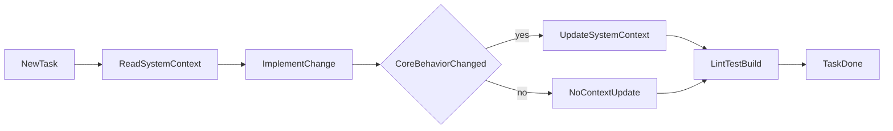

# CRM System Context

## 1) Objetivo deste documento

Este arquivo e a fonte principal de contexto do projeto CRM.

Ele existe para:
- reduzir gasto de tokens em exploração repetida;
- manter decisões técnicas e comportamento funcional centralizados;
- orientar implementação, revisão e manutenção com consistência.

Se houver conflito entre este documento e o código, o código atual prevalece e este documento deve ser atualizado imediatamente.

## 2) Estado atual do produto

O CRM está em produção interna com persistência Supabase e fluxos principais ligados:

- Autenticação Supabase Auth + proxy (`src/proxy.ts`, matcher `/crm`, `/login`) em rotas protegidas
- Kanban e ficha do lead com dados reais (`oportunidades`, campos dinâmicos, intake)
- Motor de workflow com transições via `POST /api/crm/leads/transition`
- DUE por área (tarefas, revisão, ajustes) e proposta por área
- Proposta com Word BP canônico, prévia por download DOCX e geração final validada; PDF montado direto no servidor (`pdf-lib`) a partir do modelo BP
- Contrato com builder próprio e integração D4Sign (envio + webhook)
- Histórico do lead (`lead_activity_events`) na aba **Histórico** da ficha
- Admin: usuários, campos dinâmicos, config WhatsApp DUE

Pontos em evolução (Ondas 2–3):

- Funil de pós-venda parcialmente modelado (etapas após `contrato_assinado`)
- Autorização fina por área na UI (ocultar ações por perfil/área) — incompleta; prevista para Ondas 2–3
- `/crm/clientes` lista grupos econômicos sincronizados do OrquestrAI, com status Ativo/Inativo (`gestor_atividade`) e resumo de títulos SIOE; o modal do grupo mostra Áreas (atuação jurídica), Origem do Lead, pessoas/CNPJs e **Categoria = Cliente** (Lead fica preparado no tipo da linha `origemLinha`; oportunidades ainda não entram nesta lista); admin/controladoria editam origem do lead, captador (reusa `lead_intakes.solicitante_nome` + `oportunidades.solicitante_email` do lead vinculado), plataforma, área de cross selling, decisor e áreas no modal; **Quem indicou** usa a mesma base de `indicadores` aprovados do cadastro de lead (Colaborador = quadro OrquestrAI; pessoa nova solicita aprovação em `pendente_aprovacao`); a listagem ordena por Grupo (A–Z) e depois Status, com headers clicáveis; um botão copia o **link único** da grade pública `/preencher/carteira/[token]`; `/crm/contratos` é o hub contratual com carteira, fechamentos, renovações, indicadores, o painel D4Sign e o atalho para importar PDFs fechados
- Integração RD CRM e VIOS conforme variáveis de ambiente

Hardening 2026-07-27 (Onda 1):

- Policies RLS admin/CRM reforçadas; webhooks de integração fail-closed
- RPCs transacionais `transition_opportunity_atomic` e `delete_crm_lead_atomic` (service_role)
- `fetchWithTimeout` nos conectores externos
- CI: `.github/workflows/ci.yml` (lint, test, build)

Variáveis críticas: `NEXT_PUBLIC_SUPABASE_*`, `SUPABASE_SERVICE_ROLE_KEY`, tokens RD/D4Sign conforme `.env.example`. Importação de escopos e de contratos fechados usam o mesmo cliente OpenAI (`src/lib/scope-import/openai.ts`): `OPENAI_API_KEY` (server-only), opcionalmente `SCOPE_IMPORT_OPENAI_MODEL_EXTRACTION` (default `gpt-4.1-mini`) e `SCOPE_IMPORT_OPENAI_MODEL_CONSOLIDATION` (default `gpt-4.1`). Contratos aceitam `CONTRACT_IMPORT_OPENAI_MODEL` para sobrescrever o modelo de extração. Para carteira: `ORQESTRAI_SUPABASE_URL`, `ORQESTRAI_SUPABASE_SERVICE_ROLE_KEY` (marketing-system: `email_client_groups`, `email_companies`, `email_people`), `SIOE_SUPABASE_SERVICE_ROLE_KEY` (títulos `financeiro_parcelas`). Rateio por área na importação de PDF vem de `financeiro_parcelas_itens.departamento` nas pessoas do CNPJ raiz/`grupo_cliente` (não é inventado pela IA; o escritório `26080152` é ignorado).

## 3) Arquitetura em camadas

### 3.1 Stack
- Next.js 16 (App Router)
- TypeScript
- Tailwind v4 + shadcn/ui
- Supabase (schema/modelagem pronta)
- Vitest para testes de domínio/aplicação

### 3.2 Organização de módulos
- `src/modules/crm/domain`: tipos e regras puras
- `src/modules/crm/application`: casos de uso e orquestração
- `src/modules/crm/infrastructure`: repositórios e integrações externas
- `src/modules/contracts/domain`: dinheiro em centavos, projeção, cálculo, validação e políticas puras
- `src/modules/contracts/application`: rascunho, configuração, fechamento e planejamento diário
- `src/modules/contracts/infrastructure`: repositório Supabase e consultas tipadas do hub/ficha
- `src/app`: rotas web e endpoints API

### 3.3 Fluxo técnico
1. Página/endpoint recebe input.
2. Input é validado (Zod nas APIs).
3. Serviço de aplicação executa regra de negócio.
4. Infra acessa repositório/integração.
5. Resposta estruturada retorna para UI/API.

## 4) Rotas web e comportamento

- `/`: landing técnica para entrada no CRM.
- `/login`: formulário de entrada (Supabase Auth); rotas `/crm/*` exigem sessão (`src/proxy.ts`, matcher `/crm`, `/login`, `/trocar-senha`). Sem `NEXT_PUBLIC_SUPABASE_*` o CRM redireciona para login com aviso de configuração. Depois do login a página recarrega por completo (`window.location.assign`), porque a navegação interna do Next não envia o cookie novo e a sessão só aparecia após um refresh manual. Conta com `app_metadata.must_change_password` (só o service role grava) é levada a `/trocar-senha` antes de qualquer página do CRM; a nova senha segue `adminInitialPasswordSchema` e não pode repetir a temporária. **Esqueci minha senha** (`/esqueci-senha`) pede ao Supabase o e-mail de recuperação; o link volta em `/auth/callback`, que abre a sessão e grava o cookie `crm_pwd_recovery` (15 min). `/redefinir-senha` só aceita a nova senha com esse cookie e, ao salvar, desliga `must_change_password`. O link PKCE precisa ser aberto no mesmo navegador que pediu o e-mail. `/preencher/carteira/[token]` fica fora desse matcher e é a grade pública (sem login) dos grupos já cadastrados.
- `/crm`: dashboard com KPIs e filas operacionais (dados Supabase).
- `/crm/leads`: kanban interativo, ficha do lead (Visão geral, Histórico, DUE, proposta, contrato, D4Sign). O wizard **Abertura comercial guiada** consulta `GET /api/crm/clients/lookup?documento=` ao informar CPF/CNPJ da primeira empresa; se houver cadastro na carteira (`clientes`), preenche razão social/endereço resumido e exige escolher **contrato novo** (`oportunidades.tipo = novo_contrato`) ou **aditivo** (`aditivo` + `contrato_base_id`). Cross selling continua vinculando `cliente_id` como contrato novo. Na primeira abertura do builder de proposta/contrato para `novo_contrato` com endereço `cp_cliente_*` vazio, pergunta se deseja aplicar `GET /api/crm/clients/[id]/cadastro` (recusa fica na sessão do navegador).
- Na ficha do lead, a razão social permanece como título da oportunidade. O **solicitante interno** é uma identidade separada (`lead_intakes.solicitante_nome` + `oportunidades.solicitante_email`), exibida com nome, avatar e e-mail resolvidos em `app_users`; a edição aceita somente utilizadores ativos do CRM e atualiza nome/e-mail em conjunto.
- `/crm/clientes`: carteira por grupo econômico (espelho OrquestrAI `email_client_groups` / `email_companies` / `email_people`). A coluna **Status** é Cliente ativo/inativo a partir de `email_client_groups.gestor_atividade`, espelhada em `grupos_economicos.gestor_atividade` (o fetch ao vivo só sobrepõe). **Categoria** = `Cliente` | `Lead` (`origemLinha`; hoje só Cliente, porque a lista é `grupos_economicos`). Não é área jurídica e o gestor não escolhe o valor. **Áreas** = atuação jurídica (`responsible_area` ∪ `legal_areas` ∪ rateio/pastas SIOE ∪ manual). **Origem do Lead** = tipo/subtipo/nome do cadastro de lead (rótulo de UI; chaves `tipo_lead` / `tipo_indicacao` / `nome_indicacao` inalteradas; o tipo gravado `Indicacao` aparece como “Indicação”). **Lead Digital** exige subtipo **Plataforma** (`plataforma`: Instagram, LinkedIn, Site). **Cross Selling** grava o cliente já existente (`oportunidades.cliente_id`) e a **área** (`area_cross_selling`, catálogo `CRM_PRACTICE_AREAS`). **Captador** é o solicitante interno do lead (`lead_intakes.solicitante_nome` + `oportunidades.solicitante_email`), sem coluna nova no grupo. **Decisor** é texto livre opcional (`decisor`). Colunas novas em `lead_intakes` e `grupos_economicos` estão na migration local `20261008183000_lead_plataforma_area_cross_selling.sql` (não aplicada no remoto). Admin/controladoria editam esses campos e as áreas no modal (`PATCH /api/crm/carteira/grupos/[id]`, capability `configure`); o modal segue o contrato Dialog+Select (`modal={false}` + `dialogSelectOutsideHandlers`) e as áreas são chips `type="button"` (o toggle local funciona mesmo se o PATCH retornar 409). Nome, Status OrquestrAI e Categoria não são editáveis neste lote. CPF vai para Pessoas e CNPJ para Empresas. A tabela ordena por Grupo (A–Z) e, no empate, Status. Abertos/Pagos/Valor aberto continuam sendo o resumo SIOE. Admin/controladoria/comercial copiam **um** link público da grade (`POST /api/crm/carteira/intake-links`) — não há URL por grupo. Caminho para leads: unir `oportunidades` ativas com empresa/grupo (`cliente_id` / `lead_intakes.empresas_json`) que ainda não são linha de carteira, `origemLinha: "lead"`, sem filtrar etapa de funil.
- `/crm/contratos`: hub dinâmico com abas **Carteira**, **Fechamentos**, **Renovações**, **Indicadores** e **Assinaturas D4Sign**. Sem parágrafo descritivo sob o título. A faixa de KPIs mantém Na carteira / Ativos / Em implantação / Referência anual e acrescenta **contratos por área** (áreas canônicas; um contrato em 3 áreas conta nas 3), **grupos Cliente ativo × contratos cadastrados** e alerta **ativos sem contrato** (`email_client_groups.gestor_atividade`, não o enum SIOE de `grupos_economicos.status`). Na carteira o título da linha é o **grupo econômico** e a razão social vai na mesma linha; linhas compactas (1, no máximo 2). O painel D4Sign existente, quota, signatários e documentos órfãos foram preservados. **Renovação/reajuste:** se `data_base_renovacao` estiver vazia, a data exibida e o default de importação/setup são `vigente_de` + 1 ano — inclusive em prazo indeterminado. O alerta, quando não informado, usa a antecedência já do job diário (30 dias). O job de prazo determinado sem data-base continua usando `vigente_ate`. Não há recálculo automático de valor neste lote.
- `/crm/contratos/importacao`: wizard **Enviar → Extrair → Conferir lote → Gravar rascunho**. O PDF é recortado localmente (~16k caracteres: preâmbulo + janelas de honorários/vigência) antes do GPT; a saída pede no máximo 4096 tokens e citações curtas (`evidence.quote` ≤ 160). A revisão mostra resumo em português, selos **Lido do PDF** vs **Rateio SIOE**, trechos da IA e, se não casar grupo/empresa, o diálogo da carteira (`POST .../review` `assign_group`). Gravar rascunho exige grupo/cliente; não ativa nem emite título. O título do rascunho é o nome do grupo econômico casado.
- `/crm/contratos/[id]`: ficha dinâmica com visão geral, configuração em seis etapas, áreas/regras, rateios, fechamentos, versões/aditivos, documentos e eventos. Rascunho importado de PDF mostra a citação da IA (ou o selo SIOE no rateio) no campo e o painel **Conferir etapa**; os vistos ficam em `contrato_versoes.origem_snapshot.reviewedFieldKeys` e não bloqueiam ativar.
- **Modo sócio:** usuário cujo e-mail é de sócio (Gustavo/Ricardo, inclusive aliases — `isPartnerOnlyEmail`, `src/lib/d4sign/partner-only.ts`) vê só **Assinar Contratos** e o próprio perfil, mesmo com papel `admin`. O `proxy.ts` redireciona qualquer outra página `/crm/...` para `/crm/assinar-contratos` (a troca de senha temporária em `/trocar-senha` acontece antes); o menu lateral mostra só o grupo "Sócios" e a busca de leads (botão e Ctrl+K) some. APIs não mudam (botões Ver PDF, Assinar e Cancelar continuam).
- `/crm/assinar-contratos`: área **Assinar Contratos** (grupo "Sócios" no sidebar) para os sócios signatários da firma (`getFirmSigners`: Gustavo e Ricardo, com aliases de domínio antigo). Acesso: papel `admin` **ou** e-mail de sócio (`canAccessPartnerSignatures` em `src/lib/d4sign/partner-signatures.ts`, calculado no layout e na própria página, que redireciona para `/crm` quem não tem acesso). Lê todo `d4sign_documents` (paginado, sem filtro de cofre) e mostra só documentos em que algum sócio é signatário. Contadores de pendentes por sócio; chips Todos/Gustavo/Ricardo (sócio logado começa no próprio filtro); abas Pendentes de assinatura / Aguardando outros / Finalizados / Cancelados (status `1` = finalizado; `4`/`6`/`7` = cancelado; demais = em andamento). Ações: Ver PDF (`D4SignViewDialog`), Assinar (só para o próprio sócio pendente; abre o link de assinatura da D4Sign por `GET /api/crm/d4sign/documents/[uuid]/sign` — o EMBED não está habilitado na conta) e abrir na D4Sign pela rota `GET /api/crm/d4sign/documents/[uuid]/open` (`d4signDocumentOpenPath`). Ao abrir Assinar, o contrato sai na hora dos contadores de pendente daquele sócio (aviso na tela, chip “confirmando”). A baixa fica no navegador de quem clicou (`crm.partner-sign-assumption.v1`) e no servidor (`cursor/partner-sign-refresh` em `d4sign_api_usage`, `source` = `uuid|e-mail` do sócio, http_status nulo, fora da cota), então o painel do administrador e o do outro sócio aplicam a mesma baixa. A tela relê essa lista a cada 15s em `GET /api/crm/d4sign/partner-sign-assumptions`. O clique também entra na frente da fila de signatários (`POST /api/crm/d4sign/documents/[uuid]/sign-refresh` e o próprio `GET .../sign`). A fila (`pickDocumentsToEnrich`) lê esses contratos antes do backlog, enquanto `details_fetched_at` for anterior ao clique. A confirmação usa essa leitura: se o sócio constar como assinado, o aviso some; se a leitura chegar e ele ainda estiver pendente, volta para Pendentes. Um aviso da D4Sign que só zera `details_fetched_at` não confirma nem devolve. Documentos sem signers enriquecidos não aparecem (aviso com contagem; admin tem link para a aba técnica). Realtime via `useD4SignDocumentsRealtime`. A aba técnica **Assinaturas D4Sign** de `/crm/contratos` continua como estava.
- `/crm/admin/usuarios`: listagem real de `app_users` com seletor de role por usuário (usa `SUPABASE_SERVICE_ROLE_KEY`).
- `/crm/admin/campos`: CRUD de `field_definitions` por funil/etapa com drawer de novo campo e ConditionBuilder.
- `/crm/admin/proposta-escopo`: catálogo de escopos e investimentos (CRUD admin). **Cláusulas do contrato por escopo:** ao criar um subtipo de escopo, um AlertDialog pergunta “Deseja incluir as cláusulas do contrato vinculadas a este escopo?”; **Sim** abre `ScopeContractClausesDialog`, que reutiliza `ClauseTemplatesAdminPanel` (mesmo painel de `/crm/admin/clausulas`) em modo `focusSubtype`: lista só as cláusulas com `scope_subtype_key` = `subtype_key` do subtipo e cria novas já com `area_key` (área do tipo pai) + `scope_subtype_key`, pelas APIs existentes `POST/PATCH/DELETE /api/crm/admin/contract-clauses` (admin). O editor do subtipo tem o botão **Cláusulas do contrato** com a contagem vinculada (estado de alerta quando 0). A página carrega `contract_clause_templates` no servidor; se falhar, o catálogo funciona sem o atalho. Vínculo é soft key (sem FK, sem migration): como `subtype_key` só é único por tipo, o diálogo avisa quando outra chave igual existe em outro tipo. **Geração do contrato (híbrido):** subtipos com perfil em código (`scope-profiles.ts`, hoje Trabalhista) continuam só com o perfil — o vínculo do banco é ignorado e o contrato não muda. Subtipos **sem** perfil usam as cláusulas **ativas** vinculadas (`scope_subtype_key` = subtipo; se `area_key` estiver preenchido, precisa ser a área da proposta), ordenadas por `sort_order`/título/chave, com a mesma resolução de placeholders das demais; entram na seção do `role` (o formulário de cláusula tem **Seção no contrato**; `role` aceito em `POST/PATCH /api/crm/admin/contract-clauses`, null = Disposições Gerais). Com ≥1 cláusula ativa o escopo deixa de ser `missingProfile` e conta como representado no objeto; sem nenhuma, continua bloqueado. Cláusulas sem `stable_key` recebem a chave derivada `db_clause:<id>` no motor (sem DDL). Ver `src/lib/crm/contract-engine/scope-linked-clauses.ts`. Efeito colateral esperado: cláusulas Cível já semeadas com `scope_subtype_key` (ex.: `mais_um_processo`) passam a entrar nos contratos desses subtipos.
- `/crm/admin/proposta-escopo/importacao`: wizard de importação em massa de PDF/DOCX → extração IA → consolidação → revisão/aprovação para o catálogo.

**Proposta — investimento no Word:** o placeholder `[INVESTIMENTO]` recebe um bloco com valor total consolidado (soma das áreas, editável manualmente e com forma de pagamento no builder — mais de uma forma por documento, ver `PropostaInvestimentoDocumentoItem`). Valores por área em `cp_escopo_detalhe_json` permanecem para coordenação interna; a chave reservada `__investimentoDocumento__` no mesmo JSON guarda tipo/subtipo e placeholders do documento. Previews de escopo e investimento (modal da área, catálogo e página do documento) usam texto justificado (`JustifiedDocumentText`). Placeholders `[CHAVE]` no template do catálogo entram no formulário de inclusão (união com `placeholder_keys`); o modal recarrega o catálogo ao abrir e ao voltar para a aba.
- `/crm/perfil`: edição do próprio `app_users` (nome, área, URL da foto).
- `/preencher/carteira/[token]`: grade pública (sem login) para o gestor escolher o grupo na lista e preencher origem/indicação e áreas **na própria linha**. **Quem indicou** replica o cadastro de lead: Select da base `indicadores` (`status=aprovado`) + opção “Não encontrei na base (solicitar aprovação)” (grava `pendente_aprovacao` e notifica admins); subtipo Colaborador lista o quadro OrquestrAI (`orqestrai_colaboradores`). O token é único de campanha (opaco, hash SHA-256 em `grupo_intake_tokens.scope=carteira`), com validade; o mesmo link serve para todos os grupos já cadastrados e pode corrigir enquanto não expirar. Grava em `grupos_economicos` e aparece na aba Clientes.

### 4.1 Motor documental da proposta BP (02/09/2026)

- Fonte canônica privada: `templates/proposta/PROPOSTA-BP-V1.docx`, preparado do Word oficial fornecido. Layout institucional fica no template.
- `buildPropostaDocumentSnapshot` → `buildCanonicalProposalData` → `renderCanonicalProposalDocx`; mesma geração determinística para dados/template iguais.
- `POST /api/crm/leads/:id/document/preview` retorna DOCX binário do draft sem persistir (mesmo renderer da exportação). No builder, a coluna direita renderiza o DOCX com `docx-preview`: páginas de **escopo** ficam interativas no DOM com **timbrado de referência** (`escopo-a/b/c.webp`) como `background-image` da folha (cabeçalho Word oculto para não duplicar logo; traços soltos de marcador Word ocultos); capa, institucional, **CV Gustavo**, **CV Ricardo**, **assinaturas** (com overlay transparente `Vigência da Proposta: dd/MM/aaaa`) e **contracapa** usam **miniaturas de referência** (`public/proposal-preview/reference/*.webp`; **capa** exportada de `MODELO SÓ CAPA.pdf`, demais folhas do guia `MODELO PDF DAS MINIATURAS E TIMBRADO.pdf`) — na **capa**, só três campos (`EMPRESA`, `RESPONSAVEL`, `DATA_PROPOSTA` via `buildPropostaPreviewPage` / `templateData` canônico; telefone/site/e-mail ficam no WebP estático); fallback de parse do DOCX só se a capa canônica não estiver disponível — a **capa só na primeira folha** (a contracapa final não reutiliza `capa.webp`); folhas finais do modelo BP são mapeadas pela folha de assinaturas (dois sócios): as duas anteriores viram sempre CV Gustavo e CV Ricardo (mesmo se o Word gerar folha em branco só com desenho); a linha “Data de vigência proposta” que aparece no DOCX sobre o CV **não** gera overlay nem folha `vigencia` separada; investimento e demais seções fixas dinâmicas viram PNG via `html-to-image` em captura A4 normalizada (largura ~794px, `pixelRatio` 1,5, staging visível). **Baixar prévia Word** continua disponível e permanece canônico.
- **Gerar Word** aguarda saves confirmados e revalida o estado salvo no servidor; falha de save bloqueia exportação. Validação local acompanha o draft atual.
- **Enviado por** é explícito e obrigatório, persistido em `document_instances.data_json.responsavel`; não se presume que o criador do lead seja o remetente.
- Na ficha do lead em etapa de proposta, a aba abre o builder diretamente. Ao fechar o dialog, fica apenas um ponto compacto para reabrir o editor; os cards intermediários de pendências e histórico foram removidos porque duplicavam informações do próprio builder.
- Data compartilhada entre pedidos em `America/Sao_Paulo`, vigência +7 dias. Escopos usam parágrafos/estilos Word e paginação natural.
- DOCX é transmitido em streaming e retorna SHA256; versão guarda snapshot e hashes. Nenhum arquivo é arquivado em storage por esse fluxo.
- PDF da proposta (GERAR → PDF e prévia `format: "pdf"`) é montado **direto no servidor** com `pdf-lib` + `@pdf-lib/fontkit` (`buildPropostaPdf` em `src/lib/crm/proposta-pdf-builder.ts`) a partir do mesmo `CanonicalProposalData` do Word, sem conversor externo nem variável de ambiente. Modelo em `assets/proposta-pdf/proposta-modelo.pdf` (fora de `public/`; incluído no trace via `outputFileTracingIncludes`), gerado por `scripts/prepare-proposta-pdf-assets.py` a partir de `MODELO SÓ CAPA.pdf` + guia `MODELO PDF DAS MINIATURAS E TIMBRADO.pdf` (datas de vigência de exemplo removidas só da camada de texto). Ordem: capa (desenha `EMPRESA` em caixa alta, `Enviado por: RESPONSAVEL`, `Campinas/SP, DATA_PROPOSTA`) → institucional → páginas de conteúdo sobre o timbrado (escopo por área com rótulo do tipo em negrito + `Investimento`, corpo justificado 12 pt, quebra automática respeitando cabeçalho/rodapé) → CV Gustavo → CV Ricardo → assinaturas (`Vigência da Proposta: DATA_VIGENCIA` na caixa) → contracapa. Páginas fixas são copiadas vetoriais. Fontes OFL em `assets/proposta-pdf/fonts/`: Liberation Serif (equivalente métrico do Times New Roman do Word), EB Garamond (capa), Montserrat (capa), Inter (vigência; substitui Aptos). Persistência/versão (`.pdf`, `document_versions`, bloqueio por pendências) igual ao DOCX; o DOCX continua sendo renderizado na geração oficial para `sourceDocxSha256`. A rota legada `/api/crm/leads/:id/proposta-docx` retorna HTTP 410. Contratos/D4Sign não foram alterados.
- Detalhes, testes, diferenças visuais do DOCX/PDF original e limitações: `docs/PROPOSTA-DOCUMENT-ENGINE.md`.

Observação: a navegação principal está no `AppShell` — grupos "Comercial", "Sócios" (Assinar Contratos; admin ou e-mail de sócio, via `CrmSessionUser.canAccessPartnerSignatures`) e "Configurações" (admin: Usuários, Campos, Modelo da proposta, Catálogo de Escopos, Integrações, Cláusulas), e rodapé com conta (avatar, link para perfil, sair).
O `AppShell` também disponibiliza a busca global de leads em todas as páginas: lupa permanente na sidebar recolhida, botão de pesquisa quando expandida, lupa no header mobile e atalho `Ctrl/Cmd + K`. O modal consulta `GET /api/crm/leads/search?query=...`, pesquisa empresa/nome do lead, e-mail, solicitante interno e UUID, e mantém até seis acessos recentes em `localStorage`.

## 5) Fluxos de negócio modelados

### 5.1 Abertura de demanda
- `novo_lead`: não exige cliente prévio.
- `novo_contrato`: exige cliente existente.
- `aditivo`: exige cliente existente e contrato base.

Regra implementada em `src/modules/crm/application/services/open-demand.ts`.

### 5.2 Workflow de pipeline

Etapas base:
- `cadastro_lead`
- bloco condicional de due diligence
- `reuniao` até `contrato_assinado`

Se `haveraDueDiligence = true`, inclui:
- `levantamento_dados`
- `compilacao`
- `revisao`
- `due_diligence_finalizada`

Regras:
- só permite transição para a próxima etapa imediata;
- bloqueia pulo e retrocesso no serviço atual;
- valida pré-condições por etapa:
  - `proposta_enviada` exige `linkProposta`;
  - `contrato_elaborado` e `contrato_assinado` exigem `linkContrato`;
  - `reuniao` confirma local/data/horário já gravados no intake ou na transição para `due_diligence_finalizada` (pré-preenchidos; editáveis).

No front de leads, o kanban renderiza as 12 etapas em colunas dedicadas. Ao arrastar, o card vai imediatamente para a coluna de destino (estado local) e o modal de dados obrigatórios abre na hora (esqueleto até a API responder). `GET /api/crm/leads/transition-requirements` busca oportunidade, intake, campos e valores em paralelo. Cancelar ou falhar a validação devolve o card à origem. Edições na ficha gravam via PATCH sem `router.refresh()` da página inteira; o Realtime não recarrega a ficha só por `field_values`/`lead_intakes`. APIs autenticadas (`requireAuthApi`) não esperam a API de fotos oficiais.

## 6) Contratos de API atuais

### 6.0 Contratos e faturamento (implementado localmente)

- O módulo de contratos abrange identidade e versões contratuais, áreas, regras de cobrança, rateios, consumos, fechamentos mensais, renovações, aditivos, referências D4Sign/SharePoint/VIOS e eventos auditáveis.
- A configuração financeira é concluída na etapa `inclusao_faturamento` do pós-venda. A transição dessa etapa para `boas_vindas` exige contrato vinculado com versão ativa e válida; entrar na etapa não exige a configuração completa.
- Na primeira entrega, o VIOS continua sendo o sistema de emissão e contas a receber. O CRM somente registra a referência do lançamento; não cria títulos, faturas ou notas automaticamente.
- Permissões por capability: todos os papéis (`admin`, `controladoria`, `financeiro`, `comercial`) consultam; `admin` e `controladoria` configuram, aprovam fechamentos e gerenciam renovação/aditivo; `admin`, `controladoria` e `financeiro` preparam fechamentos e registram referências VIOS. A decisão não depende de `app_users.area`.
- `POST /api/crm/contracts/ensure` — cria/repara o rascunho idempotente de oportunidade assinada; `admin`, `controladoria` e `comercial`.
- `PATCH /api/crm/contracts/[id]/configuration` — salva somente versão rascunho, com validação e concorrência otimista; `admin`/`controladoria`. O `updated_at` esperado aceita ISO truncado pelo RSC (`Z` vs `+00:00`, microssegundos) com tolerância de 1s; o RPC usa o instante exato do banco. Não reescreve `origem_snapshot` (citações da IA e vistos permanecem).
- `PATCH /api/crm/contracts/[id]/ai-review` — grava `reviewedFieldKeys` em `origem_snapshot` do rascunho; devolve `updatedAt` para o wizard. Sem DDL.
- `POST /api/crm/contracts/[id]/activate` — ativa versão e, quando solicitado, avança `inclusao_faturamento -> boas_vindas` na mesma transação; `admin`/`controladoria`. Mesma comparação de `updated_at` da configuração.
- `GET /api/crm/contracts/[id]/usage` — pastas ativas e horas do mês no SIOE para o grupo do contrato; autenticado com capability `view`. A ficha não espera o SIOE no SSR; o wizard completa no cliente.
- `GET|POST /api/crm/contracts/[id]/closings` e `GET|PATCH /api/crm/contracts/[id]/closings/[closingId]` — prepara, consulta, resolve, aprova, corrige e registra VIOS conforme capability.
- `GET|PUT /api/crm/contracts/[id]/consumptions` — consulta e substitui consumos manuais da competência; `admin`, `controladoria` e `financeiro` para escrita.
- `GET|PATCH /api/crm/contracts/[id]/renewals/[alertId]` — consulta e conclui tarefas de renovação; mutação por `admin`/`controladoria`.
- `POST /api/crm/contracts/[id]/versions` — clona rascunho e suspende, retoma ou encerra contrato com auditoria; `admin`/`controladoria`.
- `GET|POST /api/cron/contracts-daily` — job protegido por `CRON_SECRET`, agendado em `vercel.json` para `0 13 * * *`, com data de São Paulo e upserts idempotentes.
- `GET|POST /api/cron/d4sign-sync` — protegido por `CRON_SECRET`, fora do `vercel.json`. O GitHub Actions (`.github/workflows/d4sign-sync.yml`) chama `POST` a cada 5 minutos (`*/5 * * * *`) com `Authorization: Bearer CRON_SECRET`, no app `https://crm-indol-ten.vercel.app`. O agendamento do GitHub atrasa ou pula execuções, então o layout de `/crm` também dispara a rodada em `after()` quando a última tem mais de 4 minutos (`runD4SignSyncRoundIfStale`; marca em `d4sign_api_usage.endpoint = cursor/sync-round`). A rodada fica em `src/lib/d4sign/sync-round.ts`; cada etapa é isolada (erro vai para `errors` e as outras seguem, resposta 200), e um 5xx da D4Sign na listagem por fase pula para a próxima fase em vez de travar o ciclo. O workflow só falha quando o próprio endpoint responde fora de 2xx/429. A D4Sign limita **10 req/h por método** (não é global — a central de ajuda descreve o erro como limite "para o método utilizado"). `getD4SignQuotaStatus(método)` conta só o método pedido; listagem da raiz e de pasta (`documents/safe` e `documents/safe/folder`) dividem a mesma cota por precaução. O plano (`planD4SignSyncBudget`) dá a cada etapa a cota livre do seu método, menos a reserva humana `D4SIGN_HUMAN_RESERVE` (2 listagens, 2 buscas de signatários, 2 downloads de PDF por hora). Ordem da rodada: (1) **fases** por `GET /documents/{fase}/status` em todas as fases — 3, 2, 4, 1, 6, 5, 7 (`PENDING_SIGNATURE_PHASES`) —, que trazem documentos de qualquer pasta, até 500 por chamada, num ciclo contínuo (cursor `cursor/pending-signatures`); (2) **signatários** (`GET /documents/{uuid}/list`) pela fila de `pickDocumentsToEnrich`: contrato que o sócio abriu em Assinar (`cursor/partner-sign-refresh`, ainda sem leitura posterior ao clique) → pendente sem signatários → pendente com signatários há mais de 24h e finalizado com signatário não assinado → finalizado sem signatários → demais sem signatários, cada faixa do mais recente ao mais antigo, pulando o que foi buscado há menos de 6h e voltou vazio; (3) 1 página da raiz (`GET /documents/{safe}/safe`, cursor `cursor/vault-safe`); (4) pastas de cliente com o que sobrar da cota de listagem (cursor `cursor/vault-folders`), só para nome/pasta; (5) remetente pelo log do PDF (`collectD4SignPdfLogs`, `src/lib/d4sign/pdf-log-sync.ts`): fila de `log_parsed_at` nulo, pendentes primeiro; cada download no sync tem prazo de 15s+25s e só começa se couber no orçamento da rodada (`SYNC_ROUND_BUDGET_MS` = 260s, abaixo do `maxDuration` de 300s da rota e do layout; com 120s, 3 PDFs de ~30s deram 504); e cada grupo do mais recente ao mais antigo; PDF já no bucket é lido sem cota, os demais custam 1 `documents/download` (acima da reserva humana de 2/h) e, se finalizados, ficam no bucket. A listagem não traz data: `created_at_d4sign` recebe a estimativa de `estimateD4SignCreatedAt` (instante do UUIDv7, que a D4Sign usa desde set/2026, ou o prefixo `AAAA MM DD` do nome). `details_fetched_at` só é gravado pela busca de signatários; a listagem por fase o zera quando o documento passa de pendente para encerrado (signatários gravados ficaram velhos). Na exibição (`parseSigners(raw, status)`), documento finalizado (status `1`) mostra todos os signatários como assinados. Os upserts em lote mandam sempre as mesmas colunas, caindo para o valor do banco — o supabase-js grava NULL em coluna ausente. **Remetente:** a API não diz quem criou/enviou o documento; o log de eventos no fim do PDF diz ("Assinaturas iniciadas por NOME (uuid). Email: x — DATE_ATOM"). `parseD4SignPdfLog` (`pdf-log.ts`) lê esse trecho (fallback: "criado por"); o resultado vai para `sent_by_name`, `sent_by_email`, `sent_at` (migration `20261001120000_d4sign_documents_sender_from_log`). A rota `/view` aproveita todo PDF baixado para ler o log. A listagem por fase zera `log_parsed_at` quando o documento encerra sem remetente achado. Exibição (`resolveD4SignSenders`, `document-sender.ts`): enviado pelo CRM → usuário do CRM (`sent_by_app_user_id`, e `sent_at` no envio); senão o remetente do log, com nome/foto do usuário do CRM quando o e-mail bate. Painel técnico e área dos sócios mostram "enviado em DATA por NOME". O plano Hobby da Vercel recusa cron que rode mais de uma vez por dia.
- `GET|POST /api/cron/d4sign-pending-backfill` — protegido por `CRON_SECRET` e **fora** do `vercel.json`, para não disputar a cota horária. Continua disponível para chamada manual: lista as fases D4Sign **3** e **2** via `GET /documents/{fase}/status`. O cursor (`d4sign_api_usage.endpoint = cursor/pending-signatures`, `http_status` nulo) retoma se ainda houver página.
- `GET|POST /api/cron/carteira-grupos-sync` — espelha grupos/pessoas do OrquestrAI e resume títulos SIOE ABERTO/PAGO; grava `grupos_economicos.categoria = 'Cliente'` (tipo da linha, **não** `responsible_area`); `CRON_SECRET`; agendado `30 9 * * *`. Não emite título. Se a coluna `categoria` ainda não existir no remoto, o upsert segue sem ela. Casa grupo existente por `orqestrai_id` ou `chave_estavel` e **não troca o UUID local** (senão `clientes.grupo_id` quebra o sync). Grupo novo entra com o id do OrquestrAI.
- `GET|POST /api/crm/carteira` — consulta a carteira local (inclui `clienteStatus`, `origemLinha`/`categoria` = Cliente|Lead, e `responsibleArea` do OrquestrAI para Áreas); POST dispara sync (capability `configure`).
- `GET|PATCH /api/crm/carteira/grupos/[id]` — GET devolve indicação, áreas gravadas e áreas derivadas SIOE para o modal; PATCH (capability `configure`) grava tipo/subtipo/nome de indicação e `areas_atuacao`. Se as colunas da migration de intake não existirem, responde 409 com mensagem clara. Não altera nome nem Status OrquestrAI.
- `POST /api/crm/carteira/intake-links` — devolve **um** URL de campanha `/preencher/carteira/[token]` (`admin`/`controladoria`/`comercial`). Reusa o token ativo; `rotate: true` invalida o anterior e emite outro. Não gera N links por grupo.
- `GET|POST /api/public/carteira-intake/[token]` — lê a grade (todos os grupos) e grava **uma linha** (`grupoId` + indicação + áreas) após validar o token de campanha (service role só no servidor; sem policies de browser). Áreas pré-marcadas = união de departamentos de honorários em `financeiro_parcelas_itens` (via `mapSioeDepartamentoToAreaKey`) com pastas `processos_completo` em que `processo_encerrado = 'Não'` e `situacao_processo = 'Ativo'`. Manual só para área sem rateio nem pasta.
- `POST /api/crm/contracts/import` — cria lote + signed URLs para PDFs assinados (`admin`/`controladoria`).
- `GET /api/crm/contracts/import/[batchId]` — estado do lote para revisão.
- `POST /api/crm/contracts/import/[batchId]/confirm` — confirma uploads e libera extração.
- `POST /api/crm/contracts/import/[batchId]/process` — processa 1 PDF por chamada (texto recortado localmente + OpenAI compacto); `maxDuration=120`. Usa `CONTRACT_IMPORT_INPUT_CHAR_CAP` (~18k), não o teto de 60k dos escopos.
- `POST /api/crm/contracts/import/[batchId]/review` — rejeita, vincula grupo manualmente (`assign_group`) ou grava rascunho financeiro (`origem_importacao=pdf`), sem ativar. `origem_snapshot` recebe `aiProvenance` (citações + valor extraído) e `sources` (`contrato` vs `sioe`). Componentes vêm do PDF; rateio percentual por área vem do SIOE (`financeiro_parcelas_itens.departamento` de honorários ABERTO/PAGO), nunca inventado pela IA. O fetch cobre todas as pessoas do CNPJ raiz e do `grupo_cliente`, pagina o PostgREST (1000) e **exclui o escritório** (`26080152`); títulos de honorários podem estar em filial diferente da contratante/matriz (Pague Menos `/0021` e `/0044`; Ingevity `/0004-30` mesmo fora do grupo nominal). Sem título de honorários com departamento de área, não há percentual; se o contrato tiver **uma** área explícita, o rascunho recebe 100% nessa área. Honorários **por quantidade de pasta** (`R$ X por pasta/processo`) viram `variavel_processo` + `quantidade_total` + `unitAmountCents`; **excedente** de pasta/hora vira `variavel_processo`/`variavel_hora` + `excedente` + franquia em `includedQuantity`. O mapeador **não** expande unitário×quantidade para `mensal_fixo`. `variavel_processo` nasce com `areaAllocationEligible` para o rateio posterior aplicar; a modalidade de cobrança não muda. Componente existente (inclusive `variavel_processo`) pode ser marcado `elegivel_rateio`. Rascunho PDF já gravado sem rateio é completado ao abrir `/crm/contratos/[id]`. Identidade: CNPJ da contratante prevalece sobre `groupName` extraído; filiais do mesmo raiz sobem para a matriz; Bismarchi | Pires não casa como cliente. Sem casamento automático, a revisão exige grupo da carteira antes de aprovar.
- Projeção de faturamento (`monthlyProjectionCents`, referência anual calculada, wizard de componentes): mensalidade fixa soma `valor_fixo`; variável multiplica a tarifa pela quantidade **atual do SIOE**, casada primeiro por `grupo_cliente` (nome do grupo econômico) e só então por CNPJs/`pessoa_id` da carteira. Pastas ativas = `processos_completo` com `processo_encerrado = 'Não'` e `situacao_processo = 'Ativo'`. Horas do mês = `timesheets.total_horas_decimal` (não filtrar `cobrar`, inclusive quando vem `'Não'`). Se o utilizador recriar a linha de área no wizard, componentes/rateios órfãos recasam pelo `areaKey` ou, com uma só área, no save. Confirmação de substituição de origem só vale para identidade/vigência (cliente, datas, índice); ajustar áreas, preços e componentes não bloqueia salvar/ativar. O fechamento mensal continua exigindo consumo registrado; a projeção não lança consumo nem inventa rateio.
- As migrations estão versionadas no repositório; aplicação, backfill e smoke no Supabase remoto continuam pendentes de autorização explícita. Ver `docs/contract-management-runbook.md`.

### 6.1 Admin

- `PATCH /api/admin/users/[id]/role` — atualiza role de usuário (body: `{ role: string }`); usa service_role key.
- `GET /api/admin/fields?pipeline=vendas|pos_venda` — lista field_definitions por pipeline.
- `POST /api/admin/fields` — cria novo campo (body: CreateField schema).
- `PATCH /api/admin/fields/[id]` — edita label, is_required, is_active, sort_order, condition_json.
- `DELETE /api/admin/fields/[id]` — remove campo.
- `GET /api/admin/proposal-catalog` — catálogo de escopos/investimentos (admin).
- `POST/PATCH/DELETE /api/admin/proposal-catalog` — CRUD e seed do catálogo.
- `GET /api/admin/scope-import` — lista lotes de importação de escopos.
- `POST /api/admin/scope-import` — cria lote + signed upload URLs (`files: [{name,size,contentType}]`, máx. 40 arquivos / 25 MB).
- `GET/DELETE /api/admin/scope-import/[batchId]` — estado do lote (polling UI só na etapa de extração) / abandonar lote.
- `POST /api/admin/scope-import/[batchId]/confirm` — confirma uploads no storage, batch → `extraindo`.
- `POST /api/admin/scope-import/[batchId]/process` — processa 1 documento por chamada (texto + OpenAI extração); `maxDuration=120`.
- `POST /api/admin/scope-import/[batchId]/consolidate` — consolida extrações em sugestões; `maxDuration=300`.
- `PATCH/POST /api/admin/scope-import/suggestions/[id]` — editar sugestão pendente / aprovar (insere no catálogo) ou rejeitar (409 se já revisada).

### 6.2 Workflow

- **`POST /api/crm/leads/transition`** — transição autenticada de etapa (uso atual do kanban e da ficha).
- **`PATCH /api/crm/leads/[id]`** com `{ closingStatus: { value: "perdido" | null } }` — comercial/admin marca a negociação como perdida ou reabre o lead. Atualiza `oportunidades.encerramento` e registra a ação em `lead_activity_events`.
- **`PATCH /api/crm/leads/[id]/due-area-review-adjustments`** — conclui tarefas com ajustes solicitados na Compilação. Body: `{ taskIds, evidenceKind: "file" | "link", evidenceLink?, completionNote? }`. `link` exige `evidenceLink` (http/https) e grava `oportunidades.link_proposta`; `file` exige um PPT em `due_documents` enviado após a solicitação de ajustes (o modal da ficha coleta o arquivo e faz o upload antes de concluir).
- **`POST /api/workflow/validate`** e **`POST /api/workflow/transition`** — **descontinuados (410)**; substituídos pelo endpoint CRM acima.

### 6.3 Integrações
- `POST /api/integrations/rd/import`
  - usa `RD_CRM_TOKEN` e `SUPABASE_SERVICE_ROLE_KEY`;
  - importa negociações e contatos do RD com paginação real da API v1, filtra por ano (default 2026) e persiste em `clientes`, `oportunidades`, `rd_deal_reconciliacao` e `import_batches`.
- `POST /api/integrations/rd/webhook`
  - recebe eventos do RD (`crm_deal_*` e `crm_contact_*`) e sincroniza mudanças no banco em tempo real;
  - exige segredo via header `x-rd-webhook-secret` ou query `?secret=...`, igual a `RD_WEBHOOK_SECRET`.
- `GET /api/integrations/vios/client?document=...`
  - usa `VIOS_API_KEY`;
  - no estado atual retorna cliente stub.
- `POST /api/integrations/d4sign/send` (multipart)
  - sessão Supabase + papel `comercial` ou `admin`;
  - body: `opportunityId`, `signerEmail`, `signerForeign` (0|1), `message` (opcional), `file` (PDF/DOC/DOCX/imagem);
  - env: `D4SIGN_TOKEN`, `D4SIGN_SAFE_UUID` (cofre), opcional `D4SIGN_CRYPT_KEY`, `D4SIGN_API_BASE_URL` (ex. sandbox);
  - fluxo D4Sign: upload → `createlist` → `sendtosigner` → `signaturelink`; grava `link_contrato`, `d4sign_document_uuid` e timestamps na `oportunidades`;
  - garante o Webhook 2.0 no cofre (`ensureSafeWebhookV2`); não cadastra mais webhook por documento.
- `POST /api/integrations/d4sign/webhook` — POSTback **Webhook 2.0** (JSON) e 1.0 (form-data), lidos por `readD4SignWebhookRequest` (`src/lib/d4sign/webhook-payload.ts`).
  - A conta está no Webhook 2.0 (Opções da conta > Dev(API) > Webhook). O webhook é cadastrado **no cofre** (`POST /webhooks/v2/` com `type: "cofre"`) por `ensureSafeWebhookV2` (`src/lib/d4sign/webhook-registration.ts`), uma vez, na primeira rodada do sync ou no primeiro envio; marca `cursor/webhook-v2` em `d4sign_api_usage` (refaz só se a URL mudar). URL: `NEXT_PUBLIC_APP_URL`, senão `https://$VERCEL_PROJECT_PRODUCTION_URL`.
  - Eventos 2.0: `1` finalizado (com `signers[]` completos: email, name, signed_at, identification_number — dispensa o `GET /list`), `2` e-mail não entregue (`signer` + `error_details`), `3` cancelado (`cancellation_message` → `status_comment`), `4` signatário assinou (`signer`). Todos com `event_datetime` e `document_name`. Retentativa D4Sign: 7 vezes em até 27h.
  - Confiança: `Content-Hmac` (HMAC-SHA256 do UUID com `D4SIGN_WEBHOOK_HMAC_SECRET`) válido → aplica o evento; inválido → 401; ausente (ou segredo não configurado) → só registra e zera `details_fetched_at`, pondo o documento no topo da fila de signatários (202). `raw_payload._crm` guarda versão e estado do HMAC.
  - Aplica com `applyWebhookToSigners`: mantém `key_signer`/papel, acrescenta signatário que não estava na lista; evento de assinatura/bounce atrasado não reabre documento finalizado/cancelado. Documento fora do catálogo é criado na hora (nome, cofre, data estimada).
  - Oportunidade vinculada: status, `d4sign_signers` e, no `type_post = 1`, `finalize_d4sign_opportunity` (avança para `contrato_assinado`) + notificações.
  - Controle do evento (`processing_status`, `attempt_count`, `processed_at`, `last_error`) e idempotência por (`document_uuid`, `type_post`, e-mail) vêm da migration `20260727170000_harden_webhooks`, aplicada em produção em 2026-10-01 **só no trecho de webhooks** — a `finalize_d4sign_opportunity` dela é mais antiga que a de `20260812122000` e não foi reaplicada. A gravação dos campos de controle segue best-effort.
- `GET /api/crm/d4sign/documents/[uuid]/view` — PDF para o dialog de visualização. Autoriza com `authorizeD4SignDocumentAccess` (`src/lib/d4sign/document-access.ts`). Cache no bucket privado `d4sign-contracts` (`{uuid}.pdf`). O download na D4Sign é `POST /documents/{uuid}/download` com `{"type":"pdf","language":"pt"}` (1 req da cota de `documents/download`, separada das listagens); a resposta JSON `{"url","name"}` é então baixada. A URL temporária pode estar em `*.d4sign.com.br`, `*.amazonaws.com` ou `*.cloudfront.net`; redirecionamentos HTTP, cabeçalho `Refresh`/meta refresh e corpo em Base64 são tratados. Só cacheia contrato **finalizado** (status `1`) e só se o resultado começar com `%PDF`; o PDF de pendente muda a cada assinatura e é baixado de novo a cada abertura. Se o download falhar e o contrato não estiver finalizado, a 2ª via é a URL de `generate-document-view` (arquivo original, sem assinaturas). Busca do arquivo: redirecionamento manual guardando cookies, até 45s (`maxDuration = 90`), e a mensagem de erro traz host, motivo (timeout, DNS, TLS) e tempo. Objeto vazio ou inválido é apagado e a rota baixa de novo. Cada falha volta com `stage` (`api`, `url`, `file`, `content`), é registrada no log do servidor e a mensagem aparece no dialog. Com a cota de download esgotada, a rota responde 429 sem chamar a D4Sign.
- `GET /api/crm/d4sign/documents/[uuid]/open` — "Abrir no D4Sign". Mesma autorização da `/view`. Redireciona para o painel `https://secure.d4sign.com.br/desk/viewblob/{uuid}`, que mostra a versão finalizada e assinada (exige login na conta com acesso ao cofre; `/desk/viewdoc/` responde 404). Não usa `generate-document-view`, que abre o original sem assinaturas. O dialog de PDF, o dashboard, a área dos sócios e o card do lead ("Abrir contrato"/"Ver contrato assinado", quando há `d4sign_document_uuid`) usam essa rota. `link_contrato` continua guardando o link de assinatura do 1º signatário, que deixa de abrir depois que ele assina.
- `GET /api/crm/d4sign/documents/[uuid]/sign` — "Assinar". Mesma autorização da `/view`. Se quem está logado é o sócio (e-mail ou alias) pendente no documento e há `key_signer`, pede `GET /documents/{uuid}/signaturelink/{key_signer}` (cota própria `documents/signaturelink`) e redireciona para o link de assinatura dele. Qualquer outro caso (admin que não é o sócio, já assinado, sem `key_signer`, erro ou cota) redireciona para `/desk/viewblob/{uuid}`. Usado pela área dos sócios e pelo "Assinar agora" do painel técnico via `D4SignSignButton`, que escolhe: com `NEXT_PUBLIC_D4SIGN_EMBED_ENABLED=1` abre o EMBED (`EmbedSignDialog`, conforme https://docapi.d4sign.com.br/docs/instalação.md, inclusive a correção de Safari `embed/safari_fix`); sem a variável, abre esta rota. A ativação do EMBED é da conta, pelo suporte D4Sign — em 2026-10-01 a D4Sign respondia "EMBED DESABILITADO" para qualquer documento.
- `POST /api/crm/d4sign/documents/[uuid]/cancel` — body `{ reason }` (5–500 caracteres). Só **admin** e só documento em andamento (`2`, `3`, `sent`, `processing`). Chama `POST /documents/{uuid}/cancel` com o motivo em `comment` (cota própria `documents/cancel`), grava status `6`/"Cancelado", `status_comment` = motivo e `who_canceled`, e atualiza `oportunidades.d4sign_status`. Irreversível na D4Sign. Botão "Cancelar" (`D4SignCancelButton`, com confirmação e motivo) na área dos sócios e no painel técnico, só para admin. O Webhook 2.0 tipo 3 chega depois e notifica admin/comercial.
- `POST /api/integrations/d4sign/envelope` — **410 Gone** (substituído por `/send`).
- `GET /api/integrations/reconciliation/report`
  - retorna resumo de reconciliação por dados stub.

## 7) Modelo de dados canônico (Supabase v2)

Migrações aplicadas:
- `20260413170000_init_crm.sql` — schema inicial (enums, tabelas, triggers, seed vendas pipeline)
- `20260413180000_add_oportunidades_links.sql` — `link_proposta` e `link_contrato` em oportunidades
- `20260413190000_enable_rls_policies.sql` — RLS em todas as 14 tabelas + helper `auth_user_role()`
- `20260413200000_fix_search_path_rls_performance_and_fk_indexes.sql` — `SET search_path = ''`, RLS initplan, FK indexes
- `extend_schema_and_enum` — `avatar_url`, `area` em `app_users`; novos valores no enum `opportunity_stage`; colunas `pipeline_code`, `stage_code`, `sort_order`, `is_active`, `field_options` em `field_definitions`; seed pipeline `pos_venda`
- `20260415120000_d4sign_oportunidades_webhook.sql` — colunas `d4sign_document_uuid`, `d4sign_status`, `d4sign_updated_at` em `oportunidades`; tabela `d4sign_webhook_events` + índice único parcial (finalização idempotente)
- `seed_pos_venda_stages` — 5 etapas do funil pós-venda
- `seed_field_definitions_vendas` — campos completos do funil de vendas com `condition_json`
- `20260520140000_lead_activity_events.sql` — timeline unificada do lead
- `20260807120000_scope_import.sql` — importação IA de escopos: bucket `scope-import-documents`, tabelas `scope_import_*`, RLS sem policies (service role)

Migrações contratuais versionadas no repositório, ainda não aplicadas remotamente nesta entrega:

- `20260812120000_contract_management_schema.sql` — enums, tabelas relacionais, constraints, índices e guardas de imutabilidade.
- `20260812121000_contract_management_rls.sql` — leitura autenticada e bloqueio de escrita direta nas tabelas financeiras.
- `20260812122000_contract_management_workflow.sql` — rascunho/assinatura, gate pós-venda, configuração/ativação, fechamentos, consumos, alertas, notificações e versões/ciclo de vida.
- `20260917202943_carteira_grupos_contract_import.sql` — `grupos_economicos`, `grupo_titulos_resumo`, colunas de identidade em `clientes`, `contratos.grupo_id`/`origem_importacao`, tabelas `contract_import_*` e bucket `contract-import-documents`. RLS ativo sem policies de utilizador (service role). **Aplicada no remoto CRM-BP em 17/09/2026.**
- `20260918220000_grupo_status_areas_orqestrai.sql` — `gestor_atividade`, `responsible_area` e `legal_areas` em `grupos_economicos` (espelho OrquestrAI para Status/Áreas sem depender do fetch cruzado). **Aplicada no remoto CRM-BP em 18/09/2026.**
- `20260918180000_grupo_intake_indicacao_areas.sql` — colunas de origem/indicação e `areas_atuacao` em `grupos_economicos`; tabela `grupo_intake_tokens` com `scope=carteira` e `grupo_id` nulo (token de campanha da grade). RLS ativo sem policies de utilizador (service role). **Ainda não aplicada no remoto.**
- `20260918190000_grupo_categoria.sql` — `grupos_economicos.categoria` como tipo da linha (`Cliente` | `Lead`), não área jurídica. **Ainda não aplicada no remoto.**
- `20260918210000_grupo_categoria_cliente_lead.sql` — comenta a coluna e backfill de texto legado de área → `Cliente`. **Ainda não aplicada no remoto.**
- `20260918200000_grupo_intake_campaign_token.sql` — se a tabela nasceu 1 token por grupo, torna `grupo_id` opcional, adiciona `scope` e expira tokens pontuais. **Ainda não aplicada no remoto.**

### 7.1 Entidades centrais
- `app_users` — inclui `avatar_url` e `area` (área de atuação do advogado)
- `clientes` — `grupo_id` (OrquestrAI), `sioe_pessoa_id`, `orqestrai_company_id`, `orqestrai_person_id`; `email_principal` opcional
- `grupos_economicos` — espelho de `ORQESTRAI.email_client_groups` (PK local; `orqestrai_id` único); `categoria` (`Cliente` | `Lead` — tipo da linha na aba Clientes; **não** é `responsible_area`); origem comercial (`tipo_lead`/`tipo_indicacao`/`nome_indicacao`, mesmas chaves de `lead_intakes`) e `areas_atuacao` (jsonb com `areaKey` + `sources`: `rateio` | `pasta` | `manual`). Espelho OrquestrAI: `gestor_atividade`, `responsible_area`, `legal_areas`. Áreas jurídicas vêm de `responsible_area` ∪ `legal_areas` ∪ SIOE ∪ `areas_atuacao`.
- `grupo_intake_tokens` — token público de campanha da grade (`scope=carteira`, `grupo_id` nulo); armazena hash SHA-256 e o raw no `payload` só para recopiar o mesmo URL. Route Handler valida o token e grava linha a linha no grupo
- `grupo_titulos_resumo` — contagem/valor de títulos SIOE ABERTO/PAGO por grupo; o CRM não emite título
- `contatos_cliente`
- `oportunidades` — inclui `link_proposta` e `link_contrato` (usados pelas regras de workflow); colunas D4Sign `d4sign_*` quando migração aplicada
- `d4sign_webhook_events` — eventos POSTBack da D4Sign (RLS ativo, sem policies: só service role em uso típico)
- `contratos` — preserva assinatura em `status_assinatura` e usa o ciclo independente `rascunho`, `em_revisao`, `ativo`, `suspenso` ou `encerrado`; vínculo único opcional à oportunidade, `grupo_id` opcional e `origem_importacao` para rascunhos vindos de PDF.
- `aditivos` — pode apontar para a versão de origem e a versão resultante.
- Configuração: `contrato_responsaveis`, `contrato_versoes`, `contrato_areas`, `contrato_componentes_cobranca`, `contrato_parcelas`, `contrato_rateios_area`, `contrato_participacoes_socios`, `contrato_comissoes`.
- Operação: `contrato_consumos_mensais`, `contrato_fechamentos`, `contrato_fechamento_revisoes`, `contrato_fechamento_itens`, `contrato_alertas`, `contrato_eventos`.
- `pipelines`
- `stages`
- `transicoes_etapa`
- `indicadores`
- `import_batches`
- `rd_deal_reconciliacao`
- `field_definitions`
- `field_values`
- `scope_import_batches`, `scope_import_documents`, `scope_import_extractions`, `scope_import_suggestions`, `scope_import_suggestion_sources` — pipeline de importação IA de escopos (RLS ativo, sem policies de utilizador)
- Storage bucket privado `scope-import-documents` (PDF/DOCX, upload via signed URL)
- `contract_import_batches`, `contract_import_documents` — importação de contratos PDF fechados (RLS ativo, sem policies de utilizador)
- Storage bucket privado `contract-import-documents` (PDF, upload via signed URL)

### 7.2 Regras de integridade e auditoria
- identidade de cliente/grupo: `clientes.orqestrai_*` e `clientes.sioe_pessoa_id` únicos quando preenchidos; documento permanece indexado por dígitos sem unique (duplicatas históricas do RD).
- índice único de indicador aprovado por nome em lowercase;
- índices de desempenho em oportunidades e transições;
- índices cobrindo todas as FKs para performance de JOIN;
- trigger `set_updated_at` em tabelas com `updated_at` (com `SET search_path = ''`);
- seed inicial de pipeline `vendas` com 12 etapas e pipeline `pos_venda` com 5 etapas;
- `field_definitions` seeded: ~60 campos para vendas (7 etapas) + ~26 campos para pós-venda (2 etapas);
- `condition_json` padronizado: `field_equals`, `field_contains`, `field_not_empty`;
- rateio por área condicional: campos aparecem apenas se área correspondente está selecionada em `areas_objeto_contrato`.
- um contrato por `oportunidade_id`, um fechamento por contrato/competência e uma revisão por número;
- versões `ativa` não podem sobrepor vigência; versões ativas e revisões `aprovado`/`lancado_vios` possuem guardas de imutabilidade;
- status de versão: `rascunho`, `ativa`, `substituida`, `cancelada`; status de revisão: `a_calcular`, `em_revisao`, `aprovado`, `lancado_vios`, `cancelado`;
- configuração, ativação, fechamentos, consumos e versões usam RPCs transacionais exclusivas de `service_role`; eventos registram as mutações auditáveis.

### 7.3 Row Level Security (RLS)
RLS ativo nas tabelas do schema público desde a migration `enable_rls_policies` (inclui novas tabelas como `d4sign_webhook_events` com RLS sem policies de utilizador).

Função helper: `public.auth_user_role()` (SECURITY DEFINER, STABLE, `SET search_path = ''`).

Matriz de acesso por tabela:

| Tabela | SELECT | INSERT | UPDATE | DELETE |
|--------|--------|--------|--------|--------|
| `app_users` | próprio ou admin | admin | próprio ou admin | admin |
| `clientes`, `contatos_cliente` | autenticados | comercial, admin | comercial, admin | admin |
| `contratos`, `aditivos` | autenticados | controladoria, admin | controladoria, admin | admin |
| `oportunidades` | autenticados | comercial, admin | criador ou admin | admin |
| `pipelines`, `stages`, `field_definitions` | autenticados | admin | admin | admin |
| `indicadores` | autenticados | admin, controladoria | admin, controladoria | admin |
| `transicoes_etapa` | autenticados | comercial, admin | admin | admin |
| `import_batches` | admin | admin | admin | admin |
| `rd_deal_reconciliacao` | admin, controladoria | admin | admin | admin |
| `field_values` | autenticados | comercial, admin | comercial, admin | admin |

Policies usando `(select auth.uid())` para evitar re-avaliação por linha.

Nas tabelas financeiras novas, qualquer usuário autenticado pode consultar. Não há policies de `INSERT`, `UPDATE` ou `DELETE` para o browser: Route Handlers autenticam, aplicam `canAccessContractCapability` e escrevem com `service_role` por RPC/consulta controlada. A capability não depende de `app_users.area`.

## 8) Integrações e status operacional

- RD: importação real implementada para API v1 (`deals` + `contacts`) com filtro anual (default 2026), persistência no Supabase e webhook de atualização por movimentação.
- Contratos: hub, ficha, configuração, cálculo/fechamento, renovação, alertas e versões implementados. Fechamento ainda usa consumo registrado; a **projeção** de variável (pasta/hora) lê pastas ativas e horas do SIOE. A aplicação remota de algumas migrations permanece pendente.
- VIOS: conector de cliente continua stub; fechamentos aprovados aceitam somente referência/URL manual, sem emissão ou contas a receber automáticas.
- D4Sign: cliente HTTP (`D4SignConnector`), envio, webhook com HMAC, painel no lead e aba integral no hub de contratos; documentos órfãos continuam restritos a administrador — exceto a visualização do PDF para sócios signatários (`canViewD4SignDocumentRecord` com `isFirmPartner`, usado pela área `/crm/assinar-contratos`). `D4SIGN_FIRM_SIGNERS` (env) aceita `aliases` por sócio. Padrão: Gustavo = `gustavo@bpplaw.com.br` + `gustavo@bismarchipires.com.br` + `assinaturadigital@bismarchipires.com.br` + `assinaturadigital@bpplaw.com.br` (conta de assinatura digital que ele usa com o próprio certificado, no login de outro usuário); Ricardo = `ricardo@bpplaw.com.br` + `ricardo@bismarchipires.com.br`. `normalizeFirmSigner` grava todo signatário com e-mail de sócio com o nome do sócio e papel CONTRATADA — na busca de signatários, no webhook e na cópia para `oportunidades.d4sign_signers` (antes o merge marcava CONTRATANTE por padrão e o nome vinha do dono do login na D4Sign). Dados existentes corrigidos em 2026-10-01 (74 documentos, 1 oportunidade). O EMBED de assinatura aceita callbacks `postMessage` somente quando `origin` corresponde ao host configurado e `source` é o iframe D4Sign aberto. A visualização do PDF (`GET /api/crm/d4sign/documents/[uuid]/view`) pede o arquivo com `POST /documents/{uuid}/download` (`type: pdf`) e só grava no bucket `d4sign-contracts` se o corpo começar com `%PDF`; cache vazio é descartado. Cota de download esgotada responde 429 sem chamar a API. "Abrir no D4Sign" usa `/api/crm/d4sign/documents/[uuid]/open`, que redireciona ao painel `/desk/viewblob/{uuid}` (versão assinada, exige login). A cota D4Sign é de 10 req/h **por método**; o sync `d4sign-sync` roda a cada 5 minutos pelo GitHub Actions, não pelo cron da Vercel, usa só a cota de cada método acima da reserva humana e cobre raiz, fases 3 e 2, signatários e pastas de cliente. O backfill por fase (`d4sign-pending-backfill`) não está mais agendado.
- Reconciliação: tabela `rd_deal_reconciliacao` já recebe dados reais da importação/webhook; endpoint de relatório ainda está stub.

## 9) Governança técnica vigente

Regras já existentes:
- `.cursor/rules/crm-architecture.mdc`
- `.cursor/rules/crm-typescript-standards.mdc`

Padrões obrigatórios:
- regra de domínio fora de componentes UI;
- validação de entrada na borda de API com Zod;
- retorno estruturado de erro de negócio;
- testes Vitest para mudanças de workflow/transição.

## 10) Testes e qualidade

Testes ativos incluem workflow/autorizações do CRM, suítes de contratos (dinheiro, projeção anual, cálculo mensal incluindo Ingevity, validação/prefill, rascunho idempotente, persistência, fechamentos, alertas e versões) e `src/lib/scope-import/*.test.ts` (extração DOCX, schemas Zod, similaridade, validação de arquivos).

Comandos padrão:
- `npm run lint`
- `npm run test` (exclui `verify-leads-vs-sheet`, que exige Supabase; use `npm run verify:sheet` localmente)
- `npm run build`

## 11) Cutover e rollback

Referência operacional:
- `docs/cutover-runbook.md`

Resumo:
- pré-cutover com reconciliação e smoke;
- shadow mode de 2 a 5 dias;
- dia da virada com freeze legado e import incremental final;
- rollback com critérios explícitos e comunicação formal.

## 12) Limites conhecidos

- Autenticação Supabase Auth e proxy já protegem as rotas CRM; a autorização fina de ações e visibilidade na UI por perfil/área permanece incompleta e está prevista para a Onda 2.
- Kanban, dashboard e ficha do lead consomem dados reais do Supabase; não há repositório em memória como fonte padrão dessas telas.
- `/crm/clientes` lista grupos econômicos sincronizados do OrquestrAI, com pessoas/CNPJs e status Cliente ativo/inativo (`gestor_atividade`). No modal, Áreas = atuação jurídica; Categoria = Cliente (Lead preparado em `origemLinha`, ainda sem linhas de `oportunidades`); CPF/CNPJ separam Pessoas/Empresas. Admin/controladoria editam origem do lead, plataforma, área de cross selling, decisor, captador e áreas (`PATCH /api/crm/carteira/grupos/[id]`). **Quem indicou** (modal e grade pública) usa `indicadores` aprovados + solicitar aprovação (`ensurePendingIndicator`); Colaborador não cria indicador pendente. O preenchimento externo usa **um** token de campanha (`/preencher/carteira/[token]`) e a grade inline. Indicação/áreas dependem da migration `20260918180000_grupo_intake_indicacao_areas.sql` (+ `20260918200000_grupo_intake_campaign_token.sql` se a tabela já existia 1:1); `categoria` Cliente/Lead em `20260918190000` + backfill `20260918210000`; ainda não aplicadas no remoto. O hub e a ficha de contratos usam as migrations contratuais já aplicadas no remoto.
- Emissão VIOS, importação automática de consumo de fechamento e comunicação externa de renovação estão fora desta entrega. A projeção de honorário variável usa pastas/horas do SIOE sem gravar `contrato_consumos_mensais`.
- Tipos TypeScript gerados em `src/lib/supabase/database.types.ts` atualizados com schema v2 (incluindo `opportunity_stage` pos-venda, `field_definitions` extendido, `app_users` com area/avatar).
- Admin pages (`/crm/admin/*`) requerem `SUPABASE_SERVICE_ROLE_KEY` no `.env` para funcionar (usa `createSupabaseAdminClient` em `src/lib/supabase/admin.ts`).
- `DynamicForm` está criado mas ainda não integrado ao `NewDemandForm` — integração é próximo passo.
- 18 usuários criados com senha `123456`; nenhum usuário pendente (Priscila Varga de Morais não foi incluída conforme instrução original).

## 13) Processo obrigatório de atualização deste contexto

Atualizar este arquivo no mesmo ciclo sempre que houver mudança em:
- arquitetura de módulo;
- regra de negócio (workflow, abertura de demanda, pré-condições);
- contrato de endpoint API;
- schema/migração;
- integração externa;
- processo de cutover/rollback.

### 13.1 Fluxo de manutenção contínua

```mermaid
flowchart LR
  newTask[NewTask] --> readContext[ReadSystemContext]
  readContext --> implementChange[ImplementChange]
  implementChange --> coreChange{CoreBehaviorChanged}
  coreChange -->|yes| updateContext[UpdateSystemContext]
  coreChange -->|no| skipUpdate[NoContextUpdate]
  updateContext --> verifyAll[LintTestBuild]
  skipUpdate --> verifyAll
  verifyAll --> finishTask[TaskDone]
```

### 13.2 Checklist de consistência (obrigatório)

Antes de concluir qualquer tarefa:
- confirme se este arquivo ainda descreve rotas, APIs e schema corretamente;
- confirme se mudanças de regra de negócio estão refletidas aqui;
- confirme se status de integrações (real vs stub) está atualizado;
- confirme se comandos de validação foram executados quando houver alteração de código;
- confirme que não há seção desatualizada sobre funcionamento do sistema.
